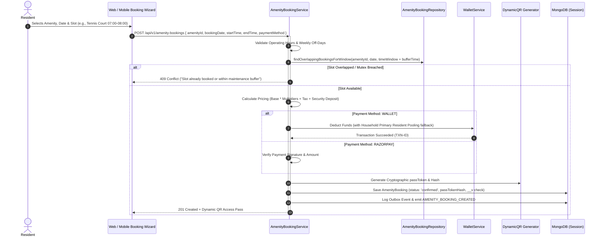
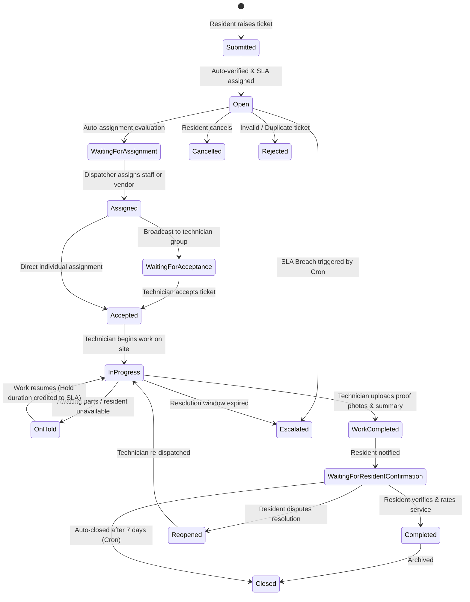

# Comprehensive System Report: Amenities & Booking + Complaints & Maintenance

**Platform:** Manage-My-Gate (Nahom Community SuperApp)  
**Architecture:** Multi-Tenant Gated Community SaaS  
**Scope:** Full End-to-End Analysis of Amenities, Reservations, Helpdesk Tickets, Work Orders, SLA Escalation, and Technician Operations  
**Date:** September 2026  
**Subsystems Audited:** Backend (`backend/`), Web Frontend (`frontend/`), Mobile App (`mobile/mobile-app/`)  

---

## 1. Executive Summary & Operational Overview

Manage-My-Gate integrates community resource utilization (**Amenities & Booking**) and property health (**Complaints & Maintenance**) into a cohesive, multi-tenant digital ecosystem.

```
                      ┌─────────────────────────────────────────────────────────┐
                      │              Community SuperApp Ecosystem               │
                      └────────────────────────────┬────────────────────────────┘
                                                   │
                   ┌───────────────────────────────┴───────────────────────────────┐
                   ▼                                                               ▼
    ┌─────────────────────────────┐                                 ┌─────────────────────────────┐
    │     Amenities & Booking     │                                 │   Complaints & Maintenance  │
    ├─────────────────────────────┤                                 ├─────────────────────────────┤
    │ • 5 Archetypes (Pool, Gym,  │                                 │ • 16-Stage Ticket Lifecycle │
    │   Courts, Halls, Tools)     │                                 │ • SLA Auto-Escalation Cron  │
    │ • Mutex Locks & Buffers     │                                 │ • Work Order Mobile Queue   │
    │ • Dynamic Tariff & Deposit  │                                 │ • Technician Skill Matrix   │
    │ • Digital Wallet Settlement │                                 │ • Vendor Gate Pass Sync     │
    │ • Dynamic QR Pass Scanning  │                                 │ • CSAT Multi-Metric Ratings │
    │ • Automated Wallet Refunds  │                                 │ • Community Issue Billboard │
    └─────────────────────────────┘                                 └─────────────────────────────┘
                   │                                                               │
                   └───────────────────────────────┬───────────────────────────────┘
                                                   ▼
                                    ┌─────────────────────────────┐
                                    │    Cross-Cutting Engine     │
                                    ├─────────────────────────────┤
                                    │ • Digital Wallet & Ledger   │
                                    │ • Security Hardware Scanner │
                                    │ • Decoupled Socket.io Rooms │
                                    │ • Atomic Transactions       │
                                    └─────────────────────────────┘
```

---

## 2. Subsystem 1: Amenities & Booking

### 2.1 Domain Models & Entity Relationships
The Amenities subsystem is driven by 4 core Mongoose models:
1. **`Amenity`** ([`backend/src/features/amenity/amenity.model.js`](file:///d:/atominos/GatedCommunity/backend/src/features/amenity/amenity.model.js)): Stores facility configuration, pricing rules, operating schedules, buffer times, weekly off days, and maintenance blackout intervals.
2. **`AmenityBooking`** ([`backend/src/features/amenityBooking/amenityBooking.model.js`](file:///d:/atominos/GatedCommunity/backend/src/features/amenityBooking/amenityBooking.model.js)): Manages reservations, slot mutex, payment status, access pass tokens, check-in/out timestamps, and optimistic concurrency versioning.
3. **`Wallet` & `WalletLedger`** ([`backend/src/features/wallet/wallet.model.js`](file:///d:/atominos/GatedCommunity/backend/src/features/wallet/wallet.model.js), [`walletLedger.model.js`](file:///d:/atominos/GatedCommunity/backend/src/features/wallet/walletLedger.model.js)): Handles instant balance deductions, household wallet pooling, and cryptographic SHA-256 tamper-evident transaction chaining.
4. **`SecurityLog`** ([`backend/src/features/securityLog/securityLog.model.js`](file:///d:/atominos/GatedCommunity/backend/src/features/securityLog/securityLog.model.js)): Records physical gate entries verified by guards scanning dynamic QR access passes.

---

### 2.2 The 5 Core Amenity Archetypes
The catalog supports 5 structural archetypes mapped to physical community resources:

| Archetype | Examples | Capacity & Mutex Rules | Pricing & Settlement Modes |
| :--- | :--- | :--- | :--- |
| **`SHARED_CAPACITY`** | Swimming Pool, Gymnasium, Kid's Play Zone | Headcount quota concurrency (e.g., max 25 persons per slot); slots remain bookable until capacity is filled. | Free for residents or subscription session rates. |
| **`EXCLUSIVE_HOURLY`** | Tennis Courts, Badminton Courts, Squash Courts | Strict mutex lock: 1 booking occupies the entire facility; buffer cleaning windows enforced between slots. | Hourly tariffs, peak-hour multipliers, weekend surge rates. |
| **`EVENT_SPACE`** | Grand Banquet Hall, Party Lawn, Clubhouse Lounge | Full-day / session locking; requires manager approval gate; mandatory security deposit. | Daily rate + refundable security deposit + cleaning fee. |
| **`ROOM_RESOURCE`** | Guest Suites, Co-working Pods, Conference Rooms | Unit-based daily or multi-hour occupancy; check-in/check-out lifecycle. | Fixed session or daily accommodation charge. |
| **`INVENTORY_TOOLS`** | High-Power Cordless Drills, Step Ladders, Lawn Mowers | Serialized loan tracking; returns inspection check. | Security deposit hold + nominal rental charge. |

---

### 2.3 Booking Lifecycle & Concurrency Safeguards



#### Optimistic Concurrency Control (OCC):
In [`amenityBooking.model.js`](file:///d:/atominos/GatedCommunity/backend/src/features/amenityBooking/amenityBooking.model.js#L164-L181):
```javascript
amenityBookingSchema.set('optimisticConcurrency', true);
amenityBookingSchema.pre('save', function () {
  if (!this.isNew) this.increment();
});
amenityBookingSchema.post('save', function (error, doc, next) {
  if (error.name === 'VersionError') {
    const err = new Error('Race condition detected: Booking was modified by another simultaneous request.');
    err.status = 409;
    return next(err);
  }
  next(error);
});
```

---

### 2.4 Gate Access & Scanning Verification
1. **Pass Token Generation:** Generates a 64-character hex secret (`passToken`) and stores a SHA-256 hash (`passTokenHash`) in MongoDB.
2. **Encrypted QR Payload:** Compiled as `MMG:AMENITY:<passToken>`.
3. **Security Gate Scanning:**
   - Security guards use `<QRScannerOverlay>` on mobile ([`scanner.tsx`](file:///d:/atominos/GatedCommunity/mobile/mobile-app/app/(resident)/amenities/scanner.tsx)) or desktop webcam ([`SecurityScannerView.jsx`](file:///d:/atominos/GatedCommunity/frontend/src/features/amenities/views/SecurityScannerView.jsx)).
   - Invokes `POST /api/v1/amenity-bookings/verify-pass`.
   - Transitions booking status to `checked-in`, logs timestamp, and prevents pass reuse.

---

### 2.5 Automated Wallet Refunds on Cancellation
When a resident cancels an amenity booking prior to the start time:
1. The service evaluates `bookingRules.cancellationRefundRules`:
   - e.g., $>48$ hours before slot: 100% refund.
   - $24-48$ hours before slot: 75% refund.
   - $<24$ hours before slot: 0% refund.
2. The refund amount is credited directly back to the resident's digital wallet (`WalletTransaction` Credit, `Refund`).
3. The cryptographic transaction is hashed and appended to `WalletLedger`.
4. Mutex slots are released immediately for other community members.

---

## 3. Subsystem 2: Complaints & Maintenance

### 3.1 Domain Models & Entity Relationships
The Complaints subsystem is governed by 4 dedicated models:
1. **`Complaint`** ([`backend/src/features/complaint/complaint.model.js`](file:///d:/atominos/GatedCommunity/backend/src/features/complaint/complaint.model.js)): Core helpdesk ticket tracking status, SLA deadlines, assigned technicians, work done, proof-of-work attachments, timeline logs, and resident CSAT ratings.
2. **`ComplaintSettings`** ([`backend/src/features/complaintSettings/complaintSettings.model.js`](file:///d:/atominos/GatedCommunity/backend/src/features/complaintSettings/complaintSettings.model.js)): Per-organization configuration for categories, SLA priority hours, working hours, auto-assignment algorithms, feedback mandatory flags, and rating scales.
3. **`Technician`** ([`backend/src/features/technician/technician.model.js`](file:///d:/atominos/GatedCommunity/backend/src/features/technician/technician.model.js)): Roster of in-house staff and external vendors, classified by trade department (`Electrical`, `Plumbing`, `Housekeeping`, `Security`, `Carpentry`, `Others`).
4. **`IssueReport`** ([`backend/src/features/issueReport/issueReport.model.js`](file:///d:/atominos/GatedCommunity/backend/src/features/issueReport/issueReport.model.js)): Public community billboard for common-area infrastructure defects with resident upvoting ("Me Too") and admin conversion to work orders.

---

### 3.2 16-Stage Ticket State Machine & Lifecycle



---

### 3.3 SLA Engine & Automated Escalation Cron
1. **SLA Configuration:** Defined per priority in `ComplaintSettings`:
   - `Critical`: Resolve within 2–4 hours; Level 1 escalation at 2 hours.
   - `High`: Resolve within 12–24 hours; Level 1 escalation at 12 hours.
   - `Medium`: Resolve within 48 hours; Level 1 escalation at 36 hours.
   - `Low`: Resolve within 72 hours.
2. **Dynamic Pause on Hold:** When a ticket enters `On Hold`, elapsed time is tracked. Upon resuming (`In Progress`), the SLA deadline (`effectiveSlaDueDate`) is extended by the exact hold duration.
3. **Hourly SLA Cron Job (`complaint.cron.js`):**
   - Runs hourly (`0 * * * *`).
   - Scans unclosed tickets where `now > slaDueDate` and `escalationLevel < 1`.
   - Automatically executes `complaintService.escalateComplaint()`, flags the ticket as `Escalated`, and alerts facility managers and community administrators.

---

### 3.4 Work Order Dispatching & External Vendor Integration
1. **Assignment Methods:**
   - **Manual Dispatch:** Admin chooses specific technician from filtered roster.
   - **Broadcast Dispatch:** Pushes work order to all technicians in the department (`isBroadcast: true`). First available technician taps "Accept" to claim it.
2. **Automated Vendor Entry Gate Pass:**
   - When an **External Vendor** is assigned, the system invokes `visitorPassService.createServicePass()`.
   - Generates a vendor visitor pass with QR credentials so security guards grant seamless gate entry on the scheduled service date.
3. **Proof of Work & Completion Sign-Off:**
   - Technician uploads completion notes and photographic evidence via mobile ([`assignee.tsx`](file:///d:/atominos/GatedCommunity/mobile/mobile-app/app/(resident)/complaints/assignee.tsx)).
   - Ticket shifts to `Work Completed`, notifying the resident to inspect and submit feedback.

---

### 3.5 Resident CSAT & Multi-Metric Ratings
Residents evaluate completed work across 5 independent criteria (1 to 5 stars):
- **Overall Rating**
- **Technician Rating** (punctuality, skill, etiquette)
- **Service Quality Rating**
- **Cleanliness Rating** (area left tidy after repair)
- **Communication Rating**
- Free-text feedback remarks.

---

### 3.6 Community Issue Reporting Billboard (`issueReport`)
Integrated in recent updates:
- Residents can report public issues (e.g., Streetlight out in Sector B, Gym AC leaking).
- Visible on the Community Issue Reports board ([`CommunityIssueReportsView.jsx`](file:///d:/atominos/GatedCommunity/frontend/src/features/issueReport/views/CommunityIssueReportsView.jsx), [`issue-reports.tsx`](file:///d:/atominos/GatedCommunity/mobile/mobile-app/app/(resident)/complaints/issue-reports.tsx)).
- Fellow residents tap **"Upvote / Me Too"** rather than raising duplicate tickets.
- Admins triage public issues and convert high-impact reports directly into maintenance complaints with a single click.

---

## 4. UI Screen & Module Inventory

### 4.1 Amenities & Booking
| Subsystem | Platform | File Path | Purpose |
| :--- | :--- | :--- | :--- |
| **Amenities** | Web | [`frontend/src/features/amenities/views/AmenitiesMasterView.jsx`](file:///d:/atominos/GatedCommunity/frontend/src/features/amenities/views/AmenitiesMasterView.jsx) | Admin catalog configuration, operating hours, pricing rules. |
| **Amenities** | Web | [`frontend/src/features/amenities/views/ResidentDiscoverView.jsx`](file:///d:/atominos/GatedCommunity/frontend/src/features/amenities/views/ResidentDiscoverView.jsx) | Resident discovery grid with archetype filtering. |
| **Amenities** | Web | [`frontend/src/features/amenities/views/ResidentBookingView.jsx`](file:///d:/atominos/GatedCommunity/frontend/src/features/amenities/views/ResidentBookingView.jsx) | Slot picker, pricing breakdown, digital wallet payment. |
| **Amenities** | Web | [`frontend/src/features/amenities/views/ResidentCalendarView.jsx`](file:///d:/atominos/GatedCommunity/frontend/src/features/amenities/views/ResidentCalendarView.jsx) | Resident visual booking calendar and upcoming slots. |
| **Amenities** | Web | [`frontend/src/features/amenities/views/AdminCalendarView.jsx`](file:///d:/atominos/GatedCommunity/frontend/src/features/amenities/views/AdminCalendarView.jsx) | Admin occupancy schedule across all community facilities. |
| **Amenities** | Web | [`frontend/src/features/amenities/views/SecurityScannerView.jsx`](file:///d:/atominos/GatedCommunity/frontend/src/features/amenities/views/SecurityScannerView.jsx) | Guard desktop QR access pass validation interface. |
| **Amenities** | Web | [`frontend/src/features/amenities/views/AdminMaintenanceView.jsx`](file:///d:/atominos/GatedCommunity/frontend/src/features/amenities/views/AdminMaintenanceView.jsx) | Facility blackout maintenance scheduling. |
| **Amenities** | Mobile | [`mobile/mobile-app/app/(resident)/amenities/discover.tsx`](file:///d:/atominos/GatedCommunity/mobile/mobile-app/app/%28resident%29/amenities/discover.tsx) | Native mobile amenity cards & category carousel. |
| **Amenities** | Mobile | [`mobile/mobile-app/app/(resident)/amenities/my-bookings.tsx`](file:///d:/atominos/GatedCommunity/mobile/mobile-app/app/%28resident%29/amenities/my-bookings.tsx) | Resident active passes, dynamic QR code modal, cancel action. |
| **Amenities** | Mobile | [`mobile/mobile-app/app/(resident)/amenities/scanner.tsx`](file:///d:/atominos/GatedCommunity/mobile/mobile-app/app/%28resident%29/amenities/scanner.tsx) | Guard mobile hardware QR camera scanner (`<QRScannerOverlay>`). |
| **Amenities** | Mobile | [`mobile/mobile-app/src/features/amenities/components/wizard/AmenityBookingWizard.tsx`](file:///d:/atominos/GatedCommunity/mobile/mobile-app/src/features/amenities/components/wizard/AmenityBookingWizard.tsx) | Type-selection-first multi-step booking wizard container. |

---

### 4.2 Complaints & Maintenance
| Subsystem | Platform | File Path | Purpose |
| :--- | :--- | :--- | :--- |
| **Complaints** | Web | [`frontend/src/features/complaints/views/ComplaintDashboard.jsx`](file:///d:/atominos/GatedCommunity/frontend/src/features/complaints/views/ComplaintDashboard.jsx) | Executive KPI metrics, category breakdowns, SLA charts. |
| **Complaints** | Web | [`frontend/src/features/complaints/views/ComplaintManagement.jsx`](file:///d:/atominos/GatedCommunity/frontend/src/features/complaints/views/ComplaintManagement.jsx) | Admin dispatch data grid with filters, search, and bulk actions. |
| **Complaints** | Web | [`frontend/src/features/complaints/views/ComplaintDetails.jsx`](file:///d:/atominos/GatedCommunity/frontend/src/features/complaints/views/ComplaintDetails.jsx) | Full audit timeline, internal notes, proof images, status switch. |
| **Complaints** | Web | [`frontend/src/features/complaints/views/CreateComplaint.jsx`](file:///d:/atominos/GatedCommunity/frontend/src/features/complaints/views/CreateComplaint.jsx) | Resident ticket submission form with media upload. |
| **Complaints** | Web | [`frontend/src/features/complaints/views/Assignee.jsx`](file:///d:/atominos/GatedCommunity/frontend/src/features/complaints/views/Assignee.jsx) | Staff active work order execution queue. |
| **Complaints** | Web | [`frontend/src/features/complaints/views/StaffAndVendor.jsx`](file:///d:/atominos/GatedCommunity/frontend/src/features/complaints/views/StaffAndVendor.jsx) | In-house technician and external vendor roster management. |
| **Complaints** | Web | [`frontend/src/features/complaints/views/ComplaintSettings.jsx`](file:///d:/atominos/GatedCommunity/frontend/src/features/complaints/views/ComplaintSettings.jsx) | SLA configuration, categories, departments, feedback scales. |
| **Complaints** | Web | [`frontend/src/features/complaints/views/PerformanceAnalytics.jsx`](file:///d:/atominos/GatedCommunity/frontend/src/features/complaints/views/PerformanceAnalytics.jsx) | Mean Time to Resolution (MTTR), SLA compliance, technician ratings. |
| **Complaints** | Web | [`frontend/src/features/issueReport/views/CommunityIssueReportsView.jsx`](file:///d:/atominos/GatedCommunity/frontend/src/features/issueReport/views/CommunityIssueReportsView.jsx) | Public issue reporting board with upvote mechanism. |
| **Complaints** | Mobile | [`mobile/mobile-app/app/(resident)/complaints/dashboard.tsx`](file:///d:/atominos/GatedCommunity/mobile/mobile-app/app/%28resident%29/complaints/dashboard.tsx) | Mobile executive helpdesk telemetry. |
| **Complaints** | Mobile | [`mobile/mobile-app/app/(resident)/complaints/manage.tsx`](file:///d:/atominos/GatedCommunity/mobile/mobile-app/app/%28resident%29/complaints/manage.tsx) | Mobile administrative dispatching & filtering. |
| **Complaints** | Mobile | [`mobile/mobile-app/app/(resident)/complaints/my-tickets.tsx`](file:///d:/atominos/GatedCommunity/mobile/mobile-app/app/%28resident%29/complaints/my-tickets.tsx) | Resident ticket history with live status badges. |
| **Complaints** | Mobile | [`mobile/mobile-app/app/(resident)/complaints/raise-ticket.tsx`](file:///d:/atominos/GatedCommunity/mobile/mobile-app/app/%28resident%29/complaints/raise-ticket.tsx) | Multi-step resident ticket creation wizard. |
| **Complaints** | Mobile | [`mobile/mobile-app/app/(resident)/complaints/assignee.tsx`](file:///d:/atominos/GatedCommunity/mobile/mobile-app/app/%28resident%29/complaints/assignee.tsx) | Technician work order queue (Start Work, On Hold, Upload Proof). |
| **Complaints** | Mobile | [`mobile/mobile-app/app/(resident)/complaints/issue-reports.tsx`](file:///d:/atominos/GatedCommunity/mobile/mobile-app/app/%28resident%29/complaints/issue-reports.tsx) | Community issue reporting list and upvote interaction. |

---

## 5. Forensic Audit & Gaps Analysis

During the deep-dive audit of the two subsystems, four critical engineering findings were noted:

1. **[Finding 1 - High] `complaint.reassigned` Event Listener Drop:**
   - **Location:** [`backend/src/features/complaint/complaint.service.js:441`](file:///d:/atominos/GatedCommunity/backend/src/features/complaint/complaint.service.js#L441)
   - When a ticket is reassigned to a different technician, `complaintEvents.emit('complaint.reassigned', ...)` fires, but neither `complaint.socket.js` nor `complaint.listeners.js` registers a handler. The new technician receives no push notification or socket push.
   - **Recommendation:** Register the event in both listener and socket layers.
2. **[Finding 2 - Medium] RBAC Ambiguity in Ticket Acceptance:**
   - **Location:** [`backend/src/features/complaint/complaint.service.js:517`](file:///d:/atominos/GatedCommunity/backend/src/features/complaint/complaint.service.js#L517)
   - Role evaluation permits users with raw role `'Employee'` or admins to claim tickets directly, setting `assignedTechnicianId` to the admin's `userId` without validating if the user is in the `Technician` roster, corrupting technician performance KPIs.
   - **Recommendation:** Restrict acceptance strictly to active roster technicians.
3. **[Finding 3 - Medium] `useComplaintsSocket` Memory Leak:**
   - **Location:** [`frontend/src/features/complaints/hooks/useComplaintsSocket.js`](file:///d:/atominos/GatedCommunity/frontend/src/features/complaints/hooks/useComplaintsSocket.js)
   - Socket event listeners are instantiated inside `useEffect` with anonymous inline functions. Navigating repeatedly between views leaves duplicate listeners attached to the global socket.
   - **Recommendation:** Use named handler references and detach via `.off()` in the cleanup block.
4. **[Finding 4 - Low] Division-by-Zero Risk in Analytics:**
   - **Location:** [`backend/src/features/complaint/complaint.service.js:890`](file:///d:/atominos/GatedCommunity/backend/src/features/complaint/complaint.service.js#L890)
   - SLA compliance and CSAT metrics divide by total closed complaints without a zero-count guard, returning `NaN` in empty or new communities.
   - **Recommendation:** Inject fallback `0` when total closed tickets equal 0.
