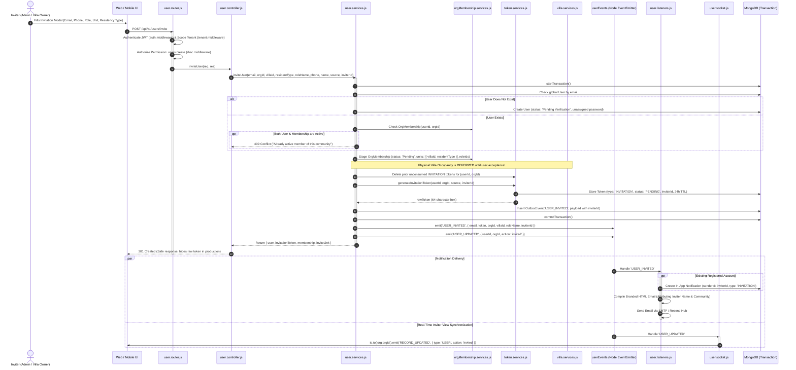
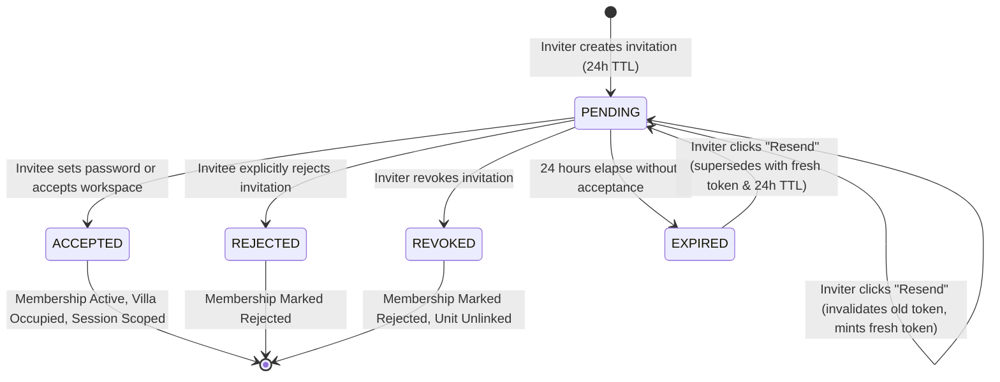
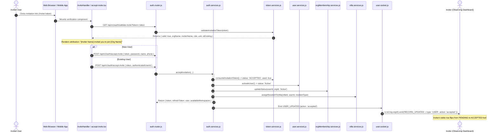

# ManageMyGate (Nahom) — User Inviter Flow End-to-End Technical Report

**Document Version:** 1.0.0  
**Target Systems:** Backend (`backend/`), Web Frontend (`frontend/`), Mobile App (`mobile/mobile-app/`)  
**Core Architecture:** Multi-Tenant Gated Community SaaS  
**Primary Entity Scope:** User Onboarding, Community Invitations, Inviter Attribution & Lifecycle Controls  

---

## 1. Executive Summary

In ManageMyGate (Nahom), the **User Inviter Flow** governs how community managers, tenant administrators, and villa owners invite new or existing individuals into a gated community workspace. It provides full lifecycle tracking, cryptographic security, multi-channel notifications, and real-time status reflection back to the inviter.

### Architectural Tenet: Decoupled Global Identity vs. Localized Membership
```text
One Person → One Global User → Many Organizations → One OrgMembership per Org
```
- **Global Identity (`User`):** Holds universal credentials (email, username, password hash, phone number, multi-factor settings, directory privacy preferences).
- **Localized Membership (`OrgMembership`):** Scopes the user's relationship to a specific gated community (`orgId`), assigned unit(s) (`units: [{ villaId, residentType }]`), role IDs (`roleIds`), and status (`Pending`, `Active`, `Rejected`).
- **Cryptographic Attribution (`Token`):** Binds the invitation token to both the invitee (`userId`) and the inviter (`inviterId`), tracking the complete lifecycle (`PENDING`, `ACCEPTED`, `REJECTED`, `REVOKED`, `EXPIRED`).

---

## 2. Inviter Personas & Access Control (RBAC)

The system supports two distinct inviter personas, each governed by role-based access control:

| Inviter Persona | Typical Roles | Capabilities | Access Control Enforcement | Entry Points |
| :--- | :--- | :--- | :--- | :--- |
| **Community Admin / Manager** | Tenant Admin, Super Admin, Facility Manager | Invite residents, staff, security guards, committee members, technicians; issue bulk invitations; view all community invitations; resend and revoke. | Requires `users:create`, `users:read`, `users:delete` permissions in `rbac.middleware.js`. | **Web:** `/users`, `/invitations`<br>**Mobile:** `/(resident)/admin/invitations` |
| **Villa Owner / Resident** | Resident Owner, Primary Tenant | Invite co-residents, family members, or secondary tenants to their specific assigned villa/unit. | Requires active unit assignment (`OrgMembership.units`) and `villas:read` permission. | **Web:** `VillaDetailsModal.jsx`<br>**Mobile:** `VillaDetailsModal.tsx` |

---

## 3. End-to-End Execution Flows

### 3.1 Invitation Initiation & Dispatch Flow
This diagram illustrates the step-by-step transaction when an inviter creates an invitation:



---

### 3.2 Inviter Lifecycle State Machine
Every invitation tracks through a formal state machine. The inviter can observe and trigger state changes:



#### State Machine Safeguards:
1. **Inviter-Initiated Resend (`user.services.js:resendInvitation`):**
   - Prohibits resending invitations in terminal states: `ACCEPTED`, `REJECTED`, or `REVOKED`.
   - Executes single-consumer atomic invalidation (`findAndInvalidateForResend`).
   - If naturally expired, marks old token `EXPIRED`; if superseded prematurely, marks old token `REVOKED`.
   - Generates brand-new cryptographic token, logs transactional audit event, and re-triggers dual-audience delivery.
2. **Inviter-Initiated Revocation (`user.services.js:revokeInvitation`):**
   - Verifies tenant ownership (`tokenDoc.orgId === orgId`).
   - Atomically transitions token status to `REVOKED`.
   - Transitions `OrgMembership.status` to `Rejected`.
   - Cleans up any staged villa reservations via `villaService.removeUserFromAllVillasInOrg`.
   - Emits `INVITATION_REVOKED` and `USER_UPDATED` WebSocket events.

---

### 3.3 Invitee Reception & Real-Time Sync Back to Inviter

When the invitee opens the link, the inviter's attribution is displayed, and their acceptance updates the inviter's dashboard in real time:



---

## 4. Inviter Management Console (Web & Mobile)

### 4.1 Inviter Administrative Interface Features
The inviter monitors dispatched invitations through dedicated views:
- **Web Frontend:** `frontend/src/features/userManagement/views/InvitationManagementView.jsx`
- **Mobile App:** `mobile/mobile-app/app/(resident)/admin/invitations.tsx`

| Feature | Implementation Details |
| :--- | :--- |
| **Inviter Attribution Column** | Displays `{row.inviter?.name \|\| row.inviter?.email \|\| 'System'}` to attribute which admin or owner generated the invite. |
| **Dynamic Status Badging** | Color-coded status badges: `PENDING` (Warning/Amber), `ACCEPTED` (Success/Green), `EXPIRED` (Secondary/Gray), `REVOKED` (Danger/Red), `REJECTED` (Dark/Slate). |
| **Search & Filtering** | Real-time text search across recipient name, email, phone; status tab filter (`ALL`, `PENDING`, `ACCEPTED`, `EXPIRED`, `REVOKED`). |
| **One-Click Resend** | Re-triggers delivery for `PENDING` or `EXPIRED` records; shows loading spinner and toast alert. |
| **Confirmation Revocation** | Prompts confirmation modal before revoking, releasing reserved units immediately. |
| **Zero Token Leakage** | Aggregation pipeline strictly projects recipient, inviter, role, and status while omitting raw tokens or cryptographic hashes. |

---

## 5. Bulk Inviter Workflow

Community managers onboarding large developments use the Bulk Invite flow:
- **Web:** `BulkInviteModal.jsx`
- **Mobile:** `BulkInviteModal.tsx`

### Bulk Processing Mechanics:
1. **Input Modes:** CSV file upload or manual multi-row spreadsheet entry.
2. **Field Resolution:** Accepts `email`, `roleName`, `residentType`, `villaNumber`. If `villaNumber` is supplied, `villaService.getVillaByNumber` resolves the corresponding `villaId`.
3. **Isolated Atomic Execution:** Each row is processed in its own independent transaction. If row #14 fails (e.g., malformed email or duplicate active membership), it logs a failure reason without aborting valid rows.
4. **Summary Feedback:** Returns `{ total, successCount, failureCount, successes: [...], failures: [...] }` so the inviter can inspect errors and retry failed rows.

---

## 6. Security, Privacy & Integrity Controls

1. **Cryptographic Token Safety:**
   - Tokens are 64-character cryptographically secure hex strings generated via `crypto.randomBytes(32)`.
   - Stored in MongoDB with single-use consumption (`used: true`) and strict 24-hour expiration (`expiresAt`).
2. **Cross-Tenant RBAC Isolation:**
   - Requests are strictly isolated by `tenantContext` and `orgId`.
   - Inviters cannot inspect, resend, or revoke invitations belonging to another community (`targetToken.orgId !== orgId` returns `403 Forbidden`).
3. **Deferred Villa Occupancy (Anti-Ghost Reservation):**
   - Staged invitations do NOT occupy villas or alter resident counts. Physical occupancy is only committed upon explicit acceptance.
4. **Enumeration Prevention:**
   - Public invite validation endpoints require a valid token parameter and do not allow unauthenticated email-only user harvesting.

---

## 7. Relevant Codebase References

- **Backend Logic:**
  - Single & Bulk Invite: [`backend/src/features/user/user.services.js`](file:///d:/atominos/GatedCommunity/backend/src/features/user/user.services.js#L264-L485)
  - Inviter Token Service: [`backend/src/features/token/token.services.js`](file:///d:/atominos/GatedCommunity/backend/src/features/token/token.services.js#L562-L780)
  - Invitation Controller: [`backend/src/features/user/user.controller.js`](file:///d:/atominos/GatedCommunity/backend/src/features/user/user.controller.js#L210-L260)
  - Universal Link Generator: [`backend/src/features/user/utils/invite.utils.js`](file:///d:/atominos/GatedCommunity/backend/src/features/user/utils/invite.utils.js#L58-L86)
  - Acceptance Service: [`backend/src/features/auth/auth.services.js`](file:///d:/atominos/GatedCommunity/backend/src/features/auth/auth.services.js#L680-L815)
- **Web Frontend:**
  - Inviter Management View: [`frontend/src/features/userManagement/views/InvitationManagementView.jsx`](file:///d:/atominos/GatedCommunity/frontend/src/features/userManagement/views/InvitationManagementView.jsx)
  - Inviter Single Modal: [`frontend/src/features/userManagement/components/SingleInviteModal.jsx`](file:///d:/atominos/GatedCommunity/frontend/src/features/userManagement/components/SingleInviteModal.jsx)
  - Invitee Reception Header: [`frontend/src/features/auth/components/InviteHeader.jsx`](file:///d:/atominos/GatedCommunity/frontend/src/features/auth/components/InviteHeader.jsx)
- **Mobile Application:**
  - Inviter Mobile Dashboard: [`mobile/mobile-app/app/(resident)/admin/invitations.tsx`](file:///d:/atominos/GatedCommunity/mobile/mobile-app/app/(resident)/admin/invitations.tsx)
  - Invitee Mobile Screen: [`mobile/mobile-app/app/(auth)/accept-invite.tsx`](file:///d:/atominos/GatedCommunity/mobile/mobile-app/app/(auth)/accept-invite.tsx)
  - Inviter Attribution Modal: [`mobile/mobile-app/src/features/notification/components/InvitationDetailModal.tsx`](file:///d:/atominos/GatedCommunity/mobile/mobile-app/src/features/notification/components/InvitationDetailModal.tsx)
