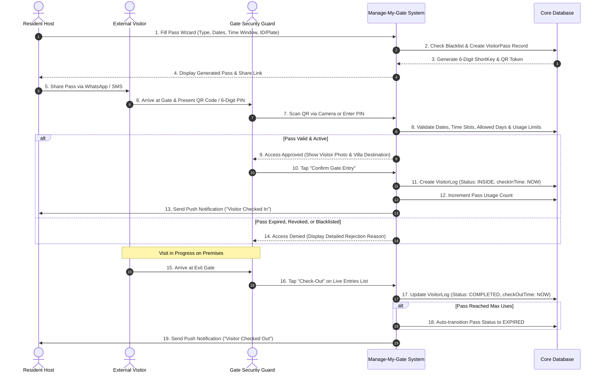
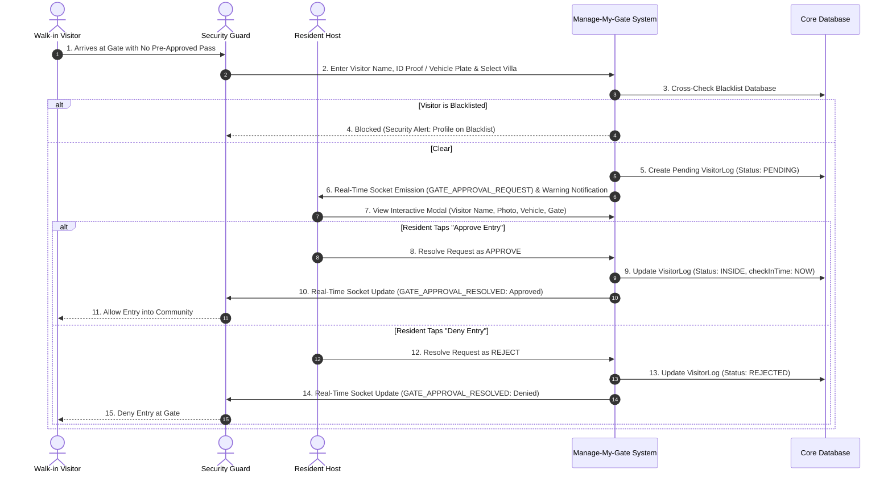

# Visitor Management — Functional & Business Analysis

---

## 1. Module Overview

### 1.1 What is Visitor Management?
The **Visitor Management Module** is a digital gate security and access control solution engineered for gated residential communities, luxury villa compounds, and managed commercial estates. It replaces paper-based gate registers with a cloud-connected, real-time ecosystem connecting residents, security gate officers, and community administrators.

### 1.2 Purpose of the Module
The purpose of the module is to streamline and secure entry and exit protocols across all estate access points. It ensures that every individual entering the property is verified, authorized, and tracked with accurate timestamps, while providing residents with control over who enters their premises.

### 1.3 Target Users
* **Residents & Property Owners:** Pre-approve visitors, receive instant gate-arrival notifications, grant real-time approvals for walk-in arrivals, and review domestic staff and visitor logs.
* **Security Gate Officers & Guards:** Verify pre-approved visitors using optical QR scanning or numeric passcodes, register unplanned walk-ins, lookup destination villa intercoms, and manage live occupancy.
* **Community Management & Security Supervisors:** Monitor estate-wide gate traffic, enforce community blacklists, audit guard activity, and review entry analytics.
* **External Visitors (Guests, Delivery Personnel, Cabs, Service Technicians):** Receive digital QR invitations, passcodes, and gate instructions directly on their smartphones without needing an app installation.

### 1.4 Operational Scope Supported
The module governs all physical perimeter access points (main gates, service gates, resident gates) and coordinates interactions across the entire lifecycle of a visit: **Pre-Arrival Invitation $\rightarrow$ Gate Arrival & Verification $\rightarrow$ Real-Time Resident Approval $\rightarrow$ Check-In & On-Premises Tracking $\rightarrow$ Gate Check-Out & Overstay Management.**

---

## 2. Business Problem

Traditional gated communities rely on manual registers, security intercom landlines, and verbal guard clearances. These legacy practices cause serious operational and security challenges:

| Problem Area | Real-World Operational Challenge | How Manage-My-Gate Solves It |
| :--- | :--- | :--- |
| **Manual Visitor Registers** | Paper logbooks are prone to illegible handwriting, forged phone numbers, skipped entries, and privacy leaks of resident phone numbers. | Replaces paper logs with digital logs featuring verified phone numbers, government ID proof records, and vehicle registration numbers. |
| **Unplanned & Walk-In Visitors** | Unannounced visitors cause gate congestion while guards attempt to contact residents via landlines or manual calls. | Guard initiates a digital walk-in request that triggers instant mobile push notifications and real-time interactive screen alerts on the resident's device. |
| **Unauthorized Access & Tailgating** | Strangers and blacklisted individuals enter by claiming to visit a random unit. | Multi-factor verification (6-digit unique passcodes, dynamic ISO QR codes, and automated blacklist cross-referencing) prevents unapproved entry. |
| **High Delivery & Cab Congestion** | Delivery couriers (Amazon, food deliveries) and taxi pickups face long delays at the gate during peak hours. | Quick-pass workflows for couriers and cabs with designated validity windows (e.g., 1-hour or 4-hour slots) and multi-day recurring passes for daily transport. |
| **Lack of Visitor History & Audit Trails** | In the event of a security breach or property damage, management cannot verify who was on the premises, which gate they used, or who authorized them. | Searchable historical database with entry/exit timestamps, processing security officer identities, and resident authorization logs. |
| **Unmonitored Domestic Staff** | Maids, drivers, and maintenance workers enter without tracked time windows or visibility into unauthorized weekend access. | Recurring service passes with configurable weekday schedules (e.g., Mon–Fri) and restricted daily entry windows (e.g., 08:00 AM – 01:00 PM). |

---

## 3. Objectives & Benefits

### 3.1 Key Objectives
* **Zero Unverified Entries:** Guarantee that no external person or vehicle crosses the gate perimeter without a digital record.
* **Sub-15-Second Gate Clearance:** Reduce visitor processing time from minutes to seconds using camera QR scanning and short-code entry.
* **Empowered Resident Privacy & Safety:** Give residents direct control over access authorization for their private units.
* **100% Real-Time Situational Awareness:** Provide security supervisors with a live headcount of all non-residents currently inside the estate.

### 3.2 Value Proposition & Stakeholder Benefits

```
+----------------------------------------------------------------------------------------------------+
|                                    VALUE PROPOSITION BY STAKEHOLDER                               |
+---------------------------------+----------------------------------+-------------------------------+
| RESIDENTS                       | SECURITY GUARDS                  | COMMUNITY MANAGEMENT          |
| - Fast 4-step pass creation     | - Fast camera QR scanner         | - Master gate audit logs      |
| - Interactive walk-in approvals | - Instant resident notification  | - Community-wide blacklist    |
| - Recurring staff passes        | - Villa directory & intercom     | - Peak-hour traffic telemetry |
| - Shareable WhatsApp/SMS links  | - Live on-premises headcount     | - Linked maintenance passes   |
+---------------------------------+----------------------------------+-------------------------------+
```

#### For Residents
* **Convenience:** Create single-entry, multi-entry, or group invitations in seconds.
* **Real-Time Control:** Receive instant interactive pop-up alerts on mobile and web to approve or deny visitors waiting at the gate.
* **Pass Sharing:** One-tap sharing of digital visitor passes via WhatsApp, SMS, or email with map directions and gate passcodes.
* **Peace of Mind:** Complete audit visibility over past visitors, deliveries, and service staff visiting their villa.

#### For Security Guards
* **Simplified Gate Processing:** Scan QR codes directly with device cameras or verify 6-digit numeric passcodes.
* **Reduced Friction:** Eliminate manual phone calls with one-tap digital walk-in requests sent directly to the resident.
* **Integrated Villa Directory:** Quick search by villa unit or resident name with simulated intercom dialer fallback.
* **Real-Time Headcount:** Clear visibility of all visitors currently inside the property, enabling quick check-outs.

#### For Community Management & Administrators
* **Estate-Wide Oversight:** Master dashboard displaying real-time metrics (Inside Now, Pending Approvals, Total Entries Today, Blacklisted Count).
* **Proactive Perimeter Defense:** Centralized blacklist registry blocking banned individuals, suspicious phone numbers, or blacklisted vehicle plates at all gates.
* **Data-Driven Operations:** Peak-hour arrival analytics and category breakdowns (Guests vs. Cabs vs. Deliveries vs. Staff) to optimize security guard shift staffing.
* **Automated Maintenance Integration:** Maintenance tickets automatically provision secure vendor visitor passes for external technicians.

---

## 4. User Roles & Access

The Visitor Management module enforces strict Role-Based Access Control (RBAC) across three primary operational contexts:

```
                      +-----------------------------+
                      |    AUTHENTICATION ENGINE    |
                      |   (Role-Based Access)       |
                      +--------------+--------------+
                                     |
         +---------------------------+---------------------------+
         |                           |                           |
         v                           v                           v
+------------------+       +-------------------+       +-------------------+
|  RESIDENT ROLE   |       |    GUARD ROLE     |       |    ADMIN ROLE     |
| (Unit-Level VMS) |       | (Gate Execution)  |       | (Master VMS Desk) |
+------------------+       +-------------------+       +-------------------+
```

### 4.1 Role Profiles & Operational Responsibilities

#### 1. Resident / Property Owner
* **Core Responsibilities:** Authorize guest, delivery, cab, group, and domestic service entries for their assigned villa/unit.
* **Accessible Screens:**
  * Resident Visitor Dashboard (`/visitor`)
  * Create Pass Wizard (`/visitor/invite`, `/visitor/cab-pass`, `/visitor/delivery-pass`, `/visitor/staff-pass`)
  * Active Passes & Pass History (`/visitor/resident-passes`, `/visitor/history`)
  * Walk-In Approval Queue (`/visitor/walk-ins`)
* **Permitted Actions:** Create passes, generate QR codes, share pass links, revoke active/pending passes, approve/deny incoming walk-in requests, view private visitor history.
* **Restricted Actions:** Cannot view visitors belonging to other villas, cannot admit visitors at the gate, cannot modify estate blacklist rules, cannot force system check-outs.

#### 2. Security Guard / Gate Officer
* **Core Responsibilities:** Execute perimeter entry/exit checks, verify credentials, initiate walk-in approvals, and manage live occupancy.
* **Accessible Screens:**
  * Gate Security Console (`/visitor/gate-console`)
  * Guard Camera Scanner & Code Lookup
  * Guard Walk-In Initiation Form & Status View
  * Inside Visitors & Check-Out Queue
  * Villa & Intercom Directory
* **Permitted Actions:** Scan QR codes via web/mobile camera, search pass codes/vehicle plates, admit pre-approved visitors, register walk-ins, check-out departing visitors, trigger intercom calls.
* **Restricted Actions:** Cannot create resident guest passes on their own authority (must select an occupant or admin host), cannot bypass a blacklisted profile match, cannot delete audit logs.

#### 3. Community Administrator / Security Supervisor
* **Core Responsibilities:** Oversee estate-wide security operations, enforce compliance, maintain blacklists, and analyze gate traffic.
* **Accessible Screens:**
  * Admin Visitor Dashboard (`/visitor/admin`)
  * All Community Passes Master Registry (`/visitor/admin/community-passes`)
  * Master Walk-In Console (`/visitor/admin/walk-in-console`)
  * Community Blacklist Registry (`/visitor/admin/blacklist`)
  * Gate Audit Logs & History (`/visitor/admin-logs`)
  * Visitor Analytics & Traffic Heatmaps (`/visitor/admin/analytics`)
* **Permitted Actions:** View and filter all passes across all villas, create administrative guest passes, force-revoke any pass with an audit reason, force-checkout overstaying visitors, manage the blacklist, export CSV audit logs.
* **Restricted Actions:** System-level configuration constraints (cannot modify core validation schemas from the client UI).

---

### 4.2 Role vs. Action Matrix

| Feature / Action | Resident | Security Guard | Community Admin | Implementation Status |
| :--- | :---: | :---: | :---: | :--- |
| **Create Guest Pass (Default / ID Proof)** | $\checkmark$ | $\times$ | $\checkmark$ | Existing |
| **Create Group / Event Pass (Multi-Token)** | $\checkmark$ | $\times$ | $\checkmark$ | Existing |
| **Create Cab / Taxi Pass** | $\checkmark$ | $\times$ | $\checkmark$ | Existing |
| **Create Delivery / Courier Pass** | $\checkmark$ | $\times$ | $\checkmark$ | Existing |
| **Create Recurring Service Staff Pass** | $\checkmark$ | $\times$ | $\checkmark$ | Existing |
| **Share Pass QR & Passcode via Link** | $\checkmark$ | $\times$ | $\checkmark$ | Existing |
| **Revoke Own Unit Pass** | $\checkmark$ | $\times$ | $\checkmark$ | Existing |
| **Force-Revoke Any Estate Pass** | $\times$ | $\times$ | $\checkmark$ | Existing |
| **Scan QR Code with Camera** | $\times$ | $\checkmark$ | $\checkmark$ | Existing |
| **Verify Numeric Passcode / Vehicle Plate** | $\times$ | $\checkmark$ | $\checkmark$ | Existing |
| **Check-In Pre-Approved Visitor** | $\times$ | $\checkmark$ | $\checkmark$ | Existing |
| **Initiate Walk-In Approval Request** | $\times$ | $\checkmark$ | $\checkmark$ | Existing |
| **Approve / Deny Walk-In Request** | $\checkmark$ (Own Unit) | $\times$ | $\checkmark$ (Admin Host) | Existing |
| **View Live Inside Headcount** | $\times$ | $\checkmark$ | $\checkmark$ | Existing |
| **Execute Visitor Check-Out** | $\times$ | $\checkmark$ | $\checkmark$ | Existing |
| **Admin Force Check-Out with Reason** | $\times$ | $\times$ | $\checkmark$ | Existing |
| **Access Villa Intercom Directory** | $\times$ | $\checkmark$ | $\checkmark$ | Existing |
| **Add / Remove Community Blacklist Rules** | $\times$ | $\times$ | $\checkmark$ | Existing |
| **View Estate-Wide Traffic Analytics** | $\times$ | $\times$ | $\checkmark$ | Existing |
| **Export Audit Logs to CSV** | $\times$ | $\times$ | $\checkmark$ | Existing |
| **Kid Exit Parental Approval** | $\checkmark$ | $\checkmark$ | $\checkmark$ | Partial (UI/Route Ready) |

---

## 5. End-to-End Workflow

### 5.1 Primary Workflow Diagrams

#### Workflow A: Pre-Approved Visitor Journey (Guest, Cab, Delivery, Service)



---

#### Workflow B: Walk-In / Unannounced Visitor Journey



---

### 5.2 Sequential Operational Workflows

#### 1. Resident Pre-Approval Flow
$$\text{User Selects Pass Type} \longrightarrow \text{Sets Schedule \& Rules} \longrightarrow \text{System Validates Blacklist} \longrightarrow \text{Generates QR/PIN} \longrightarrow \text{Pass Shared with Visitor}$$

#### 2. Gate Verification & Entry Flow
$$\text{Visitor Presents QR/PIN} \longrightarrow \text{Guard Scans/Types Code} \longrightarrow \text{System Verifies 5-Point Rules} \longrightarrow \text{Guard Confirms Entry} \longrightarrow \text{Resident Notified}$$

#### 3. Real-Time Walk-In Flow
$$\text{Guard Logs Walk-In} \longrightarrow \text{Instant Socket Alert to Resident} \longrightarrow \text{Resident Approves/Denies} \longrightarrow \text{Guard Screen Updates} \longrightarrow \text{Entry Allowed/Denied}$$

#### 4. Gate Check-Out Flow
$$\text{Visitor Reaches Exit Gate} \longrightarrow \text{Guard Taps Check-Out} \longrightarrow \text{Timestamp Recorded} \longrightarrow \text{Pass Evaluated for Expiry} \longrightarrow \text{Resident Notified}$$

---

### 5.3 Specialized Visitor Scenario Handling

```
+----------------------------------------------------------------------------------------------------+
|                                    SUPPORTED VISITOR SCENARIOS                                     |
+------------------------------------+---------------------------------------------------------------+
| SCENARIO                           | SYSTEM RULES & CONFIGURATION                                  |
+------------------------------------+---------------------------------------------------------------+
| 1. Personal Guest (Single/Multi)   | Default or Govt ID Proof verification, custom usage limits.   |
| 2. Group / Event Guests            | Multi-token pass pooling for parties, weddings, or meetings.  |
| 3. Delivery / Courier Passes       | Partner branding, order ref ID, 1h/4h slots, multi-day pool.  |
| 4. Cab / Taxi Pre-Clearance        | Brand tagging (Uber/Careem), license plate pre-registration.  |
| 5. Daily Staff & Service Providers | Multi-week date range, weekday filters (M-F), morning slots.  |
| 6. Maintenance Vendor Auto-Pass    | Generated automatically when a complaint assigns a technician.|
| 7. Administrative Guests           | Estate-wide access passes issued by community management.     |
| 8. Walk-In Unknown Visitors        | Real-time multi-channel approval with ID & plate capture.     |
+------------------------------------+---------------------------------------------------------------+
```

---

## 6. Key Features

```
                                  +------------------------------------+
                                  |     VISITOR MANAGEMENT ENGINE      |
                                  +-----------------+------------------+
                                                    |
         +--------------------+---------------------+--------------------+--------------------+
         |                    |                     |                    |                    |
         v                    v                     v                    v                    v
+------------------+ +------------------+ +-------------------+ +------------------+ +------------------+
|   PASS CREATION  | |  GATE CONSOLE    | | REAL-TIME APPROVAL| |  SECURITY AUDIT  | |   ANALYTICS &    |
|     WIZARDS      | |   & SCANNING     | |     ENGINE        | |   & BLACKLIST    | |    REPORTING     |
+------------------+ +------------------+ +-------------------+ +------------------+ +------------------+
```

### Feature Group A: Digital Pass Generation & Distribution

| Feature Name | Description | Primary User | Main Purpose | Status |
| :--- | :--- | :--- | :--- | :--- |
| **Multi-Category Pass Wizard** | 4-step wizard supporting Guest, Group, Cab, Delivery, and Service passes with category-specific forms. | Resident, Admin | Simplifies pass creation tailored to visit type. | **Existing** |
| **Dynamic ISO QR Code Engine** | Generates an encrypted ISO-compliant QR code matrix rendered on web, mobile, and public links. | All Users | Enables contactless, sub-second optical scanning. | **Existing** |
| **6-Digit ShortKey Token Generator** | Generates collision-resistant 6-digit numeric passcodes tied to an organization namespace. | Resident, Admin | Provides a simple backup for manual typing at the gate. | **Existing** |
| **Multi-Slot Time Windows** | Allows configuration of specific daily entry time windows (e.g., 07:30–09:00 and 15:30–17:00). | Resident, Admin | Prevents unauthorized entry during off-hours. | **Existing** |
| **Allowed Weekday Scheduling** | Allows restricting pass validity to specific days of the week (e.g., Mon–Fri). | Resident, Admin | Controls access for recurring domestic staff and cleaners. | **Existing** |
| **Group / Event Pass Pooling** | Creates a single event ticket code with a shared capacity pool (e.g., 25 guests). | Resident, Admin | Streamlines guest entry for parties and gatherings. | **Existing** |
| **Public Guest Pass Web Portal** | Lightweight, mobile-optimized public web page (`/public/:code`) displaying pass status, QR, and guidelines. | Visitor | Enables visitors to view passes without downloading the app. | **Existing** |
| **Native Pass Sharing** | Integrated sharing via system share sheet to WhatsApp, SMS, and email. | Resident | Facilitates instant pass delivery to guests. | **Existing** |

---

### Feature Group B: Gate Security & Hardware Console

| Feature Name | Description | Primary User | Main Purpose | Status |
| :--- | :--- | :--- | :--- | :--- |
| **Camera QR Scanner** | Embedded camera scanner (`Html5Qrcode` on web, camera modal on mobile) with auto-detect. | Security Guard | Fast gate processing for arriving vehicles. | **Existing** |
| **Manual Code & Plate Lookup** | Search engine accepting 6-digit PINs, pass IDs, vehicle plates, or visitor names. | Security Guard | Serves as an alternative if QR is unreadable or camera fails. | **Existing** |
| **5-Point Gate Validation Engine** | Evaluates status, date range, time window, allowed days, and usage limit. | System | Enforces strict validation before permitting check-in. | **Existing** |
| **One-Touch Check-In & Check-Out** | Dedicated action buttons transitioning visitor logs between `PENDING`, `INSIDE`, and `COMPLETED`. | Security Guard | Records precise timestamps and updates estate occupancy. | **Existing** |
| **Inside Visitors Live Headcount** | Real-time table and list of all non-resident visitors currently on the premises. | Security Guard, Admin | Provides complete visibility over active community visitors. | **Existing** |
| **Villa & Intercom Directory** | Searchable unit index with resident names, occupancy status, and intercom calling overlay. | Security Guard | Allows guards to reach residents when needed. | **Existing** |

---

### Feature Group C: Real-Time Walk-In & Access Approvals

| Feature Name | Description | Primary User | Main Purpose | Status |
| :--- | :--- | :--- | :--- | :--- |
| **Guard Walk-In Initiation Desk** | Guard registers unannounced visitors by entering name, ID proof, plate number, and host villa. | Security Guard | Initiates digital approval workflows for unannounced guests. | **Existing** |
| **Government ID Validation** | Format checking for Aadhaar (12 digits), PAN, Driving License, Voter ID, and Passport. | Security Guard, Resident | Ensures data integrity for visitor identification. | **Existing** |
| **Real-Time WebSockets Engine** | Socket.IO room routing (`user:${residentId}`, `org:${orgId}:guards`) for sub-second sync. | System | Instant delivery of approval requests and gate clearances. | **Existing** |
| **Global Interactive Approval Modal** | Persistent high-priority modal with visitor photo, company, vehicle, and Approve/Deny CTAs. | Resident | Enables one-tap approvals without navigating away. | **Existing** |
| **Master Walk-In Console** | Supervisor view listing all pending walk-in requests across the estate with override capability. | Admin | Prevents gate bottlenecks and monitors guard activity. | **Existing** |

---

### Feature Group D: Security, Blacklist & Administration

| Feature Name | Description | Primary User | Main Purpose | Status |
| :--- | :--- | :--- | :--- | :--- |
| **Community Blacklist Registry** | Database of barred individuals and vehicles with mandatory reasons for blocking. | Admin | Prevents unauthorized entry by problematic individuals. | **Existing** |
| **Automated Blacklist Interceptor** | Middleware checking names, phones, and plates against blacklist before pass creation or check-in. | System | Automated enforcement of security bans. | **Existing** |
| **Admin Master Community Passes** | Estate-wide list of all passes with search, status filters, and villa filter sheets. | Admin | Provides central management across all residential units. | **Existing** |
| **Admin Force Pass Revocation** | Immediate cancellation of any active or pending pass across the community. | Admin | Emergency intervention for security policy violations. | **Existing** |
| **Admin Force Check-Out** | Administrative termination of active visitor logs for overstaying visitors. | Admin | Resolves stale logs and maintains accurate headcounts. | **Existing** |
| **Maintenance Ticket Pass Linkage** | Automatic creation and revocation of service passes linked to maintenance complaints. | System | Seamless access control for maintenance technicians. | **Existing** |
| **Kid Exit Parental Control** | Parental approval workflow for children departing through the community gate. | Resident, Guard | Prevents unauthorized exit of minors. | **Partial** (UI/Route Ready) |

---

## 7. Notifications & Communication

The module incorporates a multi-tier notification architecture combining real-time WebSockets, in-app database notifications, and toast alerts.

```
+----------------------------------------------------------------------------------------------------+
|                                 NOTIFICATION & DISPATCH ARCHITECTURE                               |
+---------------------------------+----------------------------------+-------------------------------+
| REAL-TIME WEBSOCKET ROOMS       | IN-APP DATABASE NOTIFICATIONS    | CLIENT INTERACTION TOASTS     |
| - user:${residentId}            | - Gate Approval Required         | - Clickable interactive toast |
| - org:${orgId}:guards           | - Walk-in Entry Approved/Denied  | - Instant status confirmation |
| - Instant sub-second delivery   | - Check-In & Check-Out Alerts    | - Audio/Visual modal trigger  |
+---------------------------------+----------------------------------+-------------------------------+
```

### 7.1 Notification Matrix

| Event Trigger | Sender | Recipient | Transport Channel | Notification Payload / Content | Expected User Action | Status |
| :--- | :--- | :--- | :--- | :--- | :--- | :--- |
| **Walk-In Entry Initiated at Gate** | Security Guard | Resident Host | Socket.IO (`GATE_APPROVAL_REQUEST`) + In-App DB Alert | **Title:** "Gate Approval Required"<br>**Body:** `Visitor "[Name]" is waiting at the gate.` | Resident taps notification to open Approval Modal and click **Approve** or **Deny**. | **Existing** |
| **Resident Resolves Walk-In Request** | Resident Host | Security Guard & Resident | Socket.IO (`GATE_APPROVAL_RESOLVED`) + In-App DB Alert | **Title:** "Walk-in Entry Approved/Denied"<br>**Body:** `Walk-in request for "[Name]" has been approved/denied by host.` | Guard console automatically updates to allow or deny gate entry. | **Existing** |
| **Pre-Approved Visitor Check-In** | Security Guard / System | Resident Host | Event Bus $\rightarrow$ In-App DB Alert (`log_created`) | **Title:** "Visitor Checked In"<br>**Body:** `Visitor "[Name]" has checked in and entered the premises.` | Informational; resident is aware their visitor has arrived. | **Existing** |
| **Visitor Gate Check-Out** | Security Guard / System | Resident Host | Event Bus $\rightarrow$ In-App DB Alert (`log_checked_out`) | **Title:** "Visitor Checked Out"<br>**Body:** `Visitor "[Name]" has checked out and departed.` | Informational; resident confirms the visit has concluded. | **Existing** |
| **Blacklist Violation Triggered** | System | Security Guard & Admin | UI Error Banner / Toast (HTTP 403) | **Title:** "Security Alert"<br>**Body:** `Visitor is blacklisted: [Reason]. Gate access blocked.` | Guard stops visitor; admin reviews incident log. | **Existing** |
| **SMS / WhatsApp Direct Pass Delivery** | Resident | Visitor | System Share Sheet (`Share.share`) | **Message:** `Official Manage-My-Gate Pass: Villa [No], Code [PIN], Valid: [Time]. Show at Gate.` | Visitor presents QR/passcode to guard upon arrival. | **Existing** |
| **Kid Gate Exit Request** | Guard | Parent / Resident | In-App Alert | **Title:** "Child Gate Exit Alert"<br>**Body:** `Child departing via Main Gate.` | Parent confirms exit permission. | **Partial** |

---

## 8. Reports & Analytics

```
+----------------------------------------------------------------------------------------------------+
|                                    GATE REPORTING & TELEMETRY                                      |
+----------------------------------+----------------------------------+------------------------------+
| 1. Real-Time Occupancy Metrics   | 2. Peak-Hour Entry Volume Chart  | 3. Category Distribution     |
| - Inside Now Headcount           | - Hourly arrival breakdown       | - Guest vs Cab vs Delivery   |
| - Today's Total Entries          | - Shift staffing optimization    | - Service staff volume       |
+----------------------------------+----------------------------------+------------------------------+
| 4. Weekly Traffic Density Map    | 5. Master Audit Log Search       | 6. CSV Report Export Hook    |
| - Day-of-week intensity matrix   | - Multi-facet parameter filters  | - External compliance audit  |
+----------------------------------+----------------------------------+------------------------------+
```

### 8.1 Reporting & Telemetry Breakdown

| Report / Analytics Tool | Business Purpose | Data Points Visualized | Available Filters | Access Roles | Implementation Status |
| :--- | :--- | :--- | :--- | :--- | :--- |
| **Gate Traffic KPI Strip** | Provides an instant snapshot of live gate operations. | Total entries today, active inside count, pending walk-in count, blocked/blacklist count. | Today / Real-time live count. | Guard, Admin, Resident (Unit level) | **Existing** |
| **Hourly Gate Arrival Telemetry** | Identifies peak traffic congestion hours for staffing guard desks. | Bar chart of visitor entries plotted across 2-hour increments (08:00 to 20:00) with peak hour callouts. | Daily view. | Admin | **Existing** |
| **Pass Category Distribution** | Breakdown of community traffic composition. | Percentage and numerical distribution of Guest vs. Cab vs. Delivery vs. Service entries. | Current day / aggregate. | Admin | **Existing** |
| **Weekly Traffic Density Heatmap** | High-level density matrix analyzing traffic patterns across days of the week. | Intensity heat grid mapping 7 days (Mon–Sun) across key hour blocks (00:00 to 20:00). | Weekly composite. | Admin | **Existing** |
| **Master Gate Audit Log Table** | Complete chronological audit log of every entry and exit transaction. | Visitor name, contact, vehicle plate, pass type, destination villa, host name, check-in time, check-out time, gate name, guard operator. | Search keyword, status (Inside, Completed, Denied), pass type, destination villa. | Admin | **Existing** |
| **CSV Data Export Utility** | Exports filtered audit logs for administrative record-keeping and compliance. | Full tabular visitor log data fields with ISO timestamps. | Matches active table filter criteria. | Admin | **Existing** (Export Hook) |

---

## 9. Security & Audit

```
+----------------------------------------------------------------------------------------------------+
|                                       SECURITY DEFENSE MATRIX                                      |
+----------------------------------+----------------------------------+------------------------------+
| IDENTITY VERIFICATION            | ACCESS RULE ENFORCEMENT          | AUDIT INTEGRITY              |
| - 6-Digit ShortKey (Namespace)   | - 5-Point Validation Algorithm   | - Immutable timestamps       |
| - Encrypted ISO QR Matrix        | - Automated Blacklist Matching   | - Guard & host attribution   |
| - Govt ID Format Verification    | - Intraday Time-Slot Windows     | - Reason-tracked force exits |
+----------------------------------+----------------------------------+------------------------------+
```

### 9.1 Perimeter Defense Capabilities

#### 1. Identity & Credential Integrity
* **Cryptographic ShortKey Namespace:** 6-digit PINs are generated inside an isolated organization namespace (`${orgId}_${shortKey}`) with automatic retry handling to prevent collisions.
* **Government ID Format Validation:** Prevents bad data entry by enforcing standard formats for Aadhaar (12 digits), PAN, Driving License, Voter ID, and Passport.

#### 2. Access Rule Enforcement
* **5-Point Validation Algorithm:** Before a check-in is logged, the system evaluates:
  1. Pass Status (must be `PENDING` or `ACTIVE`)
  2. Date Range (start date to end date)
  3. Daily Time Window (matches predefined or multi-slot intervals)
  4. Day of the Week (must be in `allowedDays`)
  5. Usage Limit (`currentUses` < `maxUses`)
* **Automated Blacklist Interception:** If a visitor's name, phone, or vehicle plate matches an active blacklist entry, the system halts processing with an HTTP 403 alert.

#### 3. Audit Trails & Accountability
* **Immutable Timestamping:** Check-in and check-out events record server-side timestamps (`Date()`) that cannot be edited from client screens.
* **Operator Attribution:** Every gate entry log records the specific guard user ID and terminal gate name responsible for admitting the visitor.
* **Reason-Tracked Force Actions:** Administrative overrides (force-revoking a pass or force-checking out a visitor) require mandatory written audit explanations.

---

## 10. Admin / Configuration

### 10.1 Configuration Breakdown

```
+----------------------------------------------------------------------------------------------------+
|                                    CONFIGURATION CAPABILITIES                                      |
+-----------------------------------+-----------------------------------+----------------------------+
| CONFIGURABLE FROM UI              | FIXED SYSTEM BEHAVIOR             | NOT IMPLEMENTED / PROPOSED |
| - Community Blacklist Rules       | - 6-Digit PIN Generation Logic    | - Custom Pass Types Config |
| - Custom Allowed Time Slots       | - Multi-Tenant Data Isolation     | - Custom Overstay Limits   |
| - Weekday Schedule Selection      | - Server-Side Timestamping        | - Automated CCTV ANPR Gate |
| - Single / Multi-Use Limits       | - Sub-Second Socket Room Routing  | - WhatsApp API Gateway     |
+-----------------------------------+-----------------------------------+----------------------------+
```

| Configuration Item | Configurable via UI | Fixed System Behavior | Not Implemented | Details |
| :--- | :---: | :---: | :---: | :--- |
| **Blacklist Registry** | $\checkmark$ | $\times$ | $\times$ | Add/remove banned individuals, phone numbers, and vehicle plates with mandatory reasons. |
| **Pass Validity Windows** | $\checkmark$ | $\times$ | $\times$ | Configurable during pass creation (presets, custom date ranges, multi-slot time windows). |
| **Allowed Weekday Profiles** | $\checkmark$ | $\times$ | $\times$ | Selected dynamically via weekday pill selectors (Mon–Sun). |
| **Pass Usage Capacity** | $\checkmark$ | $\times$ | $\times$ | Configurable usage limits for single-entry, multi-entry, or group pool limits. |
| **ID Proof Types Supported** | $\times$ | $\checkmark$ | $\times$ | Standardized list: Aadhaar, PAN, Driving License, Voter ID, Passport. |
| **Socket & Notification Routing** | $\times$ | $\checkmark$ | $\times$ | Pre-configured room routing based on user, role, and organization IDs. |
| **Custom Overstay Auto-Alert Thresholds** | $\times$ | $\times$ | $\checkmark$ | Configurable time limits triggering alerts for visitors who overstay on-premises. |
| **Dynamic Pass Type Builder** | $\times$ | $\times$ | $\checkmark$ | Ability for admins to define new pass categories beyond the 5 built-in types. |

---

## 11. Future Enhancements

The following roadmap items represent recommended enhancements to build upon the existing Visitor Management foundation:

### 11.1 High Priority (Immediate Operational Value)
1. **Automated Server-Side WhatsApp / SMS Gateway:**
   * *Concept:* Automatically send SMS/WhatsApp invitations containing pass links directly to the visitor's mobile number upon pass creation, removing the need for manual sharing.
2. **Automated Overstay Detection & Guard Alerts:**
   * *Concept:* Trigger automated alerts on guard consoles and resident apps when a delivery courier or contractor remains on-premises past their allotted time window (e.g., > 45 minutes).
3. **Full Implementation of Kid Exit Parental Control:**
   * *Concept:* Connect the existing Kid Exit UI route to resident parent profiles, requiring 2-factor parent PIN/biometric authorization before a guard can check out a registered child.

### 11.2 Medium Priority (User Experience Enhancements)
1. **Interactive Estate Map & Navigation for Guests:**
   * *Concept:* Embed a GPS pin and community route map on the public visitor pass portal (`/public/:code`) guiding guests from the gate to the host's villa.
2. **Frequent Visitor Fast-Pass (One-Tap Re-Invite):**
   * *Concept:* Add a "Re-invite" shortcut on resident history cards to quickly recreate passes for recurring family members, friends, or trusted drivers.
3. **Expected Pre-Arrival Queue for Guards:**
   * *Concept:* Provide guards with an "Expected Today" tab on the Gate Console listing pre-approved passes scheduled to arrive within the next 2 hours.

### 11.3 Future / Advanced (Next-Gen Smart Estate Technology)
1. **Hardware ANPR (Automatic Number Plate Recognition) Integration:**
   * *Concept:* Connect gate CCTV cameras directly to the VMS backend to automatically scan vehicle plates, cross-reference active passes, and open barrier arms automatically.
2. **Facial Recognition & Fast-Track Kiosk for Domestic Staff:**
   * *Concept:* Dedicated tablet kiosks at service gates allowing registered maids and technicians to check in via facial verification without guard intervention.
3. **Emergency Estate Lockdown Mode:**
   * *Concept:* A single-action master switch in the Admin Console to instantly revoke all active passes, freeze gate barriers, and notify all on-duty security staff during emergencies.

---

## 12. Summary & Key Takeaways

```
+----------------------------------------------------------------------------------------------------+
|                                    EXECUTIVE SUMMARY DASHBOARD                                     |
+----------------------------------------------------------------------------------------------------+
| MODULE MATURITY:  [||||||||||||||||||||||||||||||||||||||||||||||||||......] 90% Production Ready  |
| CORE FLOWS:       Pre-Approved Passes, Real-Time Walk-Ins, Gate QR Scanner, Blacklist, History     |
| SUPPORTED ROLES:  Resident (Unit Host), Security Guard (Gate Operator), Admin (Supervisor)         |
| PASS TYPES:       Guest, Group Event, Cab/Taxi, Delivery/Courier, Daily Staff/Service, Admin Pass  |
| TECH STACK:       Web & Mobile (Cross-Platform), Socket.IO (Real-Time), MongoDB Aggregations       |
+----------------------------------------------------------------------------------------------------+
```

### Executive Takeaways
1. **Comprehensive End-to-End Coverage:** The application provides a complete Visitor Management solution covering all stages from pass creation to gate check-out.
2. **Multi-Role Experience:** Distinct interfaces for Residents (pass creation, one-tap approvals), Security Guards (camera scanning, walk-in registration, intercoms), and Administrators (analytics, blacklist, audit logs).
3. **Real-Time Responsiveness:** Powered by Socket.IO, walk-in entry requests appear on resident screens instantly, enabling rapid entry clearance.
4. **Flexible Pass Types:** Supports five tailored pass types (Guest, Group, Cab, Delivery, Staff) accommodating single visits, multi-day recurring schedules, and group events.
5. **Robust Security & Blacklist Engine:** Real-time 5-point validation engine combined with automated blacklist checking on names, phones, and vehicle plates.

---

## 13. Visitor Management Gap Analysis

| Functional Area | Current Application State | Identified Functional Gap | Strategic Recommendation | Priority |
| :--- | :--- | :--- | :--- | :---: |
| **Pass Distribution** | Resident creates pass and shares it manually using the native OS share sheet (`Share.share`). | No automated server-side SMS or WhatsApp dispatch upon pass creation. | Integrate Twilio or WhatsApp Business API to deliver digital passes automatically to visitor phone numbers. | **High** |
| **Overstay Management** | System tracks entry time and exit time; admin can execute manual force check-out. | No automated background scheduler alerting security when a visitor exceeds their time window. | Introduce automated overstay monitoring with push alerts for visits exceeding expected durations (e.g., deliveries > 45 mins). | **High** |
| **Parental Child Safety** | Kid Exit screen exists as a dedicated route and informational UI card. | Underlying child registration and parent biometric approval workflow is not fully wired up. | Complete the child profile linkage and require two-factor parent authorization for minor gate departures. | **High** |
| **Recurring Staff Tracking** | Supports recurring service passes with weekday scheduling and multi-use limits. | Does not record monthly staff attendance logs or provide aggregated timesheet reports. | Add a domestic staff attendance log report showing check-in/out patterns for household employees. | **Medium** |
| **Gate Hardware Automation** | Camera QR code scanning and manual plate search are fully functional. | No integration with automatic barrier gates, boom barriers, or CCTV camera OCR. | Implement webhook/relay APIs to interface with automated gate controllers and ANPR camera systems. | **Future** |
| **Emergency Protocols** | Admins can force-revoke individual passes and ban specific profiles on the blacklist. | No single-action "Emergency Lockdown" to suspend all gate entries simultaneously. | Add a master emergency lockdown switch that freezes all active gate passes and alerts security teams. | **Future** |

---

*End of Functional & Business Analysis Report.*
