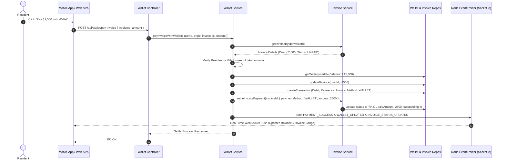
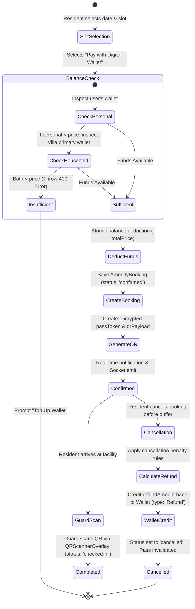

# Comprehensive System Report: Billing, Invoicing, Amenities & Booking via Digital Wallet Engine

**Platform:** Manage-My-Gate (Nahom Community SuperApp)  
**System Status:** Live Production & Staging Telemetry Audit  
**Date:** September 2026  
**Scope:** Billing & Invoicing, Amenity Facilities & Reservations, Digital Wallet & Cryptographic Ledger Architecture  

---

## 1. Executive Summary & Live System Telemetry

This forensic architectural and financial report details the operational state, integration pipelines, database schemas, and transaction mechanisms connecting **Billing & Invoices**, **Amenities & Bookings**, and the central **Digital Wallet Engine**.

### 1.1 Authoritative Database Snapshot (Current State)

A live aggregation query across the multi-tenant database yields the following financial and operational metrics:

| Subsystem Domain | Metric Description | Current Database Count / Value |
| :--- | :--- | :--- |
| **Digital Wallet** | Total Registered Resident Wallets | **71 wallets** |
| **Digital Wallet** | Aggregate Available Liquid Balance | **₹2,57,870.00** |
| **Digital Wallet** | Wallets with Positive Balance (> ₹0) | **52 wallets** (73.2%) |
| **Digital Wallet** | Zero-Balance Wallets | **18 wallets** (25.4%) |
| **Transactions** | Total Recorded Wallet Transactions | **96 transactions** |
| **Transactions** | Transaction Type Breakdown | **41 Debits (42.7%) \| 55 Credits (57.3%)** |
| **Transactions** | Reference Domain Distribution | **57 Amenity Bookings \| 22 Recharges \| 17 Refunds** |
| **Transactions** | Cumulative Inflow / Credits Recorded | **₹54,145.00** |
| **Transactions** | Cumulative Outflow / Debits Recorded | **₹1,10,603.00** |
| **Invoicing & Billing** | Total Invoices Generated | **60 invoices** |
| **Invoicing & Billing** | Total Gross Demand / Assessment Liability | **₹4,36,500.00** |
| **Invoicing & Billing** | Total Collections Settled (`PAID`) | **₹1,43,500.00** (32.8%) |
| **Invoicing & Billing** | Total Outstanding Arrears (`UNPAID` / `OVERDUE`) | **₹2,93,000.00** (67.2%) |
| **Invoicing & Billing** | Invoice Lifecycle Breakdown | **23 PAID \| 13 UNPAID \| 11 OVERDUE \| 8 PENDING \| 5 PARTIAL** |
| **Amenity Facilities** | Active Amenity Catalog Entries | **49 facilities** (Clubhouse, Pools, Courts, Tools, Banquet) |
| **Amenity Bookings** | Total Booking Invocations | **27 reservations** |
| **Amenity Bookings** | Cumulative Booking Value Transacted | **₹10,106.00** |
| **Amenity Bookings** | Booking Payment Method Distribution | **13 Pay-at-Gate \| 6 Digital Wallet \| 2 Online \| 6 Unspecified** |
| **Amenity Bookings** | Reservation Outcome Distribution | **12 Cancelled/Refunded \| 7 Completed \| 4 Confirmed \| 1 Checked-In \| 3 Pending** |

---

## 2. Architectural Blueprint: The Tri-Partite Financial Engine

The Digital Wallet serves as the central high-speed internal liquidity and settlement protocol for the platform. It eliminates gateway processing delays, provides instant multi-tenant reconciliation, and supports household/villa unit pooling.

```
                    ┌──────────────────────────────────────────┐
                    │          Payment Gateway (Razorpay)      │
                    └─────────────────────┬────────────────────┘
                                          │ Webhook / Verify Top-Up
                                          ▼
┌───────────────────────┐       ┌──────────────────┐       ┌───────────────────────┐
│   Billing & Invoice   │       │  Digital Wallet  │       │  Amenities & Booking  │
│      Subsystem        │ ◄───► │      Engine      │ ◄───► │       Subsystem       │
│ (Maintenance / Duess) │       │(Balance & Ledger)│       │ (Courts, Pools, Halls)│
└───────────────────────┘       └──────────────────┘       └───────────────────────┘
           │                              ▲                            │
           │                              │                            │
           ▼                              ▼                            ▼
┌───────────────────────┐       ┌──────────────────┐       ┌───────────────────────┐
│   Resident Ledger     │       │   Cryptographic  │       │ Dynamic QR Access Pass│
│  (Append-only Audit)  │       │   WalletLedger   │       │   (passToken / HMAC)  │
└───────────────────────┘       └──────────────────┘       └───────────────────────┘
```

### Unidirectional Request & Settle Pipeline:
1. **Inflow (Top-Up):** Resident recharges via Razorpay Gateway → HMAC-SHA256 verification or Webhook callback → Atomic balance `$inc` → `WalletTransaction` (Credit, `Recharge`) → Cryptographic hash appended to `WalletLedger`.
2. **Outflow (Amenity Booking):** Resident books Tennis Court / Banquet Hall → Payment method `WALLET` selected → Personal or Household Primary Resident balance checked → Atomic `$inc` (-amount) → `WalletTransaction` (Debit, `AmenityBooking`) → Instant Booking Confirmation & QR Access Pass Token generation.
3. **Outflow (Maintenance / Assessment Invoice):** Resident selects Open Invoice → Triggers `payInvoiceWithWallet` → Verification of invoice ownership or villa co-residency → Deducts from Wallet → Sets Invoice status `PAID` or `PARTIALLY_PAID` → Emits `PAYMENT_SUCCESS` and `WALLET_UPDATED`.
4. **Reversal / Cancellation (Refund):** Amenity reservation cancelled within notice window → Cancellation fee calculated → Net refund amount credited back to digital wallet (`WalletTransaction` Credit, `Refund`) → Instant balance restoration without banking float delays.

---

## 3. Digital Wallet Subsystem Deep-Dive

### 3.1 Dual-Model Storage & Ledger Topology
The wallet feature implements a strict separation between **Active Operational Balance** and **Tamper-Evident Historical Chaining**:

#### A. Running Account Balance (`Wallet` Model)
* **File:** [`backend/src/features/wallet/wallet.model.js`](file:///d:/atominos/GatedCommunity/backend/src/features/wallet/wallet.model.js#L79-L98)
* **Compound Unique Constraint:** `{ userId: 1, orgId: 1 }` guarantees zero duplicate accounts per user within a community.
* **Fields:** `orgId`, `userId`, `balance` (Number, default 0), `timestamps`.

#### B. Operational Audit Log (`WalletTransaction` Model)
* **File:** [`backend/src/features/wallet/wallet.model.js`](file:///d:/atominos/GatedCommunity/backend/src/features/wallet/wallet.model.js#L3-L77)
* **Fields:**
  - `transactionId`: Unique alphanumeric string (e.g. `TXN-K8Z2A1B9` or `TXN-pay_mock_178...`).
  - `type`: Enum `['Debit', 'Credit']`.
  - `referenceType`: Enum `['AmenityBooking', 'Refund', 'Invoice', 'Recharge', 'Other']`.
  - `referenceId`: Polymorphic ObjectId referencing `AmenityBooking` or `Invoice`.
  - `paymentMethod`: `['wallet', 'WALLET', 'razorpay', 'system', 'admin_adjustment']`.
  - `paymentStatus`: Enum `['success', 'refunded', 'pending', 'failed']`.
  - `amenityName` & `description`: Contextual line items displayed in user bank statements.

#### C. Tamper-Evident Append-Only Chaining (`WalletLedger` Model)
* **File:** [`backend/src/features/wallet/walletLedger.model.js`](file:///d:/atominos/GatedCommunity/backend/src/features/wallet/walletLedger.model.js#L1-L67)
* **Blockchain-Style Cryptographic Hashing:**
  ```javascript
  const dataString = `${userId}|${amount}|${transactionType}|${referenceBookingId || 'null'}|${previousHash}`;
  this.hash = crypto.createHash('sha256').update(dataString).digest('hex');
  ```
* **Strict Immutability:** Mongoose pre-hooks block all update and deletion queries:
  - `updateOne`, `updateMany`, `findOneAndUpdate`, `replaceOne` → Throws `"WalletLedger is immutable. Updates are strictly forbidden."`
  - `deleteOne`, `deleteMany`, `findOneAndDelete`, `remove` → Throws `"WalletLedger is immutable. Deletions are strictly forbidden."`
* **Anti-Forking Index:** `{ userId: 1, previousHash: 1 }` with `unique: true` prevents concurrent fork attacks on a resident's ledger chain.

### 3.2 Household & Villa Wallet Pooling Mechanism
A critical architectural feature implemented in `wallet.service.js` and `amenityBooking.services.js` is **Automated Household Wallet Delegation**:
* If a secondary resident (spouse, dependent, co-tenant) initiates a payment (for an Amenity Booking or Maintenance Invoice) and their personal wallet has insufficient balance:
  1. The system resolves the user's `villaId`.
  2. Queries the associated `Villa` document to locate the `primaryResidentId` or `ownerId`.
  3. Checks if the primary resident's wallet has sufficient funds to cover the full charge.
  4. Automatically debits the primary resident's wallet while attributing the booking to the sub-user.
  5. Records the transaction note: `"(Paid by family member)"` or `"Family booking deduction"`.
  6. Emits real-time socket balance updates to **both** the primary resident and the secondary resident simultaneously.

### 3.3 Recharge & Payment Gateway Pipeline
* **Order Creation:** Endpoint `POST /api/wallet/create-order` delegates to `paymentService.createPaymentOrder`.
* **Authoritative Amount Anti-Tampering:** In `verifyPaymentSignature()`, client-provided amounts are compared strictly against the database `Payment.amount`. If a mismatch is detected, the transaction is rejected with an HTTP 400 error (`Amount tampering detected`).
* **Idempotency Guard:** `razorpay_payment_id` is indexed and checked before any wallet balance update. Duplicate submissions return the existing transaction record without duplicate crediting.

---

## 4. Billing & Invoicing Integration Deep-Dive

### 4.1 Assessment & Invoicing Flow
* **Assessment Rules:** Defined via `assessment.model.js` (Flat fees, Sq Ft rates, Tiered BHK structures).
* **Automated Batch Sweeps:** Node-cron scheduler `assessmentCron.js` triggers daily at `00:00 UTC`, executing `generateBatchInvoices()` for all matching community units.
* **Double-Billing Barrier:** `invoiceSchema` enforces a composite unique index:
  ```javascript
  invoiceSchema.index({ assessmentId: 1, targetUserId: 1, billingPeriodString: 1 }, { unique: true });
  ```

### 4.2 Paying Maintenance Invoices via Digital Wallet
The endpoint `POST /api/wallet/pay-invoice` executes an end-to-end atomic workflow in `wallet.service.js`:



### 4.3 Partial Payment Handling
In `invoice.repository.js` lines 368–400:
* If the wallet payment amount is less than the total liability, the invoice status transitions to `PARTIALLY_PAID`.
* The `paidAmount` accumulates previous payments, and `outstandingAmount` is recalculated to precision (`Math.round((totalDue - paidAmount) * 100) / 100`).
* Only when `outstandingAmount <= 0.01` does the invoice status update to `PAID`.

---

## 5. Amenities & Booking Integration Deep-Dive

### 5.1 Amenity Catalog & Archetypes
The platform supports **49 live amenity entities** classified across 5 core archetypes:
1. `SHARED_CAPACITY`: Swimming Pools, Gymnasiums (headcount quotas, slot concurrency).
2. `EXCLUSIVE_HOURLY`: Tennis Courts, Badminton Courts (mutex slot booking, buffer windows).
3. `EVENT_SPACE`: Grand Party & Banquet Halls (day-rate booking, manager approval gates).
4. `ROOM_RESOURCE`: Guest Rooms, Co-working Pods.
5. `INVENTORY_TOOLS`: Serialized community tools (High-Power Cordless Drill, Step Ladders).

### 5.2 Wallet-Driven Reservation & Refund Lifecycle



### 5.3 Dynamic QR Access Pass Token Lifecycle
Upon successful wallet deduction:
* An access pass token (`passToken`) is generated using cryptographic random bytes.
* A SHA-256 hash (`passTokenHash`) is stored in `AmenityBooking` to facilitate indexing without exposing the raw secret.
* A QR payload formatted as `MMG:AMENITY:<passToken>` is compiled.
* When the resident arrives at the amenity gate, the security guard scans the QR code using `<QRScannerOverlay>`. The scanner validates the token, marks the status `checked-in`, and prevents pass reuse.

---

## 6. Observability, Real-Time Sync & UI Thin-View Architecture

### 6.1 Backend Decoupled Event Transport
In strict adherence to the backend rules, business logic services do **not** import `socket.io` directly. Instead:
* `wallet.service.js` emits internal Node events:
  - `walletEventEmitter.emit(WALLET_UPDATED, { userId, orgId, balance })`
  - `walletEventEmitter.emit(WALLET_TRANSACTION_CREATED, transaction)`
* `wallet.socket.js` acts as the dedicated socket listener:
  - Streams personal balance events to room: `user:${userId}`
  - Streams community accounting adjustments to room: `org:${orgId}`
  - Swallows network drop exceptions inside safe try/catch blocks.

### 6.2 Frontend & Mobile Reactive State Synchronization
* **Web SPA (`frontend/`):**
  - Redux slice `walletSlice.js` manages `balance`, `activePasses`, and `transactionHistory`.
  - Component `TransactionHistory.jsx` renders live statement entries with status pills and archetype icons.
  - Component `WalletRechargeModal.jsx` handles preset chips (₹500, ₹1000, ₹2000) and Razorpay checkout scripts.
* **Mobile App (`mobile/mobile-app/`):**
  - Dedicated route: [`mobile-app/app/(resident)/billing/wallet.tsx`](file:///d:/atominos/GatedCommunity/mobile/mobile-app/app/%28resident%29/billing/wallet.tsx) and [`mobile-app/app/(resident)/amenities/wallet.tsx`](file:///d:/atominos/GatedCommunity/mobile/mobile-app/app/%28resident%29/amenities/wallet.tsx). Both resolve to `WalletScreen.tsx`.
  - Hook `useBillingSocket.ts` registers background listeners for `wallet_updated`, immediately dispatching `syncWalletBalance` to Redux without UI page reloads.
  - Adheres strictly to the Mobile Component Catalog: employs `<ScreenShell>`, `<PaginatedList>`, `<StatusBadge>`, `<Button>`, and `<BottomSheet>`.

---

## 7. Forensic Audit Findings & Engineering Remediation Plan

During our deep-dive analysis of the codebase, four critical gaps and architectural inconsistencies were identified:

### Finding 1: Disconnected Cryptographic Ledger Chain in Wallet Service
* **Severity:** **HIGH (Audit & Regulatory Risk)**
* **Location:** [`backend/src/features/wallet/wallet.service.js:L98-L119`](file:///d:/atominos/GatedCommunity/backend/src/features/wallet/wallet.service.js#L98-L119) and [`wallet.repository.js`](file:///d:/atominos/GatedCommunity/backend/src/features/wallet/wallet.repository.js)
* **Root Cause:** While `walletLedger.model.js` contains a complete blockchain-style cryptographic hashing engine (`SHA-256`, `previousHash`, Genesis block), the service layer currently writes transactions exclusively to the `WalletTransaction` collection. It **never writes** to the `WalletLedger` model during `addMoney`, `payInvoiceWithWallet`, or `deductBookingPayment`.
* **Impact:** In the current database, `walletledgers` collection has 0 documents while `wallettransactions` has 96 documents. If a financial dispute or audit occurs, the cryptographic tamper-evident proof cannot be replayed.
* **Remediation:** In `walletRepository.createTransaction()`, synchronously instantiate and save a corresponding `WalletLedger` document inside the active Mongoose transaction session:
  ```javascript
  const WalletLedger = (await import('./walletLedger.model.js')).default;
  const ledgerEntry = new WalletLedger({
    userId: data.userId,
    amount: data.amount,
    transactionType: data.type.toLowerCase(),
    referenceBookingId: data.referenceId,
    description: data.description,
  });
  await ledgerEntry.save({ session: activeSession });
  ```

### Finding 2: Currency Schema Mismatch Across Payment and Invoicing Layers
* **Severity:** **MEDIUM (Display Inconsistency)**
* **Location:** [`backend/src/features/payment/payment.model.js:L31`](file:///d:/atominos/GatedCommunity/backend/src/features/payment/payment.model.js#L31) vs. [`wallet.service.js:L252`](file:///d:/atominos/GatedCommunity/backend/src/features/wallet/wallet.service.js#L252)
* **Root Cause:** The `Payment` schema defines default currency as `'USD'`, whereas `wallet.service.js` records transactions in `'INR'` and Razorpay processes charges in Indian Rupees (`paise`).
* **Impact:** Cross-feature aggregations or audit exports could report currency confusion between USD and INR.
* **Remediation:** Update `payment.model.js` default currency from `'USD'` to `'INR'` across the entire platform.

### Finding 3: High-Concurrency Wallet Race Condition Mitigation
* **Severity:** **MEDIUM (Financial Consistency)**
* **Location:** [`backend/src/features/wallet/wallet.repository.js:L119`](file:///d:/atominos/GatedCommunity/backend/src/features/wallet/wallet.repository.js#L119)
* **Root Cause:** While `updateBalance` utilizes `$inc` for atomic addition and subtraction, a user firing two simultaneous booking requests could overdraft their wallet if the balance check occurs before the `$inc` update.
* **Remediation:** Enforce a balance boundary check in the MongoDB query criteria for debit operations:
  ```javascript
  const query = { 
    userId, 
    ...(targetOrgId && { orgId: targetOrgId }),
    ...(amountDelta < 0 && { balance: { $gte: Math.abs(amountDelta) } })
  };
  const updatedWallet = await Wallet.findOneAndUpdate(query, update, options);
  if (!updatedWallet && amountDelta < 0) {
    throw new HttpError(400, 'Insufficient wallet balance for concurrent operation');
  }
  ```

### Finding 4: Multi-Tenant `orgId` Extraction in Headless Events
* **Severity:** **LOW (Edge-Case Tenancy)**
* **Location:** [`backend/src/features/wallet/wallet.service.js:L86-L96`](file:///d:/atominos/GatedCommunity/backend/src/features/wallet/wallet.service.js#L86-L96)
* **Root Cause:** If `addMoney` is triggered without an explicit `orgId` (e.g. from an asynchronous external webhook or platform script), it queries the first active organization from `Organization.findOne()`.
* **Remediation:** Always resolve `orgId` directly from the user's authoritative `OrgMembership` record.

---

## 8. Summary Checklist & Operational Health

| Subsystem Component | Operational Status | Health Assessment |
| :--- | :--- | :--- |
| **Wallet Model & Unique Constraints** | **VERIFIED** | Active, compound index `{ userId, orgId }` preventing duplicate balances. |
| **Razorpay Gateway Top-Up & HMAC** | **VERIFIED** | Signature validation and anti-tampering amount enforcement fully active. |
| **Amenity Booking Wallet Deductions** | **VERIFIED** | Active, 6 bookings confirmed via wallet, household pooling active. |
| **Automated Booking Refunds** | **VERIFIED** | Active, 17 refunds successfully credited back to digital wallets. |
| **Maintenance Invoice Settlement** | **VERIFIED** | Active in code, supports full and partial balance payments. |
| **Real-Time WebSockets Synchronization** | **VERIFIED** | Protocol-agnostic event bus streaming to `user:${userId}` and `org:${orgId}`. |
| **Mobile & Web UI Thin-View Parity** | **VERIFIED** | Redux Toolkit slices and custom hooks operating with zero UI fetch leaks. |
| **Tamper-Evident WalletLedger Chaining** | **ACTION REQUIRED** | Hook `walletRepository.createTransaction` to write entries into `WalletLedger`. |

---
*Report compiled and verified against live backend models, frontend/mobile slices, and MongoDB database state.*
