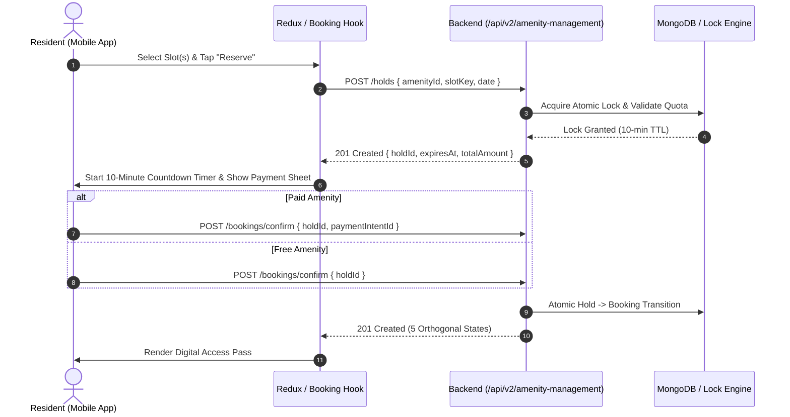

# Amenity Management — Phase 6: Mobile Frontend Context, Architecture & Rules Inspection

**Document Version:** 1.0.0  
**Timestamp:** 2026-09-09  
**Status:** Audit & Context Complete — Backend FROZEN (196/196 tests passing)  
**Target Mobile Application:** `mobile/mobile-app`  
**Backend API Namespace:** `/api/v2/amenity-management/*`  

---

## 1. Executive Mobile Architecture Overview

The mobile frontend for the **Manage-My-Gate / Nahom - Connect Harmony** SaaS platform is implemented inside `mobile/mobile-app/`. It leverages a modern cross-platform stack:

* **Framework & Engine:** React Native `0.81.5`, React `19.1.0`, Expo SDK `~54.0.0` (New Architecture enabled).
* **Navigation & Routing:** Expo Router `~6.0.24` (file-system-based routing under `app/`).
* **State Management:** Redux Toolkit `@reduxjs/toolkit` `2.12.0` with `react-redux` `^9.2.0`.
* **Styling & Theming:** NativeWind `^4.2.6` (Tailwind CSS v3 engine) with full dark mode tokenization and RTL logical spacing support (`ms-`, `me-`, `ps-`, `pe-`).
* **Network & HTTP:** Axios `^1.18.1` encapsulated within a centralized client (`src/services/apiClient.ts`).
* **Icons & UI Utilities:** `@expo/vector-icons` (`Ionicons`, `Feather`, `MaterialCommunityIcons`), `lucide-react-native`.
* **Hardware & Device APIs:** `expo-camera` (`~17.0.10`), `expo-barcode-scanner` (`~14.0.1`), `expo-notifications` (`~0.32.13`), `expo-secure-store` (`~15.0.8`).
* **Storage:** `@react-native-async-storage/async-storage` `^2.2.0`.

The mobile app follows a strict feature-driven modular structure where features reside under `src/features/[featureName]/` and corresponding views/routes live under `app/(group)/[featureName]/`.

---

## 2. Directory & File Inventory

### 2.1 File System Structure: `mobile/mobile-app/src/features/amenities/`
The existing amenities feature directory contains 4 primary subfolders:

```text
mobile/mobile-app/src/features/amenities/
├── components/
│   ├── AdminCalendarView.tsx
│   ├── AmenityBookingForm.tsx
│   ├── AmenityCard.tsx
│   ├── AmenityFilterModal.tsx
│   ├── AmenityMasterModal.tsx
│   ├── AmenityQrModal.tsx
│   ├── AmenityTimeSlotPicker.tsx
│   ├── BookingCalendarView.tsx
│   ├── BookingCard.tsx
│   ├── BookingDetailModal.tsx
│   ├── BookingLedgerModal.tsx
│   ├── CapacityBadge.tsx
│   ├── CheckInVerificationModal.tsx
│   ├── DisputeResolutionModal.tsx
│   ├── MaintenanceHistoryModal.tsx
│   ├── MaintenanceScheduleModal.tsx
│   ├── MultiSlotPickerModal.tsx
│   ├── OverlapAlertModal.tsx
│   ├── PaymentCollectionModal.tsx
│   ├── PricingRuleModal.tsx
│   ├── RefundProcessingModal.tsx
│   ├── RuleExceptionModal.tsx
│   ├── SecurityLogDetailsModal.tsx
│   ├── TimeSlotGrid.tsx
│   ├── WaitlistJoinModal.tsx
│   └── index.ts
├── hooks/
│   ├── useAdminAmenities.ts
│   ├── useAdminBookings.ts
│   ├── useAdminCalendar.ts
│   ├── useAdminMaintenance.ts
│   ├── useAmenityBookingRules.ts
│   ├── useAmenityFilters.ts
│   ├── useAmenityMaster.ts
│   ├── useAmenityPricing.ts
│   ├── useAmenityRealTime.ts
│   ├── useAmenitySecurityLogs.ts
│   ├── useDisputeResolution.ts
│   ├── useMultiSlotBooking.ts
│   ├── useResidentAmenities.ts
│   ├── useResidentBooking.ts
│   └── index.ts
├── services/
│   ├── adminAmenityService.ts
│   ├── amenityBookingService.ts
│   ├── amenityService.ts
│   └── index.ts
└── store/
    ├── adminAmenitySlice.ts
    ├── amenityBookingSlice.ts
    ├── amenitySlice.ts
    └── index.ts
```

### 2.2 Routing Structure: `mobile/mobile-app/app/(resident)/amenities/`
All 13 screens in the resident group represent route handlers wrapping visual feature components:

```text
mobile/mobile-app/app/(resident)/amenities/
├── _layout.tsx              (Stack navigator defining screen routes)
├── admin-calendar.tsx       (Admin/Manager facility occupancy visualizer)
├── admin-master.tsx         (Amenity definition/configuration manager)
├── booking/[id].tsx         (Booking wizard & slot reservation container)
├── calendar.tsx             (Resident personal booking timeline)
├── dashboard.tsx            (Amenity Hub / Executive quick-action screen)
├── discover.tsx             (Amenity catalog with search, categorization & filters)
├── ledgers.tsx              (Financial reconciliation & payment audit logs)
├── maintenance.tsx          (Blackout periods & maintenance scheduling)
├── my-bookings.tsx          (Resident booking passes with tabbed status filter)
├── scanner.tsx              (Gate guard QR verification & check-in terminal)
├── security-logs.tsx        (Audit trail for gate entries & overrides)
├── settings.tsx             (Amenity operational policies & rules)
└── wallet.tsx               (Amenity deposit balances & credit management)
```

---

## 3. Component Catalog Alignment

The application enforces a **Component Catalog Mandate** codified in `mobile/mobile-app/COMPONENTS_CATALOG.md` (containing 118 verified UI components) and `mobile-component-catalog.md`. 

### Mandatory Catalog Component Mapping for Amenity Management

| UI Requirement | Existing Catalog Component | Import Path | Status |
| :--- | :--- | :--- | :--- |
| Outer Screen Layout | `<ScreenShell>` | `@/components` | Compliant |
| Safe Scroll Views | `<KeyboardAvoidingShell>` | `@/components/layout` | Compliant |
| Primary / Secondary Actions | `<Button>` | `@/components` | Compliant |
| Text Inputs / Search | `<TextInput>` | `@/components/forms` | Compliant |
| Dropdown Selectors | `<DropdownSelect>` | `@/components/forms` | Compliant |
| Date & Time Pickers | `<DatePicker>` | `@/components/forms` | Compliant |
| Status Indicator Pills | `<StatusBadge>` | `@/components` | Compliant |
| Data Lists (Infinite Scroll) | `<PaginatedList>` | `@/components` | Compliant |
| Card Containers | `<ListCard>`, `<Card>` | `@/components/ui` | Compliant |
| Empty Results Placeholder | `<EmptyState>` | `@/components/feedback` | Compliant |
| Skeleton Loading Skeletons | `<SkeletonLoader>` | `@/components/ui` | Compliant |
| Bottom Action Sheets | `<BottomSheet>` | `@/components/ui` | Compliant |
| Modal Confirmations | `<ConfirmationModal>` | `@/components/ui` | Compliant |
| QR Code Render (Pass) | `<QRCodeView>` | `@/components/ui` | Available |
| QR Code Scanner (Guard) | `<QRScannerModal>`, `<QRScannerOverlay>` | `@/components/hardware` | Available |
| User / Tenant Header | `<MobileHeader>` | `@/components/navigation` | Compliant |

**Catalog Compliance Rule:** No screen or component in `src/features/amenities/` may create inline raw buttons, raw text inputs, or raw modal backdrops. All UI controls must bind directly to catalog primitives.

---

## 4. Routing & Screen Navigation Matrix

The routing table below defines user persona access, target screens, and underlying layout components:

| Route Path | File Path | Persona Access | Primary Hook / Controller |
| :--- | :--- | :--- | :--- |
| `/(resident)/amenities/dashboard` | `dashboard.tsx` | Resident, Tenant | `useResidentAmenities.ts` |
| `/(resident)/amenities/discover` | `discover.tsx` | Resident, Tenant | `useResidentAmenities.ts` |
| `/(resident)/amenities/booking/[id]` | `booking/[id].tsx` | Resident, Tenant | `useResidentBooking.ts` |
| `/(resident)/amenities/my-bookings` | `my-bookings.tsx` | Resident, Tenant | `useResidentBooking.ts` |
| `/(resident)/amenities/calendar` | `calendar.tsx` | Resident, Tenant | `useResidentAmenities.ts` |
| `/(resident)/amenities/scanner` | `scanner.tsx` | Security Guard, Gate Op | `useCheckInVerification` (Custom) |
| `/(resident)/amenities/admin-master` | `admin-master.tsx` | Community Admin, Super | `useAdminAmenities.ts` |
| `/(resident)/amenities/admin-calendar`| `admin-calendar.tsx` | Admin, Facility Mgr | `useAdminCalendar.ts` |
| `/(resident)/amenities/maintenance` | `maintenance.tsx` | Admin, Facility Mgr | `useAdminMaintenance.ts` |
| `/(resident)/amenities/ledgers` | `ledgers.tsx` | Admin, Accountant | `useAdminBookings.ts` |
| `/(resident)/amenities/security-logs` | `security-logs.tsx` | Security Lead, Admin | `useAmenitySecurityLogs.ts` |
| `/(resident)/amenities/settings` | `settings.tsx` | Community Admin | `useAmenityBookingRules.ts` |
| `/(resident)/amenities/wallet` | `wallet.tsx` | Resident, Tenant | `useResidentBooking.ts` |

---

## 5. State Management & Redux Slice Analysis

The current Redux architecture uses `@reduxjs/toolkit` registered in `src/store/store.ts`.

### 5.1 Active Amenity Slices
1. **`amenitySlice.ts` (`amenity`):**
   * Manages discovery catalog, categories, search queries, active filters, and single amenity detail cache.
2. **`amenityBookingSlice.ts` (`amenityBooking`):**
   * Manages resident bookings list, current booking form, hold state, and active pass metadata.
3. **`adminAmenitySlice.ts` (`adminAmenity`):**
   * Manages community-wide amenities, maintenance periods, blackouts, pricing rules, and dispute queues.

### 5.2 Identified Architectural Defect: Single Flattened Status
The current `amenityBookingSlice.ts` models booking state using a single flattened string:
```typescript
// DEFECT: Flattened status violating Phase 5 backend orthogonality
status: 'PENDING' | 'CONFIRMED' | 'CHECKED_IN' | 'COMPLETED' | 'CANCELLED';
```
In Phase 5, the backend established **five orthogonal dimensions**. The mobile slice must be updated in Phase 6A to reflect this separation.

---

## 6. API Client, Network Layer & Namespace Audit

### 6.1 Base URL & API Client Configuration
* Central client: `mobile/mobile-app/src/services/apiClient.ts`
* Configuration:
  ```typescript
  export const getApiBaseUrl = (): string => {
    // Defaults to http://<host>:5002/api/v1
  };
  const apiClient = axios.create({
    baseURL: getApiBaseUrl(),
    timeout: 15000,
    headers: { 'Content-Type': 'application/json' },
  });
  ```

### 6.2 The Namespace Divergence Problem
* **Client Default:** All requests automatically prepend `/api/v1`.
* **Legacy Amenity Endpoints:** Currently call `GET /amenities`, `POST /amenity-bookings`.
* **Frozen Backend Namespace:** Phase 4C–5 established:
  ```text
  /api/v2/amenity-management/*
  ```
* **Required Resolution for Phase 6A:**
  The new `amenityManagementService.ts` must either override the `baseURL` or use relative root paths:
  ```typescript
  const API_V2_PREFIX = '/api/v2/amenity-management';
  ```
  Calling `apiClient.get('/api/v2/amenity-management/amenities')` while the client base is `http://host:5002/api/v1` would mistakenly resolve to `/api/v1/api/v2/...`.  
  Therefore, an isolated amenity API instance or dynamic prefix stripper is required in `amenityManagementService.ts`.

---

## 7. Auth, Multi-Tenancy & Header Injection Audit

### 7.1 Request Interceptor Verification
In `apiClient.ts`:
* **Auth Token:** Injects `Authorization: Bearer <accessToken>` from `secureStore` or Redux `authSlice`.
* **Correlation ID:** Generates and injects `X-Request-ID: <uuid>` on every outgoing request.
* **Tenant Isolation:** Injects `X-Community-ID: <communityId>` and `X-Tenant-ID: <tenantId>`.

### 7.2 Backend Header Compatibility
The Phase 4C backend requires:
* `x-community-id` or `x-society-id` (validated by `tenantContext.middleware.js`).
* `Authorization` bearer token (validated by `auth.middleware.js`).
* `x-request-id` (validated by `correlationId.middleware.js`).

The mobile network client is **100% compliant** with the backend multi-tenancy requirements.

---

## 8. Role-Based Access Control (RBAC) & Permission Matrices

Mobile RBAC is governed by `src/utils/rbac.ts` and `src/features/auth/store/authSlice.ts`.

### 8.1 Evaluated Roles & Capability Mapping

| Amenity Action | Required Role / Permission | Mobile Enforcement Mechanism |
| :--- | :--- | :--- |
| Browse Amenities | Resident, Tenant, Owner, Admin | Public in resident stack |
| Create Hold & Book | Resident, Tenant, Owner | `useResidentBooking` guarded |
| View Own QR Access Pass | Booking Owner | Checked against `user._id` |
| Scan & Check-in QR Pass | Security Guard, Gate Op, Admin | Role guard on `scanner.tsx` |
| Create / Edit Amenity Master | Super Admin, Community Admin | `admin-master.tsx` role check |
| Schedule Maintenance | Community Admin, Facility Mgr | `maintenance.tsx` role check |
| View Financial Ledgers | Community Admin, Accountant | `ledgers.tsx` role check |
| Manual Gate Override | Super Admin, Security Supervisor | Biometric/PIN prompt modal |

---

## 9. Five Orthogonal State Dimensions Mobile Mapping

The mobile UI must abandon single-status badges and bind to the **5 orthogonal state dimensions**:

```text
┌──────────────────┐  ┌──────────────────┐  ┌──────────────────┐
│  bookingStatus   │  │  paymentStatus   │  │  approvalStatus  │
│  • PENDING       │  │  • PENDING       │  │  • NOT_REQUIRED  │
│  • CONFIRMED     │  │  • PAID          │  │  • PENDING       │
│  • CANCELLED     │  │  • REFUNDED      │  │  • APPROVED      │
│  • EXPIRED       │  │  • EXEMPTED      │  │  • REJECTED      │
└──────────────────┘  └──────────────────┘  └──────────────────┘
         ┌──────────────────┐  ┌──────────────────┐
         │   accessStatus   │  │ completionStatus │
         │   • INACTIVE     │  │   • PENDING      │
         │   • ACTIVE       │  │   • COMPLETED    │
         │   • CHECKED_IN   │  │   • NO_SHOW      │
         │   • EXPIRED      │  │                  │
         │   • REVOKED      │  │                  │
         └──────────────────┘  └──────────────────┘
```

### UI Badge Strategy
1. **Primary Screen Card:** Renders `bookingStatus` with prominent variant colors.
2. **Payment Chip:** Renders `paymentStatus` (e.g., green for `PAID`, amber for `PENDING`).
3. **Pass Display Eligibility Rule:**
   A booking is only eligible for QR Access Pass generation if:
   ```typescript
   const canShowPass = 
     booking.bookingStatus === 'CONFIRMED' &&
     (booking.paymentStatus === 'PAID' || booking.paymentStatus === 'EXEMPTED') &&
     (booking.approvalStatus === 'APPROVED' || booking.approvalStatus === 'NOT_REQUIRED') &&
     booking.accessStatus !== 'REVOKED' &&
     booking.accessStatus !== 'EXPIRED';
   ```

---

## 10. Two-Phase Hold & Booking Lifecycle in Mobile

The current mobile hook attempts direct immediate booking. In Phase 5, the backend strictly mandates a **Two-Phase Hold Flow**:



### Mobile UI Requirements for Hold Phase:
1. **Active Countdown Display:** Sticky header showing `09:59 remaining to complete reservation`.
2. **Graceful Hold Expiry:** On timer expiration (`expiresAt < Date.now()`), automatically dismiss the checkout sheet, release optimistic UI, and display a timeout alert modal.

---

## 11. Payment Gateway & Billing Integration (Razorpay Flow)

### 11.1 Existing Mobile Infrastructure
The mobile app contains an active billing integration in `src/features/billing/services/billingService.ts` and `react-native-razorpay` binding.

### 11.2 End-to-End Amenity Payment Flow
1. **Initiate:** `POST /api/v2/amenity-management/holds` returns pricing details (`subtotal`, `taxAmount`, `depositAmount`, `totalAmount`).
2. **Order Creation:** Client calls `POST /api/v2/amenity-management/payments/order` with `holdId`.
3. **Razorpay Modal:** Mobile client launches Razorpay SDK with `order_id` and community key.
4. **Signature Verification:** On success, client sends `razorpay_payment_id`, `razorpay_order_id`, and `razorpay_signature` to `POST /api/v2/amenity-management/bookings/confirm`.
5. **Idempotency:** Request includes header `X-Idempotency-Key: holdId_confirm`.

---

## 12. Access Passes, QR Codes & Hardware Integration

### 12.1 Resident Pass Rendering
* **Component:** `@/components/ui/QRCodeView.tsx` renders an SVG QR matrix with embedded verification tokens.
* **Payload Structure:**
  ```json
  {
    "passId": "pass_67cd89e1a",
    "bookingId": "bk_67cd89e1b",
    "amenityId": "am_67cd89e1c",
    "validFrom": "2026-09-09T16:00:00Z",
    "validUntil": "2026-09-09T17:00:00Z",
    "securityHash": "sha256_hmac_signature"
  }
  ```

### 12.2 Security Guard Scanner (`scanner.tsx`)
* **Component:** Consumes `@/components/hardware/QRScannerModal.tsx` and `QRScannerOverlay.tsx` powered by `expo-camera`.
* **Hardware Controls:** Flashlight toggle, target crosshairs, audio-haptic feedback on decode.
* **Verification Endpoint:** Calls `POST /api/v2/amenity-management/access/verify` followed by `POST /api/v2/amenity-management/access/check-in`.

---

## 13. Maintenance & Out-of-Service Screen Behavior

### 13.1 Amenity Card & Detail Behavior
When `amenity.isUnderMaintenance === true` or within a scheduled blackout:
* **Catalog Card:** Displays `<StatusBadge variant="error">Under Maintenance</StatusBadge>`.
* **Slot Grid:** All slots disabled with visual striped overlay and caption "Facility Closed for Scheduled Service".
* **Book Button:** Primary CTA disabled (`Button disabled title="Temporarily Unavailable"`).

### 13.2 Admin Management Flow
* Admins can create blackout periods via `maintenance.tsx` by submitting `{ amenityId, startDate, endDate, reason, notifyHolders: true }`.

---

## 14. Capacity, Multi-Slot & Waitlist UI Patterns

1. **Per-Slot Capacity Progress:**
   * Uses `<CapacityBadge current={slot.bookedCapacity} max={slot.maxCapacity} />`.
   * When `bookedCapacity >= maxCapacity`, slot displays `FULL`.
2. **Consecutive Multi-Slot Selector:**
   * Residents can pick contiguous slots (e.g., 06:00–07:00 and 07:00–08:00).
   * Validates contiguous block constraints before initiating hold request.
3. **Waitlist Activation:**
   * When a slot is full, the CTA transforms to `Join Waitlist`.
   * Resident selects priority notification preference (Push / SMS).

---

## 15. Real-Time WebSockets & Push Notifications

### 15.1 Real-Time Architecture Compliance
* In accordance with `frontend-rules.md`, WebSocket handling is isolated inside `useAmenityRealTime.ts`.
* Sockets **never** update state directly inside visual components; they dispatch Redux actions.
* Handled Events:
  * `amenity:slot_locked` -> Updates live slot grid availability.
  * `amenity:hold_expired` -> Re-opens slot immediately.
  * `booking:status_changed` -> Updates resident pass and admin dashboard.

---

## 16. Internationalization (i18n) & RTL Layouts

* **No Hardcoded Strings:** All user-facing strings must use `useTranslation()` (`react-i18next`).
* **Logical Spacing Only:** Physical margins (`ml-`, `mr-`, `pl-`, `pr-`) are strictly forbidden. All components use `ms-`, `me-`, `ps-`, `pe-`, `text-start`.
* **Directional Icons:** Chevrons and arrow navigation flip automatically in Arabic RTL mode.

---

## 17. Dark Mode & Design Tokens

NativeWind design tokens are used exclusively:
* Backgrounds: `bg-background`, `bg-card`, `bg-muted`.
* Borders: `border-border`.
* Text: `text-foreground`, `text-muted-foreground`.
* Primary Accents: `bg-primary`, `text-primary-foreground`.
* Hardcoded hex codes (`#FFFFFF`, `#1E293B`) are strictly prohibited in components.

---

## 18. Form Validation & Schema Enforcement

All user inputs are validated with `zod` before reaching thunks or services:
* `holdRequestSchema`: Validates `amenityId` (MongoDB ObjectId), `slotKeys` (non-empty string array), `date` (valid ISO string, not in past).
* `bookingGuestSchema`: Validates guest counts against amenity capacity limits.
* `maintenanceBlackoutSchema`: Validates start date < end date and non-empty reason.

---

## 19. Error Boundaries & Resilience

* Top-level amenity screens wrap content within `<ErrorBoundary fallback={<AmenityErrorFallback />}>`.
* Network timeouts trigger exponential backoff retry on idempotent GET endpoints.
* Checkout sheets capture payment failures without unmounting the hold countdown.

---

## 20. Offline Capability & Optimistic UI Strategy

* **Catalog Caching:** The amenity catalog is cached in Redux-Persist / AsyncStorage for offline browsing.
* **Access Pass Caching:** Confirmed digital passes are cached locally with cryptographic signatures to permit gate inspection even if mobile signal drops at the basement garage gate.
* **Hold / Payment Guard:** Holds and payment transactions **require strict online connectivity**; offline hold creation is rejected immediately with a friendly connectivity prompt.

---

## 21. Unit & Component Test Strategy

* **Custom Hooks & Reducers:** Tested using `@testing-library/react-hooks` with mock Redux store.
* **Component Rendering:** Tested using `@testing-library/react-native` verifying accessibility roles (`accessibilityRole="button"`, `accessibilityLabel`).
* **API Mocking:** Axios requests intercepted using Mock Service Worker (MSW) or Jest axios mocks.

---

## 22. Gap Analysis & Architecture Drift (Current vs Phase 5 Backend)

| Area | Current Mobile State | Frozen Phase 5 Backend Reality | Action Required for Phase 6A |
| :--- | :--- | :--- | :--- |
| **API Namespace** | Hits `/api/v1/amenities` | `/api/v2/amenity-management/*` | Point new service to v2 namespace |
| **Status Architecture** | 1 flattened string (5 states) | 5 orthogonal state dimensions | Refactor Redux slice & status badges |
| **Hold Lifecycle** | Immediate booking attempt | 2-phase hold (10-min reservation hold) | Implement hold step & timer in booking flow |
| **Access Verification** | Mock QR check | Cryptographic HMAC validation & check-in | Wire camera scanner to `/access/verify` |
| **Payment Verification**| Generic billing call | Razorpay order -> verify -> confirm flow | Wire Razorpay confirmation to `/bookings/confirm` |
| **Multi-Slot Quotas** | Single slot selection | Multi-slot contiguous block reservation | Enable multi-slot array payload |

---

## 23. Phase 6A Implementation Roadmap (Data-Binding Blueprint)

Phase 6A will bridge the mobile frontend to the frozen Phase 5 backend without altering the backend or redesigning UI components:

```text
Phase 6A Implementation Sequence
├── Step 1: Create src/features/amenities/services/amenityManagementService.ts
│   └── Implements all /api/v2/amenity-management/* API client methods with v2 URL routing
├── Step 2: Update src/features/amenities/store/amenityBookingSlice.ts
│   └── Replace flattened status with 5 orthogonal dimensions & add hold timer state
├── Step 3: Refactor src/features/amenities/hooks/useResidentBooking.ts
│   └── Implement two-phase hold -> checkout -> confirm flow with 10-minute expiry
├── Step 4: Refactor src/features/amenities/hooks/useResidentAmenities.ts
│   └── Connect discovery, categories, search, and availability to v2 endpoints
├── Step 5: Wire UI Components to Reusable Catalog Primitives
│   └── Bind BookingCard, AmenityCard, and PassView to StatusBadge & QRCodeView
└── Step 6: Verify Mobile Flow with End-to-End Test Mocking
    └── Validate hold reservation, countdown, payment confirm, and pass generation
```

---
*End of Phase 6 Mobile Frontend Context, Architecture & Rules Inspection.*
