# Amenity Management — Phase 6A: Forensic Backend Contract Audit

**Document Status:** FROZEN BASELINE AUDIT  
**Audit Target:** `backend/src/features/amenityManagement/` (Phase 5 Complete, 196/196 tests passing)  
**Consumer Target:** `mobile/mobile-app/` (Phase 6A Data-Binding Layer)  
**Date:** September 2026  
**Auditor:** Antigravity Agentic Assistant  

---

## 1. Executive Summary & Verification Scope

This document provides a **read-only forensic contract audit** of the Amenity Management backend subsystem in the Nahom / Manage-My-Gate SaaS platform. Following the successful completion of Phase 5 (E2E and integration verification with 196/196 passing tests across 5 archetypes), the backend architecture, database schemas, state machines, business logic, validation rules, and HTTP endpoints are **100% frozen**.

The purpose of this audit is to guarantee that the upcoming Phase 6A mobile frontend data-binding implementation strictly conforms to the **actual backend reality**, eliminating any discrepancies, outdated assumptions, or phantom types before writing client code.

### Core Audit Principles
1. **The Backend Contract Wins:** Any divergence between previously drafted mobile plans and the frozen backend is resolved in favor of the backend.
2. **Zero Backend Modifications:** No backend code, schemas, routes, or responses may be changed to fit client preferences.
3. **Architectural Pattern Reuse Without Feature Cross-Contamination:** The mobile data-binding layer will replicate the architectural patterns of the existing Visitor Management module (multi-step wizard, controlled state, validation boundaries, payload mappers) without importing any Visitor Management feature code.

---

## 2. Monorepo & Network Architecture

### 2.1 Backend Mounting & Routing Hierarchy
* **Express Entry Point:** `backend/index.js`
* **Route Mount:**
  ```javascript
  app.use('/api/v2/amenity-management', amenityManagementRouter);
  ```
  The Amenity Management router is mounted directly onto the top-level Express application under the `/api/v2/amenity-management` namespace. It is **not** nested under `/api/v1`.

### 2.2 Mobile Client Base URL & Namespace Resolution
* **Mobile Global API Client:** `mobile/mobile-app/services/apiClient.ts`
* **Standard Axios Configuration:**
  ```typescript
  const apiClient = axios.create({
    baseURL: `${API_BASE_URL}/api/v1`,
    timeout: 15000,
    headers: { 'Content-Type': 'application/json' },
  });
  ```
* **Resolution Strategy for Amenity Management (v2):**
  Axios handles absolute URLs passed to request methods by overriding the configured `baseURL`. When the mobile service passes a URL starting with `http://` or `https://` (or when utilizing a dedicated helper that derives the root host from `API_BASE_URL`), Axios will issue the request directly to `/api/v2/amenity-management/...` without mutating the shared `apiClient` singleton or disturbing other `/api/v1` modules.
* **Helper Implementation Pattern:**
  ```typescript
  export const getAmenityV2Url = (endpointPath: string): string => {
    // API_BASE_URL: e.g. "http://10.0.2.2:5000" or "https://api.example.com"
    const cleanBase = API_BASE_URL.replace(/\/api\/v1\/?$/, '').replace(/\/+$/, '');
    const cleanPath = endpointPath.startsWith('/') ? endpointPath : `/${endpointPath}`;
    return `${cleanBase}/api/v2/amenity-management${cleanPath}`;
  };
  ```

---

## 3. Tenant Context & Global Headers

All incoming requests to `/api/v2/amenity-management/*` must pass through authentication and tenant verification middlewares.

### 3.1 Header Specification
| Header Name | Required | Provider / Source | Purpose / Backend Verification |
| :--- | :--- | :--- | :--- |
| `Authorization` | Yes | Redux Auth Token (`Bearer <token>`) | Authenticates the user via JWT (`auth.middleware.js`). |
| `x-organization-id` | Yes | Active Tenant / Organization Context | Identifies the tenant partition (`tenant.middleware.js`). Extracted via `req.headers['x-organization-id']` or `req.user.activeTenantId`. |
| `X-Request-ID` | Yes | Client UUID / Axios Interceptor | Correlation ID for distributed tracing (`logger.middleware.js`). |
| `X-User-ID` | Optional | Auth Context | Secondary correlation header injected by the mobile interceptor. |
| `x-idempotency-key` | Conditional | Generated UUID per Mutation | Required on state mutations (`POST /holds`, `POST /reservations/confirm`, `POST /passes/check-in`, etc.). |

### 3.2 Tenant Isolation Rule
The backend strictly scopes every database query by `orgId`. A user with a valid JWT but an invalid or mismatched `x-organization-id` header will receive a `403 Forbidden` or `404 Not Found` (due to tenant boundary filters). The mobile service must ensure `x-organization-id` is present on every request.

---

## 4. Response & Error Envelopes

### 4.1 Success Response Envelope
Standardized by `backend/src/middlewares/responseHandler.middleware.js`:
```json
{
  "success": true,
  "message": "Operation completed successfully",
  "data": { ... }
}
```
* Single resource endpoints return the entity under `data` (e.g., `{ "data": { "_id": "...", "name": "..." } }`).
* Paginated list endpoints return:
  ```json
  {
    "success": true,
    "message": "Facilities retrieved successfully",
    "data": {
      "items": [ ... ],
      "pagination": {
        "page": 1,
        "limit": 20,
        "total": 45,
        "pages": 3
      }
    }
  }
  ```

### 4.2 Error Response Envelope
Standardized by `backend/src/middlewares/error.middleware.js`:
```json
{
  "success": false,
  "message": "Human-readable error description",
  "details": [ ... ]
}
```

### 4.3 Validation Error Specification (CRITICAL AUDIT FINDING)
* **Status Code:** HTTP **400 Bad Request** (Express-validator middleware `backend/src/middlewares/validator.middleware.js` explicitly returns `400`, **NOT 422**).
* **Payload Structure:**
  ```json
  {
    "success": false,
    "message": "Validation failed",
    "details": [
      {
        "field": "requestedStartDateTime",
        "message": "Start datetime is required and must be in ISO8601 format",
        "value": "invalid-date"
      }
    ]
  }
  ```
* **Mobile Client Implication:** The mobile validation handler must check for `status === 400` and map the `details` array to React Hook Form field errors using `details.forEach(err => setError(err.field, { message: err.message }))`.

---

## 5. Route Inventory & Endpoint Matrix

All routes are prefixed with `/api/v2/amenity-management`.

### 5.1 Facilities (`/facilities`)
| Method | Endpoint | RBAC / Auth | Query / Body Params | Response Structure |
| :--- | :--- | :--- | :--- | :--- |
| `GET` | `/facilities` | Authenticated | Query: `page`, `limit`, `archetype`, `search`, `status` | `{ items: AmenityFacility[], pagination }` |
| `GET` | `/facilities/:id` | Authenticated | URL Param: `id` (ObjectId) | `AmenityFacility` |
| `POST` | `/facilities` | Admin / Supervisor | Body: `AmenityFacility` definition | `AmenityFacility` (Created) |
| `PUT` | `/facilities/:id` | Admin / Supervisor | Body: Partial `AmenityFacility` | `AmenityFacility` (Updated) |
| `PATCH` | `/facilities/:id/status` | Admin / Supervisor | Body: `{ status: 'ACTIVE' \| 'INACTIVE' \| 'MAINTENANCE' \| 'DECOMMISSIONED' }` | `AmenityFacility` |

### 5.2 Resources (`/resources`)
| Method | Endpoint | RBAC / Auth | Query / Body Params | Response Structure |
| :--- | :--- | :--- | :--- | :--- |
| `GET` | `/resources` | Authenticated | Query: `facilityId` (required), `page`, `limit`, `assetState` | `{ items: AmenityResource[], pagination }` |
| `GET` | `/resources/:id` | Authenticated | URL Param: `id` (ObjectId) | `AmenityResource` |
| `POST` | `/resources` | Admin / Supervisor | Body: `AmenityResource` definition | `AmenityResource` (Created) |
| `PATCH` | `/resources/:id/state` | Admin / Supervisor | Body: `{ assetState: 'AVAILABLE' \| 'CHECKED_OUT' \| 'INSPECTION_PENDING' \| 'MAINTENANCE' }` | `AmenityResource` |

### 5.3 Availability (`/availability`)
| Method | Endpoint | RBAC / Auth | Query / Body Params | Response Structure |
| :--- | :--- | :--- | :--- | :--- |
| `GET` | `/availability` | Authenticated | Query: `facilityId`, `resourceId?`, `startDateTime` (ISO), `endDateTime` (ISO), `requestedQuantity?` | `{ isAvailable: boolean, reason?: string, availableUnits?: number, maxCapacity?: number, effectiveStartDateTime: string, effectiveEndDateTime: string }` |

* **Important Note:** Availability is calculated dynamically by the domain availability service evaluating active reservations, maintenance blocks, buffer times, and capacity caps for the specified time window. It does **not** return a precomputed full-day slot grid; the mobile client evaluates candidate windows via this endpoint.

### 5.4 Pricing Calculation (`/pricing`)
| Method | Endpoint | RBAC / Auth | Query / Body Params | Response Structure |
| :--- | :--- | :--- | :--- | :--- |
| `POST` | `/pricing/calculate` | Authenticated | Body: `{ facilityId, startDateTime, endDateTime, headcount?, quantity? }` | `AmenityPricingSnapshot` `{ baseAmount, taxAmount, depositAmount, totalAmount, currency }` |

### 5.5 Reservation Holds (`/holds`)
| Method | Endpoint | RBAC / Auth | Query / Body Params | Response Structure |
| :--- | :--- | :--- | :--- | :--- |
| `POST` | `/holds` | Authenticated | Body: `{ facilityId, resourceId?, requestedStartDateTime, requestedEndDateTime, headcount?, quantity?, holdType?, holdDurationMinutes?, unitId?, quotaLimit? }` | `{ hold: AmenityReservationHold, pricingSnapshot: AmenityPricingSnapshot }` |
| `GET` | `/holds/:id` | Authenticated | URL Param: `id` (ObjectId) | `AmenityReservationHold` |
| `POST` | `/holds/:id/release` | Authenticated | URL Param: `id` (ObjectId) | `{ success: true, message: "Hold released" }` |

### 5.6 Reservations (`/reservations`)
| Method | Endpoint | RBAC / Auth | Query / Body Params | Response Structure |
| :--- | :--- | :--- | :--- | :--- |
| `POST` | `/reservations/confirm` | Authenticated | Body: `{ holdId: string, paymentReference?: string, notes?: string }` (Header: `x-idempotency-key`) | `AmenityReservation` (Promoted & Confirmed) |
| `GET` | `/reservations` | Authenticated | Query: `page`, `limit`, `facilityId?`, `bookingStatus?`, `paymentStatus?`, `unitId?`, `startDate?`, `endDate?` | `{ items: AmenityReservation[], pagination }` |
| `GET` | `/reservations/:id` | Authenticated | URL Param: `id` (ObjectId) | `AmenityReservation` |
| `POST` | `/reservations/:id/cancel` | Authenticated | URL Param: `id`, Body: `{ reason?: string }` | `AmenityReservation` |
| `POST` | `/reservations/:id/review` | Admin / Supervisor | URL Param: `id`, Body: `{ action: 'APPROVE' \| 'REJECT', rejectionReason?: string }` | `AmenityReservation` |
| `POST` | `/reservations/:id/reschedule`| Authenticated | URL Param: `id`, Body: `{ newStartDateTime, newEndDateTime }` | `AmenityReservation` |

### 5.7 Access Passes (`/passes`)
| Method | Endpoint | RBAC / Auth | Query / Body Params | Response Structure |
| :--- | :--- | :--- | :--- | :--- |
| `GET` | `/passes/reservation/:reservationId` | Authenticated | URL Param: `reservationId` | `AmenityAccessPass[]` |
| `POST` | `/passes/check-in` | Security / Gate Staff | Body: `{ passId: string, facilityId: string, method?: string }` | `{ success: true, pass: AmenityAccessPass, checkInTime: string }` |
| `POST` | `/passes/check-out` | Security / Gate Staff | Body: `{ passId: string, facilityId: string }` | `{ success: true, pass: AmenityAccessPass, checkOutTime: string }` |
| `POST` | `/passes/:passId/revoke` | Admin / Supervisor | URL Param: `passId`, Body: `{ reason: string }` | `AmenityAccessPass` |

### 5.8 Maintenance Blocks (`/maintenance`)
| Method | Endpoint | RBAC / Auth | Query / Body Params | Response Structure |
| :--- | :--- | :--- | :--- | :--- |
| `POST` | `/maintenance` | Admin / Supervisor | Body: `{ facilityId, resourceId?, startDateTime, endDateTime, reason, blockType }` | `AmenityMaintenanceBlock` |
| `GET` | `/maintenance/overlapping` | Authenticated | Query: `facilityId, startDateTime, endDateTime` | `AmenityMaintenanceBlock[]` |
| `GET` | `/maintenance/:blockId` | Authenticated | URL Param: `blockId` | `AmenityMaintenanceBlock` |
| `PATCH` | `/maintenance/:blockId/status`| Admin / Supervisor | Body: `{ status: 'SCHEDULED' \| 'IN_PROGRESS' \| 'COMPLETED' \| 'CANCELLED' }` | `AmenityMaintenanceBlock` |

### 5.9 Payment Gateway Boundary (`/payments`)
* **Endpoint:** `POST /payments/webhook`
* **Consumer:** Payment Gateway Provider (e.g. Razorpay / Stripe webhook event delivery with `x-razorpay-signature`).
* **Client Role:** The mobile application **never** calls `/payments/webhook` or `/payments/*` directly. In the client booking flow, when payment is required, the client executes payment through the SDK/gateway, receives a payment transaction/reference ID, and submits that reference into the `POST /reservations/confirm` body (`{ holdId, paymentReference }`).

---

## 6. Domain Models & Schemas Forensic Audit

### 6.1 AmenityFacility (`amenityFacility.model.js`)
* **Primary Archetypes (Strict Enum):**
  ```typescript
  export type AmenityArchetype =
    | 'SHARED_CAPACITY'    // Swimming pool, Gym, Clubhouse lounge (concurrent capacity quota)
    | 'EXCLUSIVE_HOURLY'   // Tennis court, Squash court, Badminton (slot exclusivity)
    | 'EVENT_SPACE'        // Banquet hall, Community party terrace (daily/event rate, approvals)
    | 'ROOM_RESOURCE'      // Meeting room, Co-working pod, Music rehearsal room
    | 'INVENTORY_TOOLS';   // Lawn mower, Drilling kit, Projector (serialized/stock asset checkout)
  ```
  *(Audit Notice: Archetypes such as `EXCLUSIVE_SLOT`, `SLOT_EXCLUSIVE`, or `UNLIMITED_OPEN` do not exist in the backend. They must never appear in the mobile frontend).*

* **Pricing Types (Strict Enum):**
  ```typescript
  export type AmenityPricingType = 'FREE' | 'HOURLY' | 'DAILY' | 'FIXED_EVENT' | 'TIERED';
  ```

* **Facility Status (Strict Enum):**
  ```typescript
  export type AmenityFacilityStatus = 'ACTIVE' | 'INACTIVE' | 'MAINTENANCE' | 'DECOMMISSIONED';
  ```

* **Key Schema Properties:**
  * `orgId`: `ObjectId` (Tenant Boundary)
  * `name`: `string`
  * `archetype`: `AmenityArchetype`
  * `status`: `AmenityFacilityStatus`
  * `maxCapacity`: `number`
  * `maxHeadcountPerReservation`: `number`
  * `slotDurationMinutes`: `number`
  * `pricingConfig`: `{ type: AmenityPricingType, baseRate: number, depositAmount: number, taxRate: number, currency: string }`
  * `bookingRules`: `{ minNoticeHours: number, maxAdvanceBookingDays: number, cancelNoticeHours: number, requiresApproval: boolean, maxActiveReservationsPerResident: number }`
  * `setupBufferMinutes`: `number`
  * `teardownBufferMinutes`: `number`
  * `operatingHours`: `Array<{ dayOfWeek: number, opensAt: string, closesAt: string, isOpen: boolean }>`

### 6.2 AmenityResource (`amenityResource.model.js`)
* **Asset State (Strict Enum):**
  ```typescript
  export type AmenityAssetState = 'AVAILABLE' | 'CHECKED_OUT' | 'INSPECTION_PENDING' | 'MAINTENANCE';
  ```
* **Key Schema Properties:**
  * `orgId`: `ObjectId`
  * `facilityId`: `ObjectId`
  * `name`: `string`
  * `identifier`: `string` (e.g. "Court #1", "Tool Kit B")
  * `isSerializedAsset`: `boolean`
  * `serialNumber`: `string?`
  * `assetState`: `AmenityAssetState`
  * `totalBulkStock`: `number` (Default: 1)
  * `concurrencyVersion`: `number`

### 6.3 AmenityReservationHold (`amenityReservationHold.model.js`)
* **Hold Types (Strict Enum):**
  ```typescript
  export type AmenityHoldType = 'STANDARD' | 'ADMIN_REVIEW' | 'PAYMENT_PENDING';
  ```
* **Hold Status (Strict Enum):**
  ```typescript
  export type AmenityHoldStatus = 'ACTIVE' | 'PROMOTED' | 'EXPIRED' | 'RELEASED';
  ```
* **Key Schema Properties:**
  * `orgId`, `facilityId`, `resourceId?`, `userId`, `unitId?`
  * `requestedStartDateTime`: `Date`
  * `requestedEndDateTime`: `Date`
  * `headcount`: `number`
  * `quantity`: `number`
  * `holdType`: `AmenityHoldType`
  * `status`: `AmenityHoldStatus`
  * `expiresAt`: `Date` (Backend enforces TTL default 15 minutes for payment/review; background worker expires stale active holds)

### 6.4 AmenityReservation: The Five Orthogonal State Dimensions
The backend reservation model (`amenityReservation.model.js`) is architected with **five independent, orthogonal status axes**. Mobile clients must never collapse these into a single status string.

```mermaid
graph TD
    subgraph "1. Booking Status"
        BS_PA[PENDING_APPROVAL] --> BS_C[CONFIRMED]
        BS_PA --> BS_R[REJECTED]
        BS_C --> BS_CAN[CANCELLED]
    end

    subgraph "2. Payment Status"
        PS_NR[NOT_REQUIRED]
        PS_P[PENDING] --> PS_H[HELD_AUTHORIZED]
        PS_H --> PS_PD[PAID]
        PS_P --> PS_PD
        PS_PD --> PS_RP[REFUND_PENDING]
        PS_RP --> PS_RF[REFUNDED]
        PS_P --> PS_F[FAILED]
    end

    subgraph "3. Approval Status"
        AS_NR[NOT_REQUIRED]
        AS_PR[PENDING_REVIEW] --> AS_AP[APPROVED]
        AS_PR --> AS_RJ[REJECTED]
    end

    subgraph "4. Access Status"
        ACS_NA[NOT_APPLICABLE]
        ACS_PG[PASS_GENERATED] --> ACS_CI[CHECKED_IN]
        ACS_CI --> ACS_CO[CHECKED_OUT]
        ACS_PG --> ACS_AR[ACCESS_REVOKED]
    end

    subgraph "5. Completion Status"
        CS_P[PENDING] --> CS_CP[COMPLETED]
        CS_P --> CS_NS[NO_SHOW]
        CS_P --> CS_AB[ABANDONED]
    end
```



#### Exact TypeScript Enums (Verified from Backend Model)
```typescript
// Dimension 1: Booking Status
export type AmenityBookingStatus = 'PENDING_APPROVAL' | 'CONFIRMED' | 'CANCELLED' | 'REJECTED';

// Dimension 2: Payment Status
// CRITICAL: 'EXEMPTED' DOES NOT EXIST IN THE BACKEND!
export type AmenityPaymentStatus =
  | 'NOT_REQUIRED'
  | 'PENDING'
  | 'HELD_AUTHORIZED'
  | 'PAID'
  | 'REFUND_PENDING'
  | 'REFUNDED'
  | 'FAILED';

// Dimension 3: Approval Status
export type AmenityApprovalStatus = 'NOT_REQUIRED' | 'PENDING_REVIEW' | 'APPROVED' | 'REJECTED';

// Dimension 4: Access Status
export type AmenityAccessStatus =
  | 'NOT_APPLICABLE'
  | 'PASS_GENERATED'
  | 'CHECKED_IN'
  | 'CHECKED_OUT'
  | 'ACCESS_REVOKED';

// Dimension 5: Completion Status
export type AmenityCompletionStatus = 'PENDING' | 'COMPLETED' | 'NO_SHOW' | 'ABANDONED';
```

### 6.5 AmenityAccessPass (`amenityAccessPass.model.js`)
* **Pass Type (Strict Enum):**
  ```typescript
  export type AmenityPassType = 'QR_DYNAMIC' | 'PIN_CODE' | 'RFID_NFC';
  ```
* **Pass Status (Strict Enum):**
  ```typescript
  export type AmenityPassStatus = 'ACTIVE' | 'USED' | 'EXPIRED' | 'REVOKED';
  ```
* **Key Schema Properties:**
  * `orgId`, `facilityId`, `reservationId`, `userId`
  * `passCode`: `string` (UUID or secure randomized token)
  * `qrData`: `string` (Signed payload or verification token)
  * `validFrom`: `Date`
  * `validUntil`: `Date`
  * `maxUses`: `number` (Default 1 for entry or 2 for entry/exit)
  * `currentUses`: `number`
  * `checkedInAt`: `Date?`
  * `checkedOutAt`: `Date?`
  * `status`: `AmenityPassStatus`

### 6.6 AmenityMaintenanceBlock (`amenityMaintenanceBlock.model.js`)
* **Maintenance Status (Strict Enum):**
  ```typescript
  export type AmenityMaintenanceStatus = 'SCHEDULED' | 'IN_PROGRESS' | 'COMPLETED' | 'CANCELLED';
  ```
* **Key Schema Properties:**
  * `orgId`, `facilityId`, `resourceId?`
  * `startDateTime`: `Date`
  * `endDateTime`: `Date`
  * `reason`: `string`
  * `blockType`: `string`
  * `status`: `AmenityMaintenanceStatus`

---

## 7. Concurrency, Optimistic Locking & Idempotency

### 7.1 Optimistic Locking via `concurrencyVersion`
* Models supporting high-concurrency inventory/resource checkout (`AmenityResource`, `AmenityFacility`) maintain a `concurrencyVersion: { type: Number, default: 0 }`.
* When updating stock or booking resources, backend services perform atomic queries:
  ```javascript
  const updated = await AmenityResource.findOneAndUpdate(
    { _id: resourceId, concurrencyVersion: currentVersion, assetState: 'AVAILABLE' },
    { $inc: { concurrencyVersion: 1 }, assetState: 'CHECKED_OUT' }
  );
  ```
* If `null` is returned due to a race condition, the service returns HTTP **409 Conflict**. The mobile client must be prepared to catch 409 responses and notify the user to refresh availability.

### 7.2 Idempotency Engine (`amenityIdempotencyRecord.service.js`)
* **Header:** `x-idempotency-key` or `idempotency-key`.
* **Behavior Matrix:**
  1. **New Key:** Backend persists a record with status `PROCESSING`. Executes request. On success, updates record to `COMPLETED` and caches the response.
  2. **Duplicate Key + Identical Payload (Completed):** Backend immediately replays the cached response, adding an internal indicator `{ isReplay: true }`.
  3. **Duplicate Key + Different Payload:** Backend rejects the request immediately with HTTP **409 Conflict** (`"Idempotency key reused with different request payload"`).
  4. **Duplicate Key While Still In Flight:** If processing is active and < 30 seconds, returns HTTP **409 Conflict** (`"Operation in progress"`).
  5. **Stale Recovery:** If a previous request was marked `PROCESSING` > 30 seconds ago (e.g. process crash), backend recovers and re-executes.
* **Client Idempotency Key Generation Rules:**
  * **For Hold Creation (`POST /holds`):** Generate a client-side UUID per submit action: `uuidv4()`.
  * **For Reservation Confirmation (`POST /reservations/confirm`):** Derive a deterministic key from the hold ID: `confirm_hold_${holdId}`. This guarantees that user double-tapping "Confirm" or network retry will never create duplicate reservations or double-charge.

---

## 8. Business Logic & Access Pass Eligibility Rule

A core requirement of the mobile client is determining when to display the gate access pass (QR code) for a reservation. This must be evaluated using a pure, deterministic predicate based exclusively on the backend's orthogonal state dimensions.

### The Canonical Pass Eligibility Predicate
```typescript
/**
 * Determines whether a resident or visitor is eligible to view/present their Access Pass.
 * Evaluates strictly against frozen Phase 5 backend enums.
 */
export const canDisplayAmenityAccessPass = (reservation: AmenityReservation): boolean => {
  if (!reservation) return false;

  // 1. Booking must be explicitly confirmed
  const isBookingValid = reservation.bookingStatus === 'CONFIRMED';

  // 2. Approval must not be blocking (either not required or explicitly approved)
  const isApprovalValid =
    reservation.approvalStatus === 'APPROVED' ||
    reservation.approvalStatus === 'NOT_REQUIRED';

  // 3. Payment must be cleared (either free/no payment or fully paid)
  // NOTE: 'EXEMPTED' does not exist in the backend schema.
  const isPaymentValid =
    reservation.paymentStatus === 'PAID' ||
    reservation.paymentStatus === 'NOT_REQUIRED';

  // 4. Access pass must be active or already checked in
  const isAccessValid =
    reservation.accessStatus === 'PASS_GENERATED' ||
    reservation.accessStatus === 'CHECKED_IN';

  return isBookingValid && isApprovalValid && isPaymentValid && isAccessValid;
};
```

---

## 9. Comprehensive Gap Analysis Matrix

The following table documents every divergence between previous mobile plan assumptions and the verified frozen Phase 5 backend reality.

| # | Item / Domain Area | Previous Mobile Plan Assumption | Frozen Phase 5 Backend Reality | Mobile Impact & Required Adaptation |
| :--- | :--- | :--- | :--- | :--- |
| **1** | **Payment Status Enum** | Contained `'EXEMPTED'` alongside `'PAID'`, `'PENDING'` | `'paymentStatus'` enum is strictly: `'NOT_REQUIRED' \| 'PENDING' \| 'HELD_AUTHORIZED' \| 'PAID' \| 'REFUND_PENDING' \| 'REFUNDED' \| 'FAILED'`. **`'EXEMPTED'` DOES NOT EXIST.** | Remove `'EXEMPTED'` from all mobile TypeScript interfaces, mock generators, filters, and predicates. Use `'NOT_REQUIRED'` for waived/free reservations. |
| **2** | **Archetype Enums** | Assumed values like `'EXCLUSIVE_SLOT'`, `'UNLIMITED_OPEN'`, `'SLOT_EXCLUSIVE'` | Exactly 5 archetypes: `'SHARED_CAPACITY' \| 'EXCLUSIVE_HOURLY' \| 'EVENT_SPACE' \| 'ROOM_RESOURCE' \| 'INVENTORY_TOOLS'`. | Align mobile types and UI selection badges strictly with the 5 actual backend archetypes. |
| **3** | **Validation Error HTTP Status** | Assumed standard HTTP `422 Unprocessable Entity` | Express-validator returns HTTP **`400 Bad Request`** with `{ success: false, message: "Validation failed", details: [{ field, message, value }] }`. | Mobile API client and custom error handlers must trap `400` errors for field-level form validation parsing. |
| **4** | **API Namespace Mount** | Assumed nested under `/api/v1/amenities` or `/api/v1/amenity-management` | Mounted directly on Express root as **`/api/v2/amenity-management`**. | Mobile `apiClient` helper must construct full URL using `getAmenityV2Url(path)` to bypass Axios `/api/v1` default `baseURL`. |
| **5** | **Availability Endpoint Format** | Assumed pre-rendered 24h slot grid (`Array<{ time: string, isFree: boolean }>`) | Dynamic evaluation query: `GET /availability?facilityId=...&startDateTime=...&endDateTime=...` returning `{ isAvailable: boolean, reason?: string, availableUnits?: number, maxCapacity?: number }`. | Mobile step 2 selects candidate time range and calls evaluation endpoint to verify availability, rather than parsing an array of precomputed slots. |
| **6** | **Pricing Calculation** | Client calculates price locally via formula | Server calculates price via `POST /pricing/calculate` returning immutable snapshot `{ baseAmount, taxAmount, depositAmount, totalAmount, currency }`. | Mobile must invoke calculation endpoint whenever date/time/quantity changes; displays server-calculated figures only. |
| **7** | **Two-Phase Booking Protocol** | Single-step booking submission directly into `/reservations` | Strict two-phase protocol: Step 1 = `POST /holds` (creates temporary lock), Step 2 = `POST /reservations/confirm` (promotes hold to confirmed reservation). | Mobile wizard must create hold upon completing details step, maintain `holdId` and countdown timer, and finalize via confirm endpoint. |
| **8** | **Hold Expiration Handling** | Generic timeout or assumption of indefinite booking drafting | Backend enforces strict hold expiration (TTL default 15 mins). Confirming an expired hold returns HTTP **`410 Gone`** or **`404 Not Found`**. | Mobile UI must display a countdown timer for active holds and handle 410 error by prompting the user to re-select times. |
| **9** | **Payment Gateway Integration** | Assumed mobile calls `POST /payments` or `POST /amenity-management/payments/charge` | `/payments/webhook` is gateway-only. Mobile executes payment through provider SDK and passes transaction token as `paymentReference` in `POST /reservations/confirm`. | Mobile never calls `/payments/*`. The confirm payload carries `{ holdId, paymentReference?: string, notes?: string }`. |
| **10** | **Access Pass Query Pattern** | Assumed pass was embedded inside `reservation.pass` | Pass is an independent entity queried via `GET /passes/reservation/:reservationId`. | Mobile reservation detail screen fetches pass via dedicated pass service call when `canDisplayAmenityAccessPass(res)` is true. |
| **11** | **Check-in / Check-out Endpoints** | Assumed resident triggers check-in on mobile app | Endpoints `POST /passes/check-in` and `POST /passes/check-out` are for Security/Gate Staff roles only. Resident mobile app presents QR pass for scanning. | Gate scanning actions belong to Guard role interface; Resident interface is view-only display of the pass. |
| **12** | **Tenant Context Header** | Expected tenant in body or JWT claim only | Required header **`x-organization-id`** on every request (`tenant.middleware.js`). | Mobile interceptor must guarantee `x-organization-id` is attached from Redux active tenant state. |
| **13** | **Idempotency Key Header** | Optional or unstandardized header casing | Backend supports `x-idempotency-key` and `idempotency-key`. Mismatched payload returns HTTP **`409 Conflict`**. | Standardize on header `x-idempotency-key`. Generate UUID on initial action; deterministic key on confirmation. |
| **14** | **Optimistic Locking Support** | Client ignores concurrent modifications | Backend models track `concurrencyVersion: number`. Concurrent conflict returns HTTP **`409 Conflict`**. | Mobile error interceptor must gracefully interpret 409 as concurrency collision and offer reload. |
| **15** | **Setup and Teardown Buffers** | Client assumed start/end time equal facility usage window | Facility has `setupBufferMinutes` and `teardownBufferMinutes`. Backend locks `[start - setup, end + teardown]`. | Mobile UI displays buffer warnings so residents know their operational window is padded on the backend. |
| **16** | **Inventory Checkout vs Facility Booking** | Assumed inventory tools use identical payload as facilities | Archetype `INVENTORY_TOOLS` uses `resourceId` and `quantity: number` (bulk stock or serialized asset). | Multi-step form step 2 dynamically renders item quantity and asset picker when archetype is `INVENTORY_TOOLS`. |
| **17** | **Approval Workflow Indication** | Assumed booking status is `PENDING` | Booking status is `PENDING_APPROVAL`, while approval status is `PENDING_REVIEW`. | Mobile status badges must distinguish between approval pending, payment pending, and confirmed. |
| **18** | **Cancellation Reason** | Cancel without parameters | `POST /reservations/:id/cancel` accepts optional body `{ reason: string }`. | Cancellation dialog should capture optional reason text input. |
| **19** | **Maintenance Overlap Query** | Client fetches all maintenance and filters | Backend provides `GET /maintenance/overlapping?facilityId=...&startDateTime=...&endDateTime=...`. | Mobile calendar/date-picker calls overlapping maintenance API to disable blackout dates. |
| **20** | **Access Pass Types** | Single QR string assumed | Backend model supports `passType: 'QR_DYNAMIC' \| 'PIN_CODE' \| 'RFID_NFC'`. | Pass visual component checks `passType`; renders QR image for `QR_DYNAMIC` and formatted code for `PIN_CODE`. |
| **21** | **Pagination Envelope** | Assumed array at `data` with headers for pagination | Backend returns `{ items: [...], pagination: { page, limit, total, pages } }` in `response.data.data`. | Mobile Redux slice and paginated list component extract `items` and `pagination` from `response.data.data`. |
| **22** | **Reschedule Endpoint** | Cancel and re-create assumed | Dedicated endpoint `POST /reservations/:id/reschedule` exists accepting `{ newStartDateTime, newEndDateTime }`. | Provide direct "Reschedule" action in mobile reservation details rather than forcing cancel-and-rebook. |
| **23** | **Admin Review Action** | Single approve endpoint assumed | Dedicated endpoint `POST /reservations/:id/review` accepting `{ action: 'APPROVE' \| 'REJECT', rejectionReason?: string }`. | Staff management interface passes action payload accordingly. |

---

## 10. Mobile Data-Binding Architecture (Phase 6A Blueprint)

Following the proven Visitor Management reference pattern audited in Phase 6, the Amenity Management data-binding layer will be organized under `mobile/mobile-app/src/features/amenity/` (or `amenityManagement/`).

```
mobile/mobile-app/src/features/amenity/
├── services/
│   └── amenityService.ts          # Axios calls using getAmenityV2Url, x-idempotency-key, x-organization-id
├── store/
│   ├── amenitySlice.ts            # Redux Toolkit slice: facilities, activeHold, reservations, pass, loading, errors
│   └── amenityThunks.ts           # AsyncThunks for facilities, availability, hold, confirm, passes
├── hooks/
│   ├── useAmenityBooking.ts       # Multi-step booking form controller (Visitor Management pattern)
│   ├── useAmenityList.ts          # Catalog browsing & pagination hook
│   └── useAmenityReservation.ts   # Reservation detail & access pass status hook
├── types/
│   └── amenity.types.ts           # 100% synchronized TypeScript definitions of frozen backend models
└── utils/
    ├── amenityMappers.ts          # Payload transformers, date-to-ISO serializers, error mappers
    └── passEligibility.ts         # Pure canDisplayAmenityAccessPass predicate
```

---

## 11. Final Verdict

The forensic contract audit of the frozen Phase 5 Amenity Management backend has verified all schemas, routes, enums, error models, and concurrency controls directly against the source code. All 23 gap analysis items have been documented with precise mobile adaptation directives.

```text
================================================================================
FINAL VERDICT: READY FOR PHASE 6A IMPLEMENTATION
================================================================================
```
