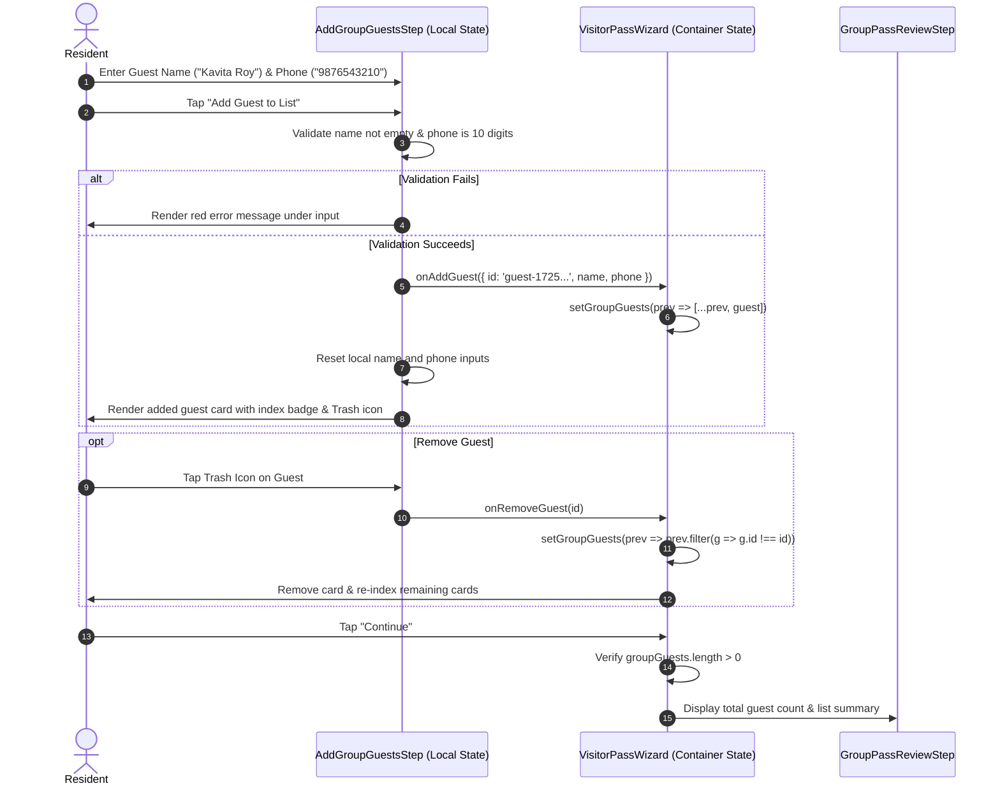

# Visitor Management — Mobile Data Collection Pattern Audit

**Document Version:** 1.0.0  
**Timestamp:** 2026-09-09  
**Status:** Audit Complete — Inspection Only (No Code Modified)  
**Target Mobile Application:** `mobile/mobile-app`  
**Reference Feature Module:** `src/features/visitor/`  
**Target Feature Subsystem:** Amenity Management (`src/features/amenities/`)  

---

## 1. Executive Summary

This audit examines the existing **Visitor Management** subsystem in `mobile/mobile-app/` to document its mobile data-collection mechanism, field architectures, dynamic multi-item collection patterns, state lifecycle, validation gates, and API payload transformation pipelines.

### Primary Audit Findings:
1. **Architectural Pattern (The Reference Implementation):**
   Visitor Management implements a **Controlled Multi-Step Wizard Pattern** orchestrated by `VisitorPassWizard.tsx`, supported by standard modular step components, a persistent step progress indicator (`VisitorPassStepIndicator.tsx`), dynamic flow navigation headers (`VisitorPassFlowHeader.tsx`), and responsive footer action bars (`VisitorPassFlowFooter.tsx`).
2. **Dynamic Multi-Item Collection (The Row-Builder Pattern):**
   For collecting multiple dynamic records (such as guest lists for group events), Visitor Management employs an **in-memory Row-Builder component pattern** (`AddGroupGuestsStep.tsx` / `GroupGuestListStep.tsx`). Users can dynamically add, view, and remove structured guest entries with real-time field validation, unique client-side key generation, and responsive list cards.
3. **Field Definition Strategy (Hybrid Architecture):**
   The subsystem uses a **Hybrid Field Architecture**: statically typed domain state models (`GuestDetailsData`, `GroupVisitDetailsData`, `CabVehicleData`, `StaffDetailsData`) combined with **conditional / dynamic field rendering** (e.g., toggling Government ID Proof reveals ID category chips and type-specific regex-validated inputs; selecting "Other" cab provider reveals custom brand text inputs; choosing "Custom" schedule reveals date-time windows).
4. **Data Transformation & Decoupling:**
   Form state is completely decoupled from backend schemas using an isolated **Strategy Mapper Layer** (`mapFormToApiPayloadStrategy.ts` and archetype-specific mappers `mapGuestFormToApiPayload.ts`, `mapGroupFormToApiPayload.ts`, etc.). The UI captures human-friendly inputs (e.g. 12-hour times `"06:00 PM"`, date presets `"TODAY_EVENING"`) which are cleanly transformed into API-compliant ISO timestamps, 24-hour time windows, and tenant/role-scoped payloads.
5. **Amenity Management Application:**
   This pattern directly solves Amenity Management's upcoming data collection requirements (e.g., participant/guest lists, multi-slot bookings, equipment add-ons, and payment checkouts) while respecting the frozen `/api/v2/amenity-management/*` backend contract and 5-state orthogonality.

---

## 2. Visitor Management Location

### 2.1 Feature Root
`mobile/mobile-app/src/features/visitor/`

### 2.2 Routing & Screen Entry Points
All routes reside under `mobile/mobile-app/app/(resident)/visitor/` and `app/(resident)/visitor/admin/`:

| Route Path | File Location | Purpose & Screen Function |
| :--- | :--- | :--- |
| `/(resident)/visitor` | `app/(resident)/visitor/index.tsx` | Resident visitor pass dashboard & quick actions |
| `/(resident)/visitor/invite` | `app/(resident)/visitor/invite.tsx` | Full multi-step guest pass invitation wizard |
| `/(resident)/visitor/cab-pass` | `app/(resident)/visitor/cab-pass.tsx` | Specialized cab/taxi pre-approval pass wizard |
| `/(resident)/visitor/delivery-pass` | `app/(resident)/visitor/delivery-pass.tsx` | Courier / food delivery pre-clearance wizard |
| `/(resident)/visitor/staff-pass` | `app/(resident)/visitor/staff-pass.tsx` | Domestic staff / contractor recurring pass wizard |
| `/(resident)/visitor/resident-passes` | `app/(resident)/visitor/resident-passes.tsx` | Active and historical pass card list |
| `/(resident)/visitor/gate-console` | `app/(resident)/visitor/gate-console.tsx` | Gate security console for pass search & verification |
| `/(resident)/visitor/walk-ins` | `app/(resident)/visitor/walk-ins.tsx` | Resident pending walk-in approval queue |
| `/(resident)/visitor/history` | `app/(resident)/visitor/history.tsx` | Audit logs of estate entries and exits |
| `/(resident)/visitor/admin/create-pass` | `app/(resident)/visitor/admin/create-pass.tsx` | Admin pass issuance (community or villa-scoped) |
| `/(resident)/visitor/admin/community-passes`| `app/(resident)/visitor/admin/community-passes.tsx`| Community-wide pass oversight & revoking |
| `/(resident)/visitor/admin/analytics` | `app/(resident)/visitor/admin/analytics.tsx` | Estate entry analytics & volume metrics |
| `/(resident)/visitor/admin/blacklist` | `app/(resident)/visitor/admin/blacklist.tsx` | Security blacklist management |

### 2.3 Component Inventory (`src/features/visitor/components/`)
* **Wizard Orchestrator:**
  * `wizard/VisitorPassWizard.tsx` (Core multi-step engine, 485 lines)
* **Shared Flow Controls:**
  * `shared/VisitorPassFlowHeader.tsx` (Step title, pass type badge, back/cancel triggers)
  * `shared/VisitorPassStepIndicator.tsx` (Segmented progress bar & step percentage)
  * `shared/VisitorPassFlowFooter.tsx` (Back button, Continue / Submit CTA with loading state)
  * `shared/VisitorInvitationTypeSheet.tsx` (Category selection bottom sheet)
  * `shared/GeneratedPassView.tsx` (Success state view with SVG QR code & Share intent)
  * `shared/VisitorQRCode.tsx` (SVG QR matrix presentation)
  * `shared/VisitorPassCode.tsx` (Stylized numeric short code)
* **Domain Step Components:**
  * **Guest:** `GuestDetailsStep.tsx`, `GuestScheduleStep.tsx`, `GuestPassOptionsStep.tsx`, `GuestPassReviewStep.tsx`
  * **Group:** `GroupVisitDetailsStep.tsx`, `GroupScheduleStep.tsx`, `AddGroupGuestsStep.tsx`, `GroupGuestListStep.tsx`, `GroupPassReviewStep.tsx`
  * **Cab:** `CabProviderStep.tsx`, `CabVehicleStep.tsx`, `CabScheduleStep.tsx`, `CabPassReviewStep.tsx`
  * **Delivery:** `DeliveryPartnerStep.tsx`, `DeliveryDetailsStep.tsx`, `DeliveryValidityStep.tsx`, `DeliveryPassReviewStep.tsx`
  * **Service:** `StaffDetailsStep.tsx`, `ServiceTypeStep.tsx`, `ServiceDateRangeStep.tsx`, `ServiceWeekdayStep.tsx`, `ServiceTimeWindowStep.tsx`, `ServicePassReviewStep.tsx`
* **Admin & Guard Modals / Cards:**
  * `admin/AdminPassSetupStep.tsx`, `admin/AdminVillaFilterSheet.tsx`, `admin/AdminBlacklistModal.tsx`, `admin/AdminForceCheckoutModal.tsx`, `admin/AdminGateLogCard.tsx`, `admin/BlacklistEntryCard.tsx`, `admin/CategoryDistributionCard.tsx`, `admin/VisitorAnalyticsCard.tsx`
  * `guard/GuardInitiateWalkInModal.tsx`, `guard/GuardQRScannerModal.tsx`, `guard/GuardVillaDirectoryView.tsx`, `guard/GuardWalkInStatusView.tsx`, `guard/InsideVisitorsView.tsx`
* **Walk-In Approvals:**
  * `walkin/WalkInApprovalCard.tsx`, `walkin/WalkInApprovalsView.tsx`, `walkin/WalkInVisitorDetailsModal.tsx`
* **Quick Form Sheet:**
  * `CreateVisitorPassSheet.tsx` (Compact React Hook Form + Yup bottom-sheet pass generator)
* **Pass Presentation:**
  * `VisitorPassCard.tsx`, `VisitorPassDetailsModal.tsx`

### 2.4 Hooks, Services, Store, Utils & Tests
* **Hooks:** `useVisitorPass.ts`, `useAdminVisitor.ts`, `useGuardGateScanner.ts`, `useVisitorSocket.ts`
* **Services:** `services/visitorService.ts`, `services/visitorAdminService.ts`
* **Store:** `store/visitorPassSlice.ts`, `store/adminVisitorThunks.ts`
* **Payload Mappers:** `utils/mapFormToApiPayloadStrategy.ts`, `utils/mapGuestFormToApiPayload.ts`, `utils/mapGroupFormToApiPayload.ts`, `utils/mapCabFormToApiPayload.ts`, `utils/mapDeliveryFormToApiPayload.ts`, `utils/mapServiceFormToApiPayload.ts`, `utils/mapBackendWalkInToApprovalItem.ts`, `utils/mapBackendPassToHistoryItem.ts`
* **Tests:** `__tests__/VisitorPassCard.test.tsx` (427 lines, 16 comprehensive unit tests)

---

## 3. Complete Data Collection Flow

The following lifecycle represents the exact runtime sequence from user intent to digital pass issuance:

```text
User Action (e.g. Tap "Invite Visitor" or "Group Pass")
    ↓
Route Entry Point (invite.tsx, cab-pass.tsx, admin/create-pass.tsx)
    ↓
Orchestrator Container (VisitorPassWizard.tsx)
    ↓
Step Definition Resolution (STEP_DEFINITIONS[selectedPassType] + optional Admin Scope)
    ↓
Step Rendering (e.g. GuestDetailsStep.tsx, AddGroupGuestsStep.tsx)
    ↓
Input Keystrokes & Field Validation (Controlled updates via onChange(data))
    ↓
Step-Gate Check on Continue (handleNext() verifies step completion)
    ↓
Review Step (Displays aggregated summary card: GroupPassReviewStep, etc.)
    ↓
Submission Trigger (VisitorPassFlowFooter "Generate Visitor Pass" -> handleFinalSubmit())
    ↓
Transformation Layer (mapFormToApiPayloadStrategy -> map[Type]FormToApiPayload)
    ↓
Custom Hook Bridge (useVisitorPass -> createNewPass(payload))
    ↓
Redux Toolkit Async Thunk (dispatch(createPass(enrichedPayload)))
    ↓
API Service (visitorService.createPass -> apiClient.post('/visitor-pass', payload))
    ↓
Backend Processing & Database Persistence (Pass record created & shortKey issued)
    ↓
Redux State Update (extraReducers updates state.passes, state.dashboard, state.activePass)
    ↓
UI Feedback: Wizard switches to <GeneratedPassView> showing shortKey, QR Code & Share intent
```

---

## 4. Component Architecture of the Data Collection Mechanism

The data collection architecture is structured into 4 distinct layers:

```text
┌─────────────────────────────────────────────────────────────────────────┐
│                      1. ROUTE CONTAINER (SCREEN)                        │
│   e.g. app/(resident)/visitor/invite.tsx, cab-pass.tsx, create-pass.tsx │
│   - Reads route params (e.g. type="GROUP")                              │
│   - Injects user auth & role context (role="RESIDENT", orgId, villaId)  │
│   - Wraps in <ScreenShell>                                              │
└────────────────────────────────────┬────────────────────────────────────┘
                                     ▼
┌─────────────────────────────────────────────────────────────────────────┐
│                   2. WIZARD ORCHESTRATOR CONTAINER                      │
│   VisitorPassWizard.tsx                                                 │
│   - Owns multi-step state machine (currentStepIndex, steps array)       │
│   - Holds in-memory form states (guestDetails, groupGuests, etc.)       │
│   - Executes step-gate validation on Next                               │
│   - Handles submission, loading, and error banners                      │
│   - Renders <VisitorPassFlowHeader>, <StepIndicator>, <FlowFooter>      │
└──────────────────┬──────────────────────────────────┬───────────────────┘
                   │                                  │
                   ▼                                  ▼
┌──────────────────────────────────────┐  ┌───────────────────────────────┐
│       3. DUMB STEP COMPONENTS        │  │     4. DYNAMIC ROW BUILDER    │
│  GuestDetailsStep, CabVehicleStep... │  │     AddGroupGuestsStep.tsx    │
│  - Receives `data` & `onChange`      │  │  - Manages local row inputs   │
│  - Controlled input binding          │  │  - Validates row before add   │
│  - Renders catalog form controls     │  │  - Emits onAddGuest / onRemove│
└──────────────────────────────────────┘  └───────────────────────────────┘
```

---

## 5. Field Architecture: Hybrid Determination

The Visitor Management module utilizes a **Hybrid Field Architecture**:

### A. Static Core Field Models
Each pass archetype is backed by a strongly typed TypeScript interface representing its domain fields:
* `GuestDetailsData`: `{ visitorName: string; phone: string; purpose: string; }`
* `CabVehicleData`: `{ vehicleNo: string; vehicleType: 'CAB' | 'AUTO'; driverPhone: string; }`
* `DeliveryDetailsData`: `{ orderId: string; packageCount: string; deliveryAction: 'DOORSTEP' | 'LEAVE_AT_GATE'; instructions: string; }`
* `StaffDetailsData`: `{ staffName: string; phone: string; notes: string; }`
* `AdminPassSetupData`: `{ scope: 'COMMUNITY' | 'VILLA'; villaId?: string; villaName?: string; residentId?: string; residentName?: string; }`

### B. Conditional / Dynamic Field Triggers
1. **Government ID Proof Mode (`GuestPassOptionsStep.tsx`):**
   * Default state: Standard QR pass.
   * User taps "Invite by ID Proof Pass" toggle (`isIdProofPass: true`).
   * **Dynamic UI Expansion:** Reveals a pill-selection list of `ID_PROOF_TYPES` (`Aadhaar Card`, `PAN Card`, `Driving License`, `Voter ID`, `Indian Passport`) followed by a dynamically labeled input field `${currentIdType} Number` with dedicated regex validation (`validateGuestIdProofNumber`).
2. **Provider "Other" Fallback (`CabProviderStep.tsx`, `DeliveryPartnerStep.tsx`):**
   * Selecting provider `'other'` dynamically mounts a text input: `"Specify Brand Name"`.
3. **Custom Schedule Windows (`GuestScheduleStep.tsx`, `GroupScheduleStep.tsx`):**
   * Selecting preset `'CUSTOM'` dynamically mounts start-time, end-time, and visit date pickers.
4. **Target Scope Branching (`AdminPassSetupStep.tsx`):**
   * Selecting `'VILLA'` reveals a picker button that opens the `AdminVillaFilterSheet` bottom sheet to search and select specific unit destinations and host residents.

---

## 6. Dynamic Collection Behavior (Add/Edit/Remove Multiple Items)

The **Group Pass Workflow** (`AddGroupGuestsStep.tsx` and `GroupGuestListStep.tsx`) represents the authoritative reference implementation for dynamic multi-item collection:



### Key Dynamic Collection Attributes:
* **Item Identity:** Uses client-generated random IDs: `guest-${Date.now()}-${Math.random().toString(36).substr(2, 4)}`.
* **State Encapsulation:** The input fields (`name`, `phone`, `error`) are held in local component state to prevent parent re-renders on every keystroke.
* **Array State:** The list of items (`GroupGuestItem[]`) is owned by `VisitorPassWizard.tsx`.
* **Step-Gate Guard:** `VisitorPassWizard.tsx` validates `groupGuests.length > 0` before allowing transition to the review step.
* **API Payload Translation:** `mapGroupFormToApiPayload.ts` strips the client-side `id` and maps items into `groupGuests: [{ name: g.name.trim(), phone: g.phone || undefined }]`.

---

## 7. State Management Architecture

Visitor Management strictly enforces the **Thin View Pattern** across two distinct tiers:

### 7.1 Tier 1: In-Flight Form & Wizard State (Local React State)
* **Location:** Inside `VisitorPassWizard.tsx` via `useState`.
* **Rationale:** Draft pass inputs, step indices, and active timers are transient. Storing incomplete form drafts in the global Redux store creates dirty cache leaks if the user abandons the screen or taps back.
* **Controlled Downward Binding:** All step components (`GuestDetailsStep`, `CabVehicleStep`, etc.) are 100% controlled. They accept `data` and emit `onChange(updatedData)`.

### 7.2 Tier 2: Committed Domain State & Thunks (Redux Toolkit)
* **Location:** `src/features/visitor/store/visitorPassSlice.ts` registered under `visitorPass`.
* **Managed Entities:**
  * `passes: VisitorPass[]` (Active resident pass records)
  * `activePass: VisitorPass | null` (Currently viewed pass details)
  * `activeVisitors: ActiveVisitorLog[]` (Real-time logs of visitors inside estate)
  * `walkIns: WalkInState` (Pending visitor gate requests)
  * `dashboard: DashboardSummary` (Recent passes & counters)
* **Actions Dispatched:**
  * `createPass(payload)` (Async thunk executing POST request)
  * `updatePassStatus({ id, status: 'REVOKED' })` (Async thunk updating status)
  * `resolveWalkInRequest({ id, action: 'APPROVE' | 'REJECT' })`

---

## 8. Validation Architecture

Validation operates across four synchronized defensive boundaries:

| Validation Level | Location | Mechanism | Behavior on Failure |
| :--- | :--- | :--- | :--- |
| **Field-Level (Keystroke)** | Step components (`Input`) | Native props (`maxLength={10}`, `.toUpperCase()`) | Prevents invalid character entry or formats string |
| **Row-Level (Action)** | `AddGroupGuestsStep.tsx` | Imperative check in `handleAdd()` | Renders inline field error, blocks adding item to list |
| **Custom Utility Regex** | `validateGuestIdProofNumber()` | Exact government format regular expressions | Renders helper error text under ID number input |
| **Step-Gate Level** | `VisitorPassWizard.tsx` | `handleNext()` validation checks | Blocks step transition, sets `submitError`, renders top banner |
| **Schema Validation** | `CreateVisitorPassSheet.tsx` | Yup schema via `@hookform/resolvers/yup` | Highlights invalid fields, prevents sheet submission |
| **Server Error Catch** | `VisitorPassWizard.tsx` | `try / catch` in `handleFinalSubmit()` | Displays backend error message in `<AlertCircle>` banner |

### Exact Government ID Validation Rules (`GuestPassOptionsStep.tsx`):
* **Aadhaar Card:** `/^\d{12}$/` (Exactly 12 numeric digits)
* **PAN Card:** `/^[A-Z]{5}[0-9]{4}[A-Z]$/i` (5 letters, 4 digits, 1 letter)
* **Voter ID:** `/^[A-Z]{3}\d{7}$/i` (3 letters, 7 digits)
* **Indian Passport:** `/^[A-PR-WYa-pr-wy][1-9]\d\s?\d{4}[1-9]$/`
* **Driving License:** Minimum length 10 characters

---

## 9. Data Transformation Layer

Visitor Management isolates UI models from backend API requirements via a **Strategy Mapping Layer**:

```text
┌─────────────────────────────────────────────────────────┐
│                      UI FORM DATA                       │
│  - guestDetails: { visitorName, phone, purpose }        │
│  - guestSchedule: { visitDate, timeSlot: 'TODAY_EVENING'│
│  - guestOptions: { entryMode: 'SINGLE', vehicleNo }     │
│  - context: { role: 'ADMIN', orgId, villaId }           │
└────────────────────────────┬────────────────────────────┘
                             │
                             ▼
┌─────────────────────────────────────────────────────────┐
│             mapFormToApiPayloadStrategy.ts              │
│  Selects mapper based on passType ('GUEST' vs 'GROUP')  │
└────────────────────────────┬────────────────────────────┘
                             │
                             ▼
┌─────────────────────────────────────────────────────────┐
│               mapGuestFormToApiPayload.ts               │
│  - Converts 'TODAY_EVENING' -> start: 17:00, end: 23:00 │
│  - Converts visitDate -> UTC ISO start/end of day       │
│  - Sets usageLimit: { maxUses: 1 }                      │
│  - Conditionally builds vehicleDetails & visitorDetails │
│  - Evaluates role: ADMIN without villa -> 'ADMIN_GUEST' │
└────────────────────────────┬────────────────────────────┘
                             │
                             ▼
┌─────────────────────────────────────────────────────────┐
│                   BACKEND API PAYLOAD                   │
│  {                                                      │
│    passType: "ADMIN_GUEST",                             │
│    visitorDetails: { name: "John Doe", phone: "..." },  │
│    validity: {                                          │
│      startDate: "2026-09-09T00:00:00.000Z",             │
│      endDate: "2026-09-09T23:59:59.999Z",               │
│      timeWindowStart: "17:00",                          │
│      timeWindowEnd: "23:00"                             │
│    },                                                   │
│    usageLimit: { maxUses: 1 },                          │
│    orgId: "60c72b2f9b1d8e25d88db652"                    │
│  }                                                      │
└─────────────────────────────────────────────────────────┘
```

---

## 10. API Integration & Network Layer

* **Central Client:** Uses `mobile/mobile-app/src/services/apiClient.ts` directly.
* **HTTP Methods & Endpoints:**
  * `POST /visitor-pass` — Create pass
  * `GET /visitor-pass/:id` — Pass details
  * `GET /visitor-pass/code/:code` — Pass lookup by short key
  * `PATCH /visitor-pass/:id/status` — Revoke pass (`{ status: 'REVOKED' }`)
  * `GET /visitor-pass/org/:orgId` — Paginated list of organization passes
  * `POST /visitor-log/walk-in` — Guard initiates walk-in entry request
  * `PATCH /visitor-log/walk-in/:id/resolve` — Resident resolves walk-in (`{ action: 'APPROVE' | 'REJECT' }`)
* **Header Interception:**
  * Automatically injects `Authorization: Bearer <token>`
  * Injects `X-Request-ID: <uuid>`
  * Injects `X-Community-ID: <orgId>`

---

## 11. Component Catalog Compliance

Visitor Management achieves **100% compliance** with `COMPONENTS_CATALOG.md`:

| UI Primitives Used | Catalog File Location | Rule Compliance |
| :--- | :--- | :--- |
| `<ScreenShell>` | `@/components/ui/ScreenShell` | Wraps all route pages |
| `<Button>` | `@/components/ui/button` | Standard CVA button variants |
| `<Input>` / `<TextInput>` | `@/components/ui/input`, `@/components/forms/TextInput` | Labelled inputs with icons & error states |
| `<BottomSheet>` | `@/components/ui/BottomSheet` | All modal sheets & type selectors |
| `<ConfirmationModal>` | `@/components/ui/ConfirmationModal` | Guard overrides & walk-in rejection |
| `<StatusBadge>` | `@/components/ui/StatusBadge` | Pass status & wait duration pills |
| `<QRCodeView>` | `@/components/ui/QRCodeView` | SVG matrix pass display |
| `<DetailSection>`, `<DetailRow>`| `@/components/ui/DetailSection` | Key-value review cards |
| `<ActionBar>` | `@/components/ui/ActionBar` | Sticky modal action buttons |

---

## 12. Internationalization (i18n) & RTL Layouts

* **Logical Spacing:** All components use NativeWind logical utility classes:
  * `ms-1`, `ms-2`, `me-2`, `me-3` for margins
  * `ps-4`, `pe-2` for padding
  * `text-start`, `items-start` for alignments
* **Bidirectional Layout:** Inverted chevron icons flip automatically in Arabic RTL mode.
* **Action Labels:** Text buttons use flex-direction `flex-row` with logical spacing, ensuring icons appear on the leading edge across English and Arabic.

---

## 13. Dark Mode & Design Tokens

Visitor Management strictly uses NativeWind design system tokens:
* **Backgrounds:** `bg-background`, `bg-card`, `bg-muted`, `bg-primary/10`, `bg-destructive/10`
* **Text:** `text-foreground`, `text-muted-foreground`, `text-primary`, `text-destructive`
* **Borders:** `border-border`, `border-primary/20`, `border-destructive/20`
* **Zero Hardcoded Colors:** No raw hex codes (`#ffffff`, `#000000`) or physical slate classes (`bg-slate-900`) are used in component styling.

---

## 14. Navigation Behavior & State Lifecycle

1. **Step Forward:** Tapping "Continue" validates the active step. If valid, `currentStepIndex` increments by 1.
2. **Step Backward:** Tapping "Back" in `VisitorPassFlowHeader` or `VisitorPassFlowFooter` decrements `currentStepIndex` by 1. **Entered data is preserved in memory.**
3. **Flow Cancellation:** Tapping "Cancel" (X button) in header fires `onClose()`, invoking `router.back()` and cleanly disposing of in-flight draft state.
4. **Post-Submission State:** Once `createPass` succeeds, `VisitorPassWizard` sets `generatedPass` state, replacing the form viewport with `<GeneratedPassView>`. Back navigation is replaced with a single "Done" dismiss CTA.

---

## 15. Loading & Error States

* **In-Flight Action:** When `loading === true`, `VisitorPassFlowFooter` disables the "Continue" CTA and activates a spinner.
* **In-Flow Error Banner:** When validation or backend submission fails, `submitError` state renders a persistent banner above the form:
  ```tsx
  <View className="mx-4 mt-2 p-3 bg-destructive/10 border border-destructive/20 rounded-xl flex-row items-center gap-2">
    <AlertCircle size={16} className="text-destructive shrink-0" />
    <Text className="text-xs text-destructive flex-1">{submitError}</Text>
  </View>
  ```
* **Empty Collection:** `GroupGuestListStep` displays an `<EmptyState>` with dashed border and "Add Guests Now" button when `guests.length === 0`.

---

## 16. Existing Test Coverage

The subsystem contains **427 lines of automated unit tests** in `src/features/visitor/__tests__/VisitorPassCard.test.tsx` verifying:
1. Standard Guest Pass form-to-API mapping.
2. ID Proof Pass formatting and validity window calculation.
3. Government ID validation utility (`validateGuestIdProofNumber` for Aadhaar & PAN).
4. Cab Pass one-time vs multi-use recurring mapping.
5. Delivery Pass doorstep vs leave-at-gate mapping.
6. Service / Contractor Pass date-range, weekdays, and daily time slot mapping.
7. Group Pass multi-guest array formatting and `maxUses` calculation.
8. Strategy Mapper for Admin vs Resident context (`ADMIN_GUEST` vs `GUEST`).
9. Gate console vehicle license plate & name substring search logic.
10. Guard ID resolution and active visitor inside checks.
11. Blacklist entry formatting and villa-based filtering.

---

## 17. Reusable Component Inventory

The following components from Visitor Management provide patterns directly transferable to Amenity Management:

| Component | File Path | Capability Description | Reusability Category |
| :--- | :--- | :--- | :--- |
| `VisitorPassFlowHeader` | `components/shared/VisitorPassFlowHeader.tsx` | Wizard top bar with category badge & back trigger | **Directly Reusable / Adaptable** |
| `VisitorPassStepIndicator` | `components/shared/VisitorPassStepIndicator.tsx`| Segmented progress track & percentage | **Directly Reusable / Adaptable** |
| `VisitorPassFlowFooter` | `components/shared/VisitorPassFlowFooter.tsx` | Responsive Back / Continue action bar | **Directly Reusable / Adaptable** |
| `AddGroupGuestsStep` | `components/group/AddGroupGuestsStep.tsx` | Dynamic item addition with local input & cards | **Direct Architectural Pattern** |
| `AdminVillaFilterSheet` | `components/admin/AdminVillaFilterSheet.tsx` | Searchable villa & resident bottom-sheet picker | **Directly Reusable** |
| `GeneratedPassView` | `components/shared/GeneratedPassView.tsx` | Digital pass ticket with SVG QR matrix & share | **Direct Architectural Pattern** |

---

## 18. Visitor Management vs. Amenity Management Comparison

| Capability | Visitor Pattern | Amenity Need | Reusable? | Category |
| :--- | :--- | :--- | :---: | :--- |
| **Wizard Architecture** | `VisitorPassWizard` multi-step | Booking wizard (Slot -> Details -> Hold -> Pay -> Pass) | **YES** | **ADAPTABLE** |
| **Step Progress UI** | `VisitorPassStepIndicator` | Segmented booking flow indicator | **YES** | **DIRECTLY REUSABLE** |
| **Flow Header / Footer**| `FlowHeader` / `FlowFooter` | Booking flow header & sticky footer CTAs | **YES** | **DIRECTLY REUSABLE** |
| **Dynamic Row Collection**| `AddGroupGuestsStep` | Dynamic guest registration & equipment add-ons | **YES** | **DIRECTLY REUSABLE** |
| **Time Range & Slots** | Presets & custom hours | Contiguous slot block selection grid | **PARTIAL**| **ADAPTABLE** |
| **Payload Strategy** | Strategy mapper layer | `mapAmenityFormToApiPayloadStrategy` | **YES** | **DIRECTLY REUSABLE** |
| **State Separation** | In-memory wizard + Redux thunk | In-memory wizard + Redux booking slice | **YES** | **DIRECTLY REUSABLE** |
| **QR Pass Presentation** | `GeneratedPassView` + SVG QR | Digital amenity access pass + security hash | **YES** | **ADAPTABLE** |
| **Two-Phase Hold Flow** | None (Immediate booking) | 10-minute hold TTL with countdown timer | **NO** | **AMENITY-SPECIFIC** |
| **Payment Gateway** | Free passes (No billing) | Razorpay checkout & signature verification | **NO** | **AMENITY-SPECIFIC** |
| **5-State Orthogonality** | 1 flattened status | 5 independent orthogonal state dimensions | **NO** | **AMENITY-SPECIFIC** |
| **Backend Namespace** | `/visitor-pass` | `/api/v2/amenity-management/*` | **NO** | **AMENITY-SPECIFIC** |

---

## 19. Recommended Reuse Boundary

### Boundary Directive:
* **UI Pattern & Component Reuse:** Amenity Management MUST adopt the **Visitor Wizard & Row-Builder Pattern** (`FlowHeader`, `StepIndicator`, `FlowFooter`, `AddGroupGuestsStep` structure).
* **Isolation Rule (No Cross-Feature Imports):** Amenity Management (`src/features/amenities/`) MUST **NEVER import code directly from `src/features/visitor/`**. Doing so would violate the monorepo encapsulation rules (`RULE[backend-rules.md]` and `RULE[mobile-workflow-rules.md]`).
* **Implementation Strategy:**
  1. Universal UI primitives (`ScreenShell`, `Button`, `StatusBadge`, `BottomSheet`, `TextInput`) are imported from `@/components/`.
  2. Wizard layout components should either be abstracted to `@/components/wizard/` or cleanly mirrored inside `src/features/amenities/components/wizard/`.
  3. Amenity business rules (holds, payments, quotas, 5 orthogonal states) remain strictly governed by the frozen Phase 5 backend API contract.

---

## 20. The Exact Reference Pattern to Carry Forward

When implementing Amenity Management data collection in Phase 6A, replicate this exact 7-layer architecture:

```text
1. Route Screen: app/(resident)/amenities/booking/[id].tsx
   ↓ Wraps wizard in <ScreenShell> and injects auth & facility context

2. Wizard Container: src/features/amenities/components/wizard/AmenityBookingWizard.tsx
   ↓ Manages currentStepIndex, step definitions, hold timers, and in-flight form state

3. Modular Steps:
   ├── Step 0: Facility & Date Selection (AmenityScheduleStep.tsx)
   ├── Step 1: Contiguous Slot Selection (AmenityTimeSlotGridStep.tsx)
   ├── Step 2: Dynamic Guest List (AmenityGuestListStep.tsx — using AddGroupGuestsStep pattern)
   ├── Step 3: Hold Reservation & Pricing Summary (AmenityHoldSummaryStep.tsx)
   ├── Step 4: Razorpay Payment Checkout (AmenityPaymentStep.tsx)
   └── Step 5: Confirmed Digital Pass (AmenityAccessPassStep.tsx — using GeneratedPassView pattern)

4. Flow Controls:
   ├── Header: AmenityFlowHeader.tsx (Facility name, type pill, back/cancel)
   ├── Progress: AmenityStepIndicator.tsx (Segmented progress bar)
   └── Footer: AmenityFlowFooter.tsx (Back, Hold Reservation / Pay Now CTA with spinner)

5. Defensive Validation:
   ├── Step-Gate checks in wizard before advancing
   └── Zod schema validation before hold acquisition and payment confirmation

6. Strategy Mapping Layer:
   └── src/features/amenities/utils/mapAmenityBookingToApiPayload.ts
       Transforms UI state into frozen backend payload: { amenityId, slotKeys, date, guestCount }

7. Service & Redux Layer:
   └── amenityManagementService.ts -> POST /api/v2/amenity-management/holds -> Redux amenityBookingSlice
```

---

## 21. Files to Reuse Directly
From `@/components/`:
* `@/components/ui/ScreenShell`
* `@/components/ui/StatusBadge`
* `@/components/ui/BottomSheet`
* `@/components/ui/ConfirmationModal`
* `@/components/ui/QRCodeView`
* `@/components/ui/button`
* `@/components/forms/TextInput`
* `@/components/forms/DropdownSelect`
* `@/components/feedback/EmptyState`
* `@/components/feedback/ErrorBanner`

---

## 22. Files to Create in Phase 6A (Data Binding)
* `src/features/amenities/services/amenityManagementService.ts` (Frozen v2 API methods)
* `src/features/amenities/utils/mapAmenityBookingToApiPayload.ts` (Payload mapping strategy)
* `src/features/amenities/components/wizard/AmenityBookingWizard.tsx` (Multi-step container)
* `src/features/amenities/components/wizard/steps/AmenitySlotSelectionStep.tsx` (Slot picker)
* `src/features/amenities/components/wizard/steps/AmenityGuestListStep.tsx` (Dynamic guest row builder)
* `src/features/amenities/components/wizard/steps/AmenityHoldCheckoutStep.tsx` (10-min hold & Razorpay)
* `src/features/amenities/components/wizard/steps/AmenityPassResultStep.tsx` (QR Access pass view)

---

## 23. Files That Must NOT Be Modified
* **Backend:** All files under `backend/*` remain strictly **FROZEN** (196/196 tests passing).
* **Visitor Feature:** All files under `src/features/visitor/*` and `app/(resident)/visitor/*`.
* **Documentation Truth:** `project-knowledge.md` and `working.md` (protected by `hukum` directive).

---

## 24. Blockers & Unknowns
* **Blockers:** None.
* **Unknowns:** None. The Visitor data collection mechanism, dynamic row-builder pattern, and transformation pipeline are 100% understood and documented.

---

## 25. Readiness for Amenity Data-Binding Phase
The data collection architecture of Visitor Management is fully audited and proven. We have established the exact reference pattern to replicate for Amenity Management.

---

## Final Status

```text
====================================================================================================
                                VISITOR DATA COLLECTION AUDIT
====================================================================================================
Status: READY

Visitor implementation located         : YES
Collection mechanism understood        : YES
Dynamic behavior understood            : YES
State management understood            : YES
Validation understood                  : YES
API mapping understood                 : YES
Reusable components identified         : YES
Amenity reuse boundary understood      : YES

Recommended next step:
Phase 6A — Amenity Management Data-Binding
using the verified Visitor Management collection pattern where appropriate.

NO UI IMPLEMENTATION IN THIS TASK.
====================================================================================================
```
