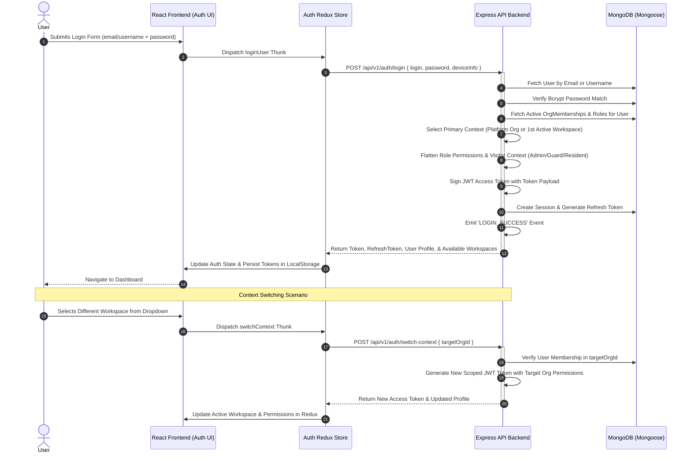
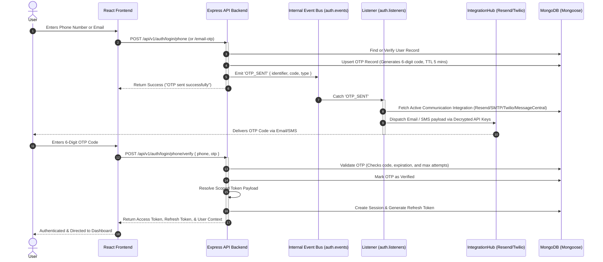
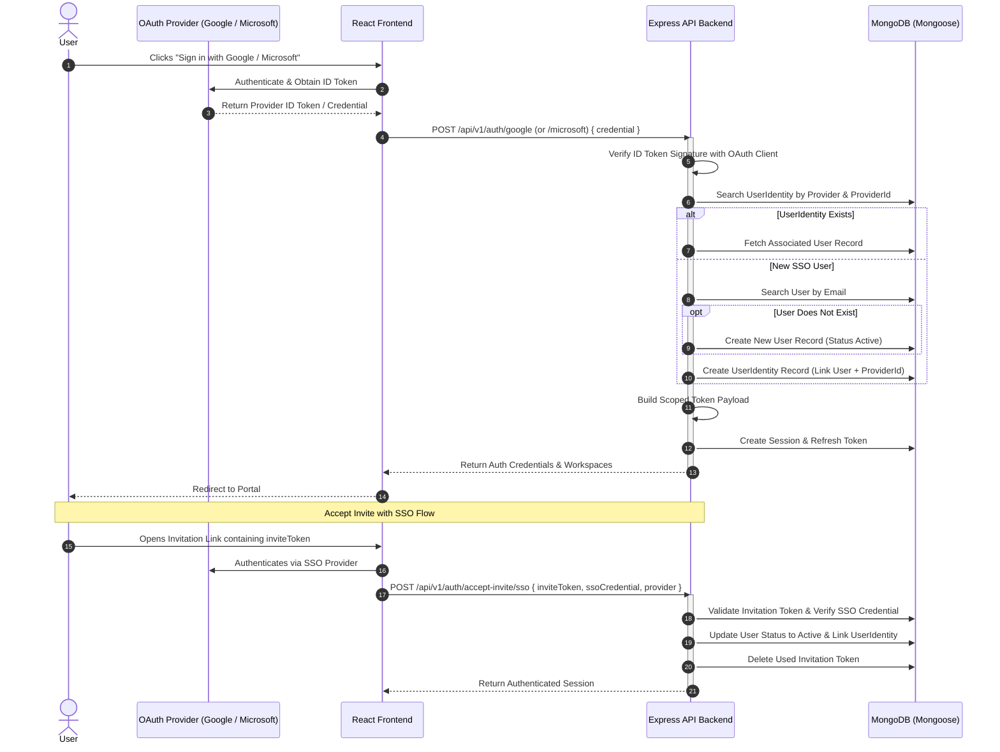
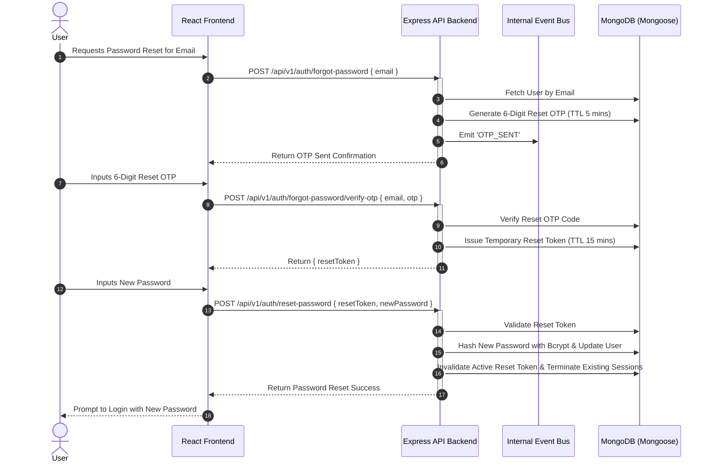
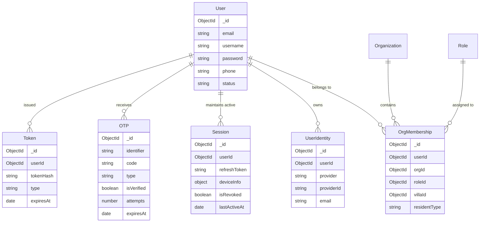

# Authentication & Identity Management System Detailed E2E Report

This report provides an end-to-end technical guide to the **Authentication & Identity Management System (Auth Feature)** architecture in ManageMyGate. It details multi-tenant context resolution, authentication methods, role-based access control, real-time security events, database schemas, and comprehensive Mermaid sequence diagrams for all key execution flows.

---

## 1. System Architecture & Multi-Tenant Security Model

The Authentication system follows a decoupled, multi-tenant architecture that isolates credentials, user identities, workspace memberships, and permissions.

- **Dual-Token Session Architecture:** Uses short-lived JWT Access Tokens for API request authorization and long-lived Refresh Tokens (persisted in the `Session` entity) for sliding session extensions.
- **Dynamic Context Resolution (`getScopedTokenPayload`):** Rather than hardcoding user roles, JWT tokens are scoped dynamically to the active organization (`orgId`). Tokens include flattened runtime permissions, active role, `isPlatform` status, and visitor role context (`Admin`, `Guard`, `Resident`, or `None`).
- **Multi-Tenant Workspace Switching:** Users belonging to multiple organizations can seamlessly switch active contexts via `/auth/switch-context` without re-authenticating, generating a freshly scoped JWT token.
- **Event-Driven Integration Architecture:** Decouples core business logic from communication providers. On successful OTP generation, `auth.services.js` emits internal `OTP_SENT` events. The `auth.listeners.js` subscriber picks up these events and routes dispatching dynamically via **IntegrationHub** drivers (Resend, SMTP, Twilio, Message Central).
- **Transactional User Creation:** User registration and invitation acceptance execute inside Mongoose Transactions (`session.startTransaction()`) to guarantee atomic creation across user records and invitation token consumption.
- **Brute-Force & Rate-Limiting Protections:** Protected by Express rate-limiting middleware (`authLimiter` for authentication attempts and `otpLimiter` for OTP requests).

---

## 2. Supported Authentication Capabilities

| Authentication Method | Primary Credential | Secondary Verification | Description |
| :--- | :--- | :--- | :--- |
| **Password Authentication** | Email / Username | Password (Bcrypt) | Standard login returning scoped JWT access token, refresh token, and user workspace list. |
| **Phone OTP Login** | Phone Number | 6-Digit SMS OTP | Passwordless login for mobile users. Sends SMS via Twilio or Message Central. |
| **Email OTP Login** | Email Address | 6-Digit Email OTP | Passwordless login for web users. Sends email via Resend or SMTP integration. |
| **Google SSO** | Google ID Token | OAuth 2.0 Credential | Authenticates via Google. Automatically provisions `UserIdentity` and links to `User`. |
| **Microsoft SSO** | Microsoft ID Token | OAuth 2.0 Credential | Authenticates via Microsoft Azure AD / Entra ID. Provisioned into `UserIdentity`. |
| **Accept Invitation (Standard)**| Invitation Token | Set New Password | Allows invited users to activate their account and set their password via email token. |
| **Accept Invitation (SSO)** | JWT Invite Token | SSO ID Token (Google/MS)| Allows invited users to activate their membership using their existing SSO account. |
| **Password Reset** | Registered Email | 6-Digit OTP + Reset Token| Self-service password recovery flow with temporary reset token authorization. |
| **Token Rotation & Refresh** | Refresh Token | Active Session Check | Issues a fresh access token and updates the session last active timestamp. |
| **Context Switching** | Active JWT | Target Organization ID | Switches active workspace context and returns an updated token with new permissions. |

---

## 3. End-to-End Execution Flows (Sequence Diagrams)

### Flow A: Username / Password Login & Workspace Switch

### Flow B: Passwordless Phone / Email OTP Login

### Flow C: Single Sign-On (SSO) & Invitation Acceptance

### Flow D: Self-Service Password Reset

---

## 4. Database Schema & Entity Relationships

The authentication ecosystem relies on six primary database entities interacting seamlessly across transactions:

---

## 5. Security Controls & System Architecture Summary

1. **Zero Password Exposure:** Passwords are never stored in plain text. Hashed using **Bcrypt** with dynamic salting.
2. **Context Integrity & Anti-Lockout:** The System Platform tenant workspace (`isPlatform: true`) is protected from accidental blocking or deletion via explicit backend checks in service layers.
3. **Correlation ID Tracing (`X-Request-ID`):** All incoming HTTP requests and API calls pass an `X-Request-ID` correlation header to track user request trajectories across logs.
4. **Transport Isolation:** Business logic inside `auth.services.js` never imports transport libraries (e.g. Nodemailer, Twilio, Socket.io) directly. Communication is purely event-driven via `auth.events.js`.
5. **Session Revocation:** Users can view active device sessions (`/sessions`) and remotely revoke stolen or lost device sessions, immediately invalidating the associated refresh token.
