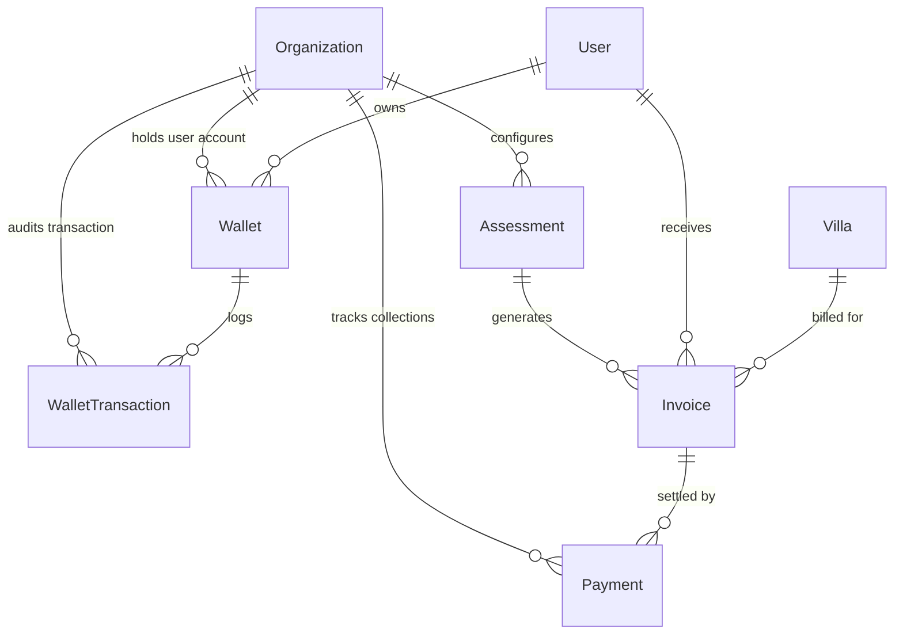
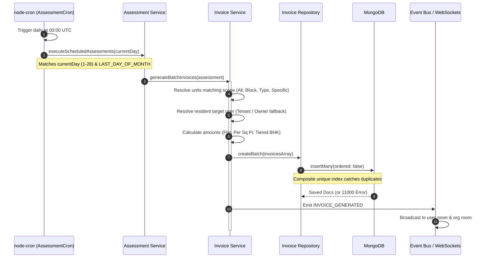
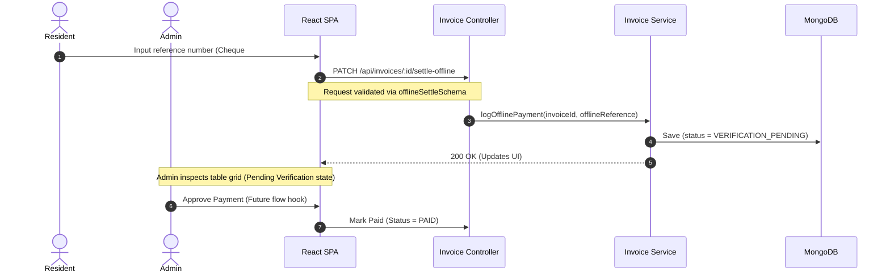
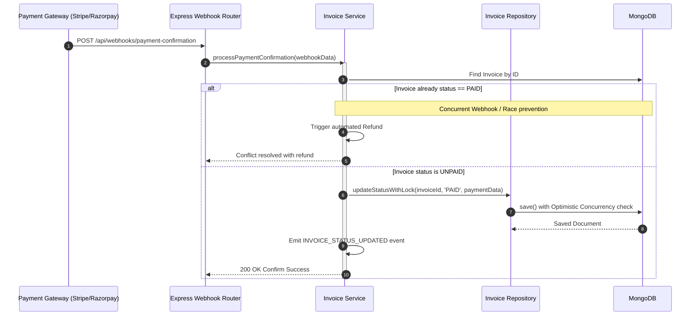

# Billing & Collection System - Architectural & Process Report

This report provides a comprehensive guide to the **Billing & Collection System (Assessments & Invoicing)** architecture, detailing the end-to-end design patterns, database schemas, cross-feature integrations, real-time synchronization pipelines, and a detailed audit finding.

---

## 1. System Architecture & Flow

The Billing and Collection module enforces a strict unidirectional flow of data, ensuring clean boundaries between the HTTP transport layer, input validators, business logic services, and repository layers, in compliance with the system's architectural rules.

### A. Unidirectional Request Flows

#### Backend Execution Flow:
```
┌──────────────────┐       ┌────────────────────────┐       ┌──────────────────────┐
│  Express Router  │ ───>  │   Express Validator    │ ───>  │      Controller      │
│ (invoice.routes) │       │ (invoice.validator.js) │       │ (invoice.controller) │
└──────────────────┘       └────────────────────────┘       └──────────┬───────────┘
                                                                       │
┌──────────────────┐       ┌────────────────────────┐                  │
│  Mongoose Model  │ <───  │       Repository       │ <────────────────┘
│ (invoice.model)  │       │  (invoice.repository)  │
└──────────────────┘       └────────────────────────┘
```
1. **Express Router:** Exposes RESTful endpoints, applying authentication boundaries (`isAuthenticated`) and tenant isolation middleware (`tenantContext`).
2. **Express Validator:** Rules block invalid inputs (e.g. malformed Mongo ObjectIds or wrong period strings) before they hit application code.
3. **Controller:** Extracts req params, user contexts, and passes them straight to the service layer.
4. **Service:** Implements 100% of business logic, manages cross-feature fetches, processes webhook notifications, and triggers internal domain events.
5. **Repository:** Executes optimized Mongoose queries, transactional reads/writes with lock checks, and performance-heavy aggregations.

#### Frontend Execution Flow ("Thin View" Pattern):
```
┌─────────────────┐       ┌────────────────────────┐       ┌──────────────────────┐
│  UI Component   │ ───>  │   Custom Hook Bridge   │ ───>  │  Redux Toolkit Thunk │
│ (BillingLedger) │       │      (useBilling)      │       │   (billingSlice)     │
└─────────────────┘       └────────────────────────┘       └──────────┬───────────┘
                                                                       │
┌─────────────────┐       ┌────────────────────────┐                  │
│  Express Server │ <───  │   Global API Client    │ <────────────────┘
│   API Route     │       │     (apiClient.js)     │
└─────────────────┘       └────────────────────────┘
```
* **Thin View Separation:** UI views remain completely visual. They bind to reactive state variables and call methods exposed by `useBilling.js`. The hook handles Redux dispatching, and asynchronous actions communicate through a centralized `apiClient`.

---

## 2. Directory & Module Map

The following folder structure outlines the placement of features and files under the monorepo structure, detailing how billing capabilities are encapsulated:

```
├─ backend/src/features/
│  ├─ assessment/
│  │  ├─ utils/
│  │  │  └─ assessmentCron.js   # Daily UTC scheduler matching template generation days
│  │  ├─ assessment.model.js     # Mongoose Schema defining assessment rules and scopes
│  │  ├─ assessment.repository.js# Encapsulated Mongoose queries for templates
│  │  ├─ assessment.services.js  # Rule validation, soft/hard deletion, scheduler triggers
│  │  ├─ assessment.controller.js# HTTP handlers mapping to assessment services
│  │  ├─ assessment.routes.js    # REST routes secured by billing:assessment_manager RBAC
│  │  └─ assessment.validator.js # Schema validation rules for assessments
│  │
│  ├─ invoice/
│  │  ├─ invoice.model.js         # Mongoose Schema defining invoices and lock attributes
│  │  ├─ invoice.repository.js    # Aggregations for community lists and KPIs
│  │  ├─ invoice.services.js      # Invoice batch generator and offline payment handlers
│  │  ├─ invoice.controller.js    # HTTP handlers mapping to invoice services
│  │  ├─ invoice.routes.js        # REST routes secured by RBAC permissions
│  │  ├─ invoice.validator.js     # Schema validation rules for manual triggers & settlement
│  │  ├─ invoice.events.js        # Event emitter for INVOICE_GENERATED & STATUS_UPDATED
│  │  └─ invoice.socket.js        # Room broadcasters dispatching events over WebSockets
│  │
│  ├─ payment/
│  │  ├─ payment.model.js         # Mongoose Schema storing payment transaction details
│  │  ├─ payment.repository.js    # Aggregations for payments, trends, and recent logs
│  │  ├─ payment.service.js       # Mock payment provider, webhooks, and refunds
│  │  ├─ payment.controller.js    # Simulation trigger for manual payment completion
│  │  ├─ payment.router.js        # REST routes for payment simulation
│  │  └─ payment.events.js        # Events emitted on success, failure, refund, or init
│  │
│  └─ wallet/
│     ├─ wallet.model.js          # Mongoose Schema defining wallet balances & transactions
│     ├─ wallet.repository.js     # CRUD for wallets and transaction entries
│     ├─ wallet.service.js        # Recharges, debits, and event listeners for bookings
│     └─ wallet.router.js         # REST endpoints for wallet top-ups and balance checks
│
├─ frontend/src/features/
│  ├─ assessment/                 # Encapsulated Assessment templates feature
│  │  ├─ hooks/useAssessment.js   # Custom controller hook linking components to Redux
│  │  ├─ services/assessment.js   # Axios endpoint wrappers for assessments
│  │  └─ store/assessmentSlice.js # Slice managing active template states & async thunks
│  │
│  └─ billing/                    # UI feature for Invoices, Ledgers & Action Center
│     ├─ components/
│     │  ├─ AssessmentDetail.jsx  # Configured rules & targeted units panel
│     │  ├─ AssessmentFormModal.jsx# Complex multi-step configuration form modal
│     │  ├─ AssessmentList.jsx    # Left panel template list
│     │  ├─ BillingLedgerTable.jsx# Admin invoice data grid and KPI strip
│     │  ├─ BillingTopNav.jsx     # Navigation tabs for Billing views
│     │  ├─ HeroLiabilityBanner.jsx# Resident-facing list of personal unpaid invoices
│     │  └─ TenantComplianceBadge.jsx# Owner-facing dashboard summarizing tenant compliance
│     ├─ hooks/
│     │  ├─ useBilling.js         # Custom controller hook for invoice actions
│     │  └─ useBillingSocket.js   # Silent background socket room synchronization listener
│     ├─ services/billing.js      # Axios endpoint wrappers for invoices
│     ├─ store/billingSlice.js    # Redux Slice managing invoices list and real-time sync
│     ├─ styles/_billing.scss     # Feature-level centralized custom styling
│     └─ views/
│        ├─ BillingDashboardView.jsx # Admin billing ledger dashboard
│        ├─ BillingView.jsx       # Main orchestrator matching RBAC tabs
│        └─ ResidentActionCenterView.jsx # Mobile-first financials view
```

---

## 3. Database Relationships & Multi-Tenancy

Data consistency and isolation are critical. The billing models enforce strict organization boundaries using compound keys and join lookups.



### A. Multi-Tenant Partitioning & Compound Indexes
* **Assessments:** Bound via `communityId`.
* **Invoices:** Linked via `assessmentId` and `unitId` (Villa). To fetch invoices for an organization, the repository matches the community's `orgId` by joining the `assessments` collection via `$lookup`.
* **Double Billing Prevention:** To block duplicate batch invoices if the script runs twice on the same day, `invoiceSchema` defines a composite unique index:
  ```javascript
  invoiceSchema.index(
    { assessmentId: 1, targetUserId: 1, billingPeriodString: 1 },
    { unique: true }
  );
  ```

### B. High-Performance KPI Aggregation via `$facet`
To compile admin dashboard metrics without running four sequential database queries, `invoice.repository.js` aggregates gross demand, successful collections, pending gateway items, and outstanding arrears inside a single Mongoose `$facet` stage:
```javascript
const result = await Invoice.aggregate([
  { $lookup: { from: 'assessments', localField: 'assessmentId', foreignField: '_id', as: 'assessment' } },
  { $unwind: '$assessment' },
  { $match: { 'assessment.communityId': new mongoose.Types.ObjectId(communityId) } },
  {
    $facet: {
      grossDemand: [{ $match: { status: { $ne: 'CANCELLED' } } }, { $group: { _id: null, total: { $sum: '$totalDue' } } }],
      totalCollected: [{ $match: { status: 'PAID', paid_at: { $ne: null } } }, { $group: { _id: null, total: { $sum: '$totalDue' } } }],
      inTransitGateway: [{ $match: { status: 'PAID', paid_at: { $ne: null }, settled_at: null } }, { $group: { _id: null, total: { $sum: '$totalDue' } } }],
      totalUnpaidArrears: [{ $match: { status: { $in: ['UNPAID', 'VERIFICATION_PENDING'] } } }, { $group: { _id: null, total: { $sum: '$totalDue' } } }]
    }
  }
]);
```

---

## 4. End-to-End Execution Flows

### Flow A: Scheduled Recurring Assessment & Cron Pipeline


### Flow B: Resident Offline Payment & Admin Verification


### Flow C: Online Payment Webhook Confirmation (Idempotent Lock)


---

## 5. Real-Time WebSockets Synchronization

Real-time screen updates are managed via Node `EventEmitter` boundaries delegating immediately to Socket.io Rooms, which keeps the backend service layer completely protocol-agnostic.

1. **Backend Event Emitter:** In `invoice.services.js`, successful actions trigger:
   * `invoiceEventEmitter.emit(INVOICE_GENERATED, invoiceObj)`
   * `invoiceEventEmitter.emit(INVOICE_STATUS_UPDATED, updatedInvoice)`
2. **WebSocket Delegation:** The `invoice.socket.js` listener catches these emissions, populates user details, and routes updates directly to targeted rooms:
   * **User Room:** `user:${targetUserId}` (forces immediate refresh of the resident's Hero Liability Banner).
   * **Organization Room:** `org:${communityId}` (forces immediate table grid updates on the Admin Billing Ledger).
3. **Frontend Sync:** `useBillingSocket.js` registers event listeners for:
   * `invoice_generated`
   * `invoice_status_updated`
   * `INVOICE_UPDATED` (legacy channels)
   * These dispatch `syncRealtimeInvoice` straight to Redux, adding or patching invoices on the fly without causing full page reloads.

---

## 6. Detailed Architectural Audit Findings

During our deep-dive code audit of the Billing & Collection features, we identified critical logic bugs, structural flaws, and database performance traps that must be refactored:

### A. Critical Bug: Webhook Automated Refund Failure (Mismatched Arguments)
* **Location:** [invoice.services.js:L180](file:///d:/Atominos%20Consulting/web%20app/Manage-My-Gate/backend/src/features/invoice/invoice.services.js#L180)
* **Description:** When a concurrent payment conflict is detected (an invoice is already marked `PAID`), the code attempts to trigger an automated refund to avoid double charging:
  ```javascript
  paymentService.processRefund(transactionId)
  ```
  However, in `payment.service.js`, the method is defined as:
  ```javascript
  async processRefund(paymentId, amount = null)
  ```
  It queries the database using `Payment.findById(paymentId)`.
* **Impact:** The code passes a gateway transaction ID string (e.g. `txn_xxxx`) into a method expecting a Mongoose ObjectId. This will throw a Mongoose CastError or fail to find the document, meaning **the duplicate payment refund will silently fail**, leaving the resident double-charged.

### B. Structural Bug: Mismatched Class Import & Singleton Bypassing
* **Location:** [assessment.services.js:L220](file:///d:/Atominos%20Consulting/web%20app/Manage-My-Gate/backend/src/features/assessment/assessment.services.js#L220)
* **Description:** When running billing manually for a template, the assessment service performs a dynamic import:
  ```javascript
  const invoiceService = (await import('../invoice/invoice.services.js')).InvoiceService;
  const invoiceServiceInst = new invoiceService();
  ```
  It extracts the raw Class definition `InvoiceService` and instantiates it, rather than importing the default exported singleton instance:
  ```javascript
  import invoiceService from '../invoice/invoice.services.js';
  ```
* **Impact:** Bypassing the singleton class instance goes against the rest of the monorepo configuration patterns. If future updates attach shared state, configurations, or event-bindings to the default exported instance, this dynamically generated instance will bypass them entirely.

### C. Database Performance Trap: Missing `orgId` / `communityId` on Invoices
* **Location:** [invoice.model.js:L4-L88](file:///d:/Atominos%20Consulting/web%20app/Manage-My-Gate/backend/src/features/invoice/invoice.model.js#L4-L88)
* **Description:** The `Invoice` schema does not contain a native `orgId` or `communityId` field. Instead, it relies on a reference to `assessmentId`.
* **Impact:** Every query to fetch invoices for a community (e.g., admin dashboard ledger, KPI metrics compilation) is forced to run a database-level `$lookup` join to the `assessments` collection to filter by `orgId`:
  ```javascript
  { $lookup: { from: 'assessments', localField: 'assessmentId', ... } },
  { $unwind: '$assessment' },
  { $match: { 'assessment.communityId': orgId } }
  ```
  This is a significant performance bottleneck. As the collection grows to thousands of invoices, joined lookups will cause high database CPU spikes and slow page loading.

### D. System Inconsistency: Currency Definition Mismatch
* **Location:** [payment.model.js:L31](file:///d:/Atominos%20Consulting/web%20app/Manage-My-Gate/backend/src/features/payment/payment.model.js#L31) vs. [invoice.repository.js:L248](file:///d:/Atominos%20Consulting/web%20app/Manage-My-Gate/backend/src/features/invoice/invoice.repository.js#L248)
* **Description:** The `Payment` schema defines currency with a default value of `'USD'`:
  ```javascript
  currency: { type: String, default: 'USD' }
  ```
  However, the `Invoice` repository's table query hardcodes the Indian Rupee symbol as a literal string:
  ```javascript
  currency: { $literal: '₹' }
  ```
* **Impact:** This presents a mismatch between backend payment gateway processing currencies and the visual values displayed on the frontend administration tables.
