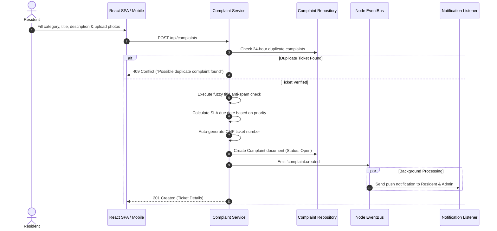
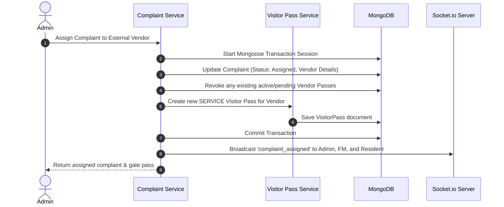
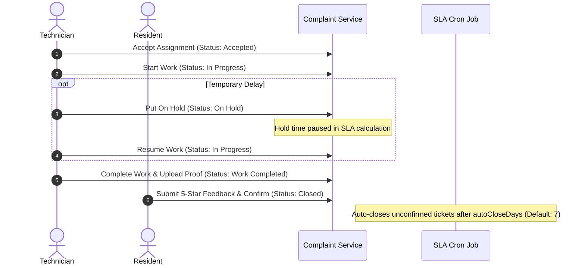

# Complaints & Maintenance System - Architectural & Process Report

This report provides an end-to-end technical breakdown of the **Complaints & Maintenance System (Helpdesk, Work Orders, Ticket Dispatching, SLA Auto-Escalation, Complaint Settings, Staff & Vendor Management)** across backend microservices, web SPA, and mobile application platforms. It concludes with an **Audit & Gaps Analysis (Detailed Bug Report)** identifying critical security, logic, and real-time synchronization issues.

---

## 1. System Architecture & Flow

The Complaints & Maintenance module strictly adheres to unidirectional request flows, event-driven decoupling, and multi-tenant partitioning.

### A. Unidirectional Request Flows

#### Backend Execution Flow:
```
┌─────────────────────────┐       ┌─────────────────────────┐       ┌─────────────────────────┐
│     Express Router      │ ───>  │    Express Validator    │ ───>  │       Controller        │
│  (complaint.router.js)  │       │ (complaint.validators)  │       │ (complaint.controller)  │
└─────────────────────────┘       └─────────────────────────┘       └────────────┬────────────┘
                                                                                 │
┌─────────────────────────┐       ┌─────────────────────────┐                    │
│     Mongoose Model      │ <───  │       Repository        │ <──────────────────┘
│  (complaint.model.js)   │       │ (complaint.repository)  │
└─────────────────────────┘       └─────────────────────────┘
             │                                 │
             ▼                                 ▼
┌─────────────────────────┐       ┌─────────────────────────┐
│     Node EventBus       │ ───>  │  Socket & Notifications │
│  (complaint.events.js)  │       │   (socket.js / listener)│
└─────────────────────────┘       └─────────────────────────┘
```
1. **Router:** Mounts REST endpoints, registers tenant-context boundaries (`orgId`), and attaches RBAC permission guards.
2. **Validator:** Sanitizes payload inputs (category, priority, location parameters) via `express-validator` rules.
3. **Controller:** Extracts HTTP context, correlation headers, and delegates traffic to the service layer.
4. **Service:** Executes business logic, handles Mongoose transactions, manages duplicate prevention fuzzy logic, generates auto-indexed ticket numbers, and broadcasts native events via `EventEmitter`.
5. **Repository:** Executes database queries using `$facet` Mongoose pipelines for single round-trip paginated table queries.

#### Frontend Execution Flow ("Thin View" Pattern):
```
┌─────────────────────────┐       ┌─────────────────────────┐       ┌─────────────────────────┐
│   React UI / Screen     │ ───>  │    Custom Hook Bridge   │ ───>  │   Redux Toolkit Thunk   │
│(ComplaintManagement/View)│      │   (useComplaints.js)    │       │   (complaintSlice.js)   │
└─────────────────────────┘       └─────────────────────────┘       └────────────┬────────────┘
                                                                                 │
┌─────────────────────────┐       ┌─────────────────────────┐                    │
│   Express REST API      │ <───  │    Global API Client    │ <──────────────────┘
│     /api/complaints     │       │     (apiClient.js)      │
└─────────────────────────┘       └─────────────────────────┘
```
* **Decoupled State Management:** React components never call API services or Redux dispatchers directly. They interact with `useComplaints.js`, which encapsulates view state, filter parameters, and Redux thunk actions.

---

## 2. Directory & Module Map

The architecture maintains strict encapsulation across all three application layers:

```
├─ backend/src/features/
│  ├─ complaint/
│  │  ├─ complaint.model.js        # Mongoose Schema defining ticket status, SLA, timelines, and feedback
│  │  ├─ complaint.repository.js   # Encapsulated Mongoose aggregation pipelines and search queries
│  │  ├─ complaint.service.js      # Core workflow logic, assignment strategies, and SLA math
│  │  ├─ complaint.controller.js   # Traffic controller mapping HTTP requests to services
│  │  ├─ complaint.router.js       # REST routes with authentication & RBAC guards
│  │  ├─ complaint.validators.js   # Express-validator input verification rules
│  │  ├─ complaint.cron.js         # Hourly Node Cron job executing automatic SLA breach escalations
│  │  ├─ complaint.events.js       # Native domain EventEmitter
│  │  ├─ complaint.listeners.js    # Push notifications & email notification listener
│  │  └─ complaint.socket.js       # Socket.io room broadcaster
│  ├─ complaintSettings/           # Category rules, SLA timings, rating configs, & ticket prefixes
│  └─ technician/                  # In-house staff & external vendor directory management
│
├─ frontend/src/features/complaints/
│  ├─ views/
│  │  ├─ ComplaintDashboard.jsx   # Top-level executive metrics & category breakdown
│  │  ├─ ComplaintManagement.jsx  # Admin central dispatch table
│  │  ├─ ComplaintDetails.jsx     # Full ticket detail, timeline, and comment thread
│  │  ├─ CreateComplaint.jsx      # Ticket submission form with file upload dropzones
│  │  ├─ AssignComplaint.jsx     # Technician dispatching & vendor assignment workflow
│  │  ├─ Assignee.jsx             # Staff work order queue
│  │  ├─ ComplaintSettings.jsx   # SLA configuration, category manager, and rating setup
│  │  ├─ PerformanceAnalytics.jsx# SLA compliance & satisfaction metrics
│  │  └─ StaffAndVendor.jsx       # Technician roster and vendor directory management
│  ├─ components/                 # Reusable sub-components (StatusBadge, Timeline, VendorPassModal, etc.)
│  ├─ hooks/                      # Controller hooks (useComplaints.js, useComplaintSettings.js, etc.)
│  ├─ services/                   # Axios API service queries
│  └─ store/                      # Redux Toolkit slice and thunks
│
└─ mobile/mobile-app/src/features/complaints/
   ├─ screens/                    # Mobile routes (AdminComplaintManagementScreen, ResidentRaiseTicketScreen, StaffAssigneeQueueScreen)
   ├─ components/                 # Mobile cards & sheets (AssignTechnicianSheet, ProofOfWorkModal, ResidentFeedbackSheet)
   ├─ hooks/                      # Custom mobile hooks
   └─ services/                   # Axios mobile client calls
```

---

## 3. Database Schemas & Multi-Tenancy

### Database ER Diagram
```mermaid
erDiagram
    Organization ||--o{ Complaint : "hosts tickets"
    User ||--o{ Complaint : "submits (Resident)"
    User ||--o{ Complaint : "assigned to (Technician)"
    Organization ||--o{ ComplaintSettings : "defines SLA & categories"
    Organization ||--o{ Technician : "manages technician roster"
    Complaint ||--o? VisitorPass : "triggers Vendor Entry Pass"
```

### Key Schemas Summary

1. **`Complaint` Collection (`complaint.model.js`)**:
   - `orgId`: Tenant isolation key (`ObjectId`).
   - `complaintNumber`: Unique ticket identifier (`CMP-YYYY-000001`).
   - `status`: Multi-stage state enum (`Open`, `Waiting For Assignment`, `Waiting For Acceptance`, `Assigned`, `Accepted`, `In Progress`, `On Hold`, `Work Completed`, `Waiting For Resident Confirmation`, `Completed`, `Closed`, `Rejected`, `Cancelled`, `Escalated`).
   - `slaDueDate` & `effectiveSlaDueDate`: Calculated deadlines factoring in active "On Hold" pauses.
   - `timeline`: Audit trail capturing actions, user roles, IP addresses, and timestamps.
   - `feedback`: Resident ratings (overall, technician, service, cleanliness, communication) and remarks.

2. **`ComplaintSettings` Collection (`complaintSettings.model.js`)**:
   - `orgId`: Unique compound index ensuring one configuration record per tenant.
   - `categories` & `suggestedIssues`: Category hierarchy with usage tracking counts.
   - `slaRules`: Priority-based resolution windows (Low, Medium, High, Critical).
   - `ticketFormat`: Custom ticket numbering prefixes and sequence padding.

3. **`Technician` Collection (`technician.model.js`)**:
   - `department`: Trade skill categorization (`Electrical`, `Plumbing`, `Housekeeping`, `Security`, `Carpentry`, `Others`).
   - `type`: Employment classification (`In-House Staff`, `External Vendor`).

---

## 4. End-to-End Execution Flows

### Flow 1: Resident Ticket Submission (Anti-Spam & SLA Calculation)


### Flow 2: Admin Dispatching & Vendor Gate Pass Generation


### Flow 3: Technician Work Lifecycle & Resident Feedback


---

## 5. Real-Time Synchronization Pipeline

The system utilizes Socket.io room-based isolation to ensure live updates across all connected clients:

* **Target Rooms**:
  - `org:${orgId}:role:admin`
  - `org:${orgId}:role:facilitymanager`
  - `user:${userId}`
* **Emitted Socket Events**:
  - `complaint_created`: Sent on new ticket creation.
  - `complaint_assigned`: Sent when assigned directly or broadcast to a technician group.
  - `complaint_started`: Sent when work order is set to "In Progress".
  - `complaint_completed`: Sent when technician uploads proof of work.
  - `complaint_closed`: Sent upon resident confirmation.
  - `complaints:settings:updated`: Sent when admins modify SLA or category configurations.

---

## 6. Audit & Gaps Analysis (Detailed Bug Report)

During an in-depth code audit of `backend/src/features/complaint`, `backend/src/features/complaintSettings`, `frontend/src/features/complaints`, and `mobile/mobile-app/src/features/complaints`, the following technical issues were identified:

### [BUG 1] Silent Event Emission Drop for `complaint.reassigned`
* **Location:** [`backend/src/features/complaint/complaint.service.js`](file:///d:/atominos/GatedCommunity/backend/src/features/complaint/complaint.service.js#L441)
* **Severity:** **High (Real-time & Notification Failure)**
* **Description:** In `assignTechnician()`, when a ticket is reassigned to a new technician, the service emits `complaintEvents.emit('complaint.reassigned', ...)`. However, neither [`complaint.socket.js`](file:///d:/atominos/GatedCommunity/backend/src/features/complaint/complaint.socket.js) nor [`complaint.listeners.js`](file:///d:/atominos/GatedCommunity/backend/src/features/complaint/complaint.listeners.js) listens to `complaint.reassigned`.
* **Impact:** Reassigned technicians never receive push notifications, email updates, or real-time WebSockets when a ticket is transferred to them.
* **Fix:** Register `complaint.reassigned` in `complaint.listeners.js` and `complaint.socket.js` to dispatch notifications to the new assignee.

---

### [BUG 2] Role Privilege Flaw in Non-Broadcast Ticket Acceptance
* **Location:** [`backend/src/features/complaint/complaint.service.js`](file:///d:/atominos/GatedCommunity/backend/src/features/complaint/complaint.service.js#L517-L526)
* **Severity:** **Medium (RBAC Security Issue)**
* **Description:** In `acceptAssignment()`, the role check allows users with role string `'Employee'` to claim tickets directly, despite `'Employee'` not being a standard system role. Furthermore, when an admin accepts a ticket on behalf of an unassigned ticket, the field `assignedTechnicianId` is populated with the admin's `userId` without validating if the admin is a registered technician.
* **Impact:** Distorts technician work order metrics and workload analytics.
* **Fix:** Enforce strict technician validation checks before accepting direct assignments.

---

### [BUG 3] Division-by-Zero Risk in Performance Analytics
* **Location:** [`backend/src/features/complaint/complaint.service.js`](file:///d:/atominos/GatedCommunity/backend/src/features/complaint/complaint.service.js#L890-L910)
* **Severity:** **Low (Data Integrity & Client Crash)**
* **Description:** In `getPerformanceAnalytics()`, SLA compliance rates and resident satisfaction percentages divide total closed complaints directly. When an organization has zero complaints, the calculation yields `NaN`, returning unsanitized mathematical anomalies to the frontend analytics dashboard.
* **Fix:** Add fallback guards returning `0` when total ticket count equals `0`.

---

### [BUG 4] Memory Leak in `useComplaintsSocket` Listener Detachment
* **Location:** [`frontend/src/features/complaints/hooks/useComplaintsSocket.js`](file:///d:/atominos/GatedCommunity/frontend/src/features/complaints/hooks/useComplaintsSocket.js)
* **Severity:** **Medium (Client Memory & Performance)**
* **Description:** `useComplaintsSocket` instantiates socket event listeners inside `useEffect` without storing named reference functions for cleanup. Upon re-rendering or navigating away from the view, duplicate listeners remain attached to the global socket instance.
* **Impact:** Multiple duplicate Redux thunk dispatches occur for a single socket event after visiting the complaints view repeatedly.
* **Fix:** Store explicit event handler function references and detach them via `.off(eventName, handler)` in the `useEffect` cleanup return block.
