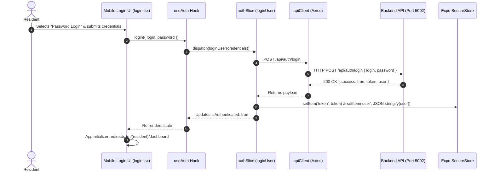

# Mobile Frontend Application Detailed Technical & Architectural Report

This report provides an end-to-end technical overview of the **Manage-My-Gate Mobile Application** (`mobile/mobile-app`). It details the mobile architecture, technological stack, directory structure, state management, API synchronization, security and session persistence, navigation tree, and operational workflows.

---

## 1. Executive Summary & Architecture Overview

The Manage-My-Gate mobile application is a cross-platform mobile app built for iOS, Android, and Web using **React Native** and **Expo SDK 56**. It serves as the primary mobile interface for Residents, Villa Owners, Security Guards, and Community Managers.

```
┌─────────────────────────────────────────────────────────────────────────────┐
│                           Mobile App UI Layer                               │
│  Expo Router v56 (File-Based Navigation) + NativeWind v4 + RN Reusables     │
└──────────────────────────────────────┬──────────────────────────────────────┘
                                       │
┌──────────────────────────────────────▼──────────────────────────────────────┐
│                        State & Logic Layer (Redux)                          │
│ Custom Hooks (useAuth, useVisitorPass, useVilla, useAmenity, useBilling)   │
│                 Redux Toolkit Feature Slices & Async Thunks                 │
└──────────────────────────────────────┬──────────────────────────────────────┘
                                       │
┌──────────────────────────────────────▼──────────────────────────────────────┐
│                    Persistence & Network Gateway Layer                       │
│     Expo SecureStore / AsyncStorage  ───  Axios API Client Interceptor      │
│        (Bearer Token & UUID Correlation Header: X-Request-ID)               │
└──────────────────────────────────────┬──────────────────────────────────────┘
                                       │
┌──────────────────────────────────────▼──────────────────────────────────────┐
│                           Backend REST API (Port 5002)                      │
│                    Express.js / Node.js API Service                         │
└─────────────────────────────────────────────────────────────────────────────┘
```

### Key Architectural Highlights
- **Cross-Platform Compatibility:** 100% unified codebase running seamlessly on **iOS**, **Android**, and **Web Browser** via `react-native-web`.
- **Feature-Based Encapsulation:** Code is grouped strictly by domain under `src/features/[featureName]/` (containing isolated `/services/`, `/store/`, and `/hooks/`).
- **File-Based Routing:** Utilizes **Expo Router v56** under `app/`, with strict authentication route guards dynamically handling user sessions.
- **Secure Persistence:** Persists JWT tokens, active user profiles, and organization state using `expo-secure-store` on native devices and fallback `AsyncStorage` on Web.
- **Correlation ID Tracking:** Every API call auto-generates a unique `X-Request-ID` UUID header to correlate mobile requests with backend observability logs.

---

## 2. Technology Stack & Dependencies

| Layer | Framework / Technology | Version | Purpose |
| :--- | :--- | :--- | :--- |
| **Core Framework** | React Native / Expo SDK | `0.85.3` / `56.0.13` | Native cross-platform app framework |
| **Routing** | Expo Router | `56.2.12` | File-based routing with layout nesting |
| **Styling & UI** | NativeWind / Tailwind CSS | `4.2.6` / `3.4.14` | Utility-first mobile styling engine |
| **UI Components** | React Native Reusables | `1.5.2` | Primitive-based accessible UI design system |
| **State Management** | Redux Toolkit | `2.12.0` | Global store, feature slices, and async thunks |
| **Form Engine** | React Hook Form + Yup | `7.82.0` / `1.7.1` | High-performance form state & schema validation |
| **HTTP Client** | Axios | `1.18.1` | Interceptor-based REST API client |
| **Realtime Transport**| Socket.io Client | `4.8.3` | Realtime socket communication |
| **Security Storage** | Expo Secure Store | `57.0.1` | Hardware-backed encrypted credential storage |

---

## 3. Mobile Directory Architecture

```
mobile/mobile-app/
├── app/                        # Expo Router Pages & Navigation Tree
│   ├── (auth)/                 # Unauthenticated Routes
│   │   ├── _layout.tsx         # Auth Stack Layout
│   │   ├── login.tsx           # Multi-Method Login (Password & Phone OTP)
│   │   └── otp.tsx             # OTP Verification Screen
│   ├── (resident)/             # Authenticated Resident Routes
│   │   └── dashboard.tsx       # Resident Dashboard Container
│   ├── +html.tsx               # Web Root Document Template
│   ├── +not-found.tsx          # 404 Fallback Screen
│   ├── _layout.tsx             # Root Provider & Auth Redirection Initializer
│   └── index.tsx               # App Landing Entry Point
├── components/                 # Reusable UI Primitives
│   └── ui/                     # Design System Components
│       ├── button.tsx          # Styled Touchable Button
│       ├── input.tsx           # Text Input with Icon & Password Visibility Toggle
│       ├── text.tsx            # Typography Component
│       └── icon.tsx            # Lucide Icon Wrapper
├── src/                        # Data Logic & Core Features
│   ├── features/               # Modular Feature Slices
│   │   ├── auth/               # Auth Slice, Services & Hooks
│   │   ├── visitor/            # Visitor Pass Management Slice & Services
│   │   ├── villa/              # Villa & Unit Context Slice & Services
│   │   ├── amenities/          # Amenities & Slot Booking Slice & Services
│   │   ├── billing/            # Invoices & Payments Slice & Services
│   │   ├── complaints/         # Complaints & Maintenance Ticketing Slice & Services
│   │   └── noticeBoard/        # Community Announcements Slice & Services
│   ├── services/               # Global HTTP Services
│   │   └── apiClient.ts        # Axios Client with Auto-Token & Correlation Headers
│   ├── store/                  # Central Redux Store
│   │   └── store.ts            # Registered Feature Reducers
│   └── utils/                  # Utility Functions & Storage
│       └── storage.ts          # Cross-Platform Secure Storage Wrapper
├── .env                        # Public Environment Configuration
├── app.json                    # Expo Configuration Manifest
├── babel.config.js             # Babel Compiler Config with NativeWind Plugin
├── tailwind.config.js          # Tailwind CSS Design System Config
└── tsconfig.json               # TypeScript Compiler Configuration
```

---

## 4. State Management & Data Synchronization

The mobile application's data layer is fully synchronized with backend micro-feature endpoints using Redux Toolkit slices and custom hooks.

```
┌─────────────────────────────────────────────────────────────────────────────┐
│                           Central Redux Store (`store.ts`)                  │
├─────────────┬─────────────┬─────────────┬─────────────┬─────────────┬───────┤
│ auth        │ visitorPass │ villa       │ amenities   │ complaints  │ billing
└──────┬──────┴──────┬──────┴──────┬──────┴──────┬──────┴──────┬──────┴───────┘
       │             │             │             │             │
┌──────▼──────┐┌─────▼──────┐┌─────▼──────┐┌─────▼──────┐┌─────▼──────┐
│   useAuth   ││useVisitor  ││  useVilla  ││ useAmenity ││useComplaint│
└─────────────┘└────────────┘└────────────┘└────────────┘└────────────┘
```

### Registered Feature Modules

1. **Authentication (`src/features/auth/`):**
   - **Service:** `authService.ts` (`login`, `register`, `initiatePhoneLogin`, `verifyPhoneLogin`, `logoutApi`)
   - **Slice:** `authSlice.ts` (`bootstrapAuth`, `loginUser`, `requestOtp`, `verifyOtpLogin`, `performLogout`)
   - **Hook:** `useAuth.ts`

2. **Visitor Management (`src/features/visitor/`):**
   - **Service:** `visitorService.ts` (`fetchPasses`, `createPass`, `revokePass`, `verifyPassCode`)
   - **Slice:** `visitorPassSlice.ts` (`getVisitorPasses`, `generatePass`, `cancelPass`)
   - **Hook:** `useVisitorPass.ts`

3. **Villa & Unit Context (`src/features/villa/`):**
   - **Service:** `villaService.ts` (`fetchVillas`, `fetchVillaBlocks`, `fetchVillaById`, `fetchVillaStats`)
   - **Slice:** `villaSlice.ts` (`getVillas`, `getVillaById`)
   - **Hook:** `useVilla.ts`

4. **Amenities Management (`src/features/amenities/`):**
   - **Service:** `amenityService.ts` (`fetchAmenities`, `fetchAmenityById`, `bookAmenity`, `fetchMyBookings`)
   - **Slice:** `amenitySlice.ts` (`getAmenities`, `getMyAmenityBookings`)
   - **Hook:** `useAmenity.ts`

5. **Complaints & Ticketing (`src/features/complaints/`):**
   - **Service:** `complaintService.ts` (`fetchComplaints`, `createComplaint`, `fetchComplaintById`)
   - **Slice:** `complaintSlice.ts` (`getComplaints`, `submitComplaint`)
   - **Hook:** `useComplaint.ts`

6. **Billing & Receivables (`src/features/billing/`):**
   - **Service:** `billingService.ts` (`fetchInvoices`, `fetchInvoiceById`, `payInvoice`)
   - **Slice:** `billingSlice.ts` (`getInvoices`, `processPayment`)
   - **Hook:** `useBilling.ts`

7. **Notice Board (`src/features/noticeBoard/`):**
   - **Service:** `noticeBoardService.ts` (`fetchNotices`, `fetchNoticeById`)
   - **Slice:** `noticeBoardSlice.ts` (`getNotices`)
   - **Hook:** `useNoticeBoard.ts`

---

## 5. Authentication Flow & UI Implementation

The mobile app supports **multi-method authentication** via a clean tabbed UI on `app/(auth)/login.tsx`:



### Multi-Auth Capabilities
- **Password Authentication:** Enter Email or Username with Password. Features interactive password eye-toggle.
- **Phone OTP Authentication:** Enter mobile number (international format e.g., `+919988776655`), receives OTP code, and verifies on `app/(auth)/otp.tsx`.
- **Automatic Session Restoration (`bootstrapAuth`):** On app startup, `bootstrapAuth()` reads stored credentials from Expo SecureStore. If valid, the app directly mounts the user's dashboard without forcing re-login.

---

## 6. Network Gateway & Persistence

### 1. `apiClient.ts` (Network Interceptor)
Located at `src/services/apiClient.ts`:
- **Base URL:** Dynamically configured via `EXPO_PUBLIC_API_URL` (currently `http://localhost:5002/api`).
- **Correlation ID Header:** Generates a fresh UUID v4 header (`X-Request-ID`) on every single request.
- **Bearer Token Header:** Reads active JWT token from Redux state and attaches `Authorization: Bearer <token>`.
- **Automatic 401 Interception:** Listens for 401 Unauthenticated errors, attempts token refresh via `/auth/refresh-token`, and auto-logs out user if refresh fails.

### 2. `storage.ts` (Cross-Platform Storage)
Located at `src/utils/storage.ts`:
- Uses `expo-secure-store` on iOS/Android for hardware-encrypted token protection.
- Automatically falls back to `AsyncStorage` when running in web browsers.

---

## 7. How to Run, Test, and Build

### Prerequisites
Ensure Node.js is installed. Navigate to the mobile project directory:
```bash
cd mobile/mobile-app
```

### 1. Run on Web Browser (UI Preview & Inspection)
```bash
npm run web
```
> Starts the Expo web bundler at `http://localhost:8081`. Allows responsive mobile testing in Google Chrome DevTools.

### 2. Run on Mobile Device via Expo Go
```bash
npm run dev
```
> Displays a QR code in the terminal. Scan it using the **Expo Go** app on iOS or Android.

### 3. Run on Emulators
- **Android Emulator:** Ensure Android Studio is running, then press `a` (or `npm run android`).
- **iOS Simulator (macOS only):** Press `i` (or `npm run ios`).

### 4. Type Checking & Verification
```bash
cmd /c "cd mobile/mobile-app && npx tsc --noEmit"
```
> Verifies 100% clean TypeScript compilation across all routes, components, services, and hooks.

---

## 8. Summary of Status & Readiness

| Module / Feature | Status | Implementation Details |
| :--- | :--- | :--- |
| **Expo Router Setup** | ✅ Ready | `app/` file-based navigation with `RootLayout` session guard |
| **Redux Store & Slices** | ✅ Ready | `auth`, `visitorPass`, `villa`, `amenities`, `billing`, `complaints`, `noticeBoard` |
| **API Client & Gateway** | ✅ Ready | `apiClient.ts` connected to backend port `5002` with `X-Request-ID` |
| **Basic Authentication** | ✅ Ready | Email/Username + Password login screen with validation & error banners |
| **Phone OTP Auth** | ✅ Ready | Phone login tab & verification screen (`otp.tsx`) |
| **Secure Persistence** | ✅ Ready | `storage.ts` using Expo SecureStore with web fallback |
| **TypeScript Build** | ✅ 0 Errors | Verified via `npx tsc --noEmit` |
