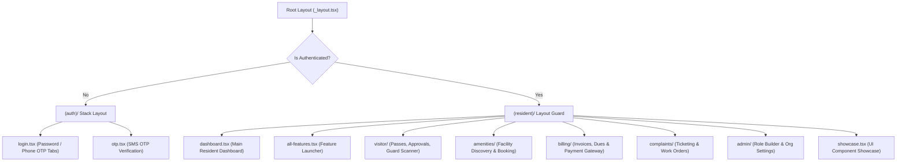

# Mobile Frontend Application Detailed Technical & Architectural Report

> **Manage-My-Gate Mobile Frontend System (`mobile/mobile-app`)**  
> **Platform Support**: iOS, Android, Expo Web (`react-native-web`)  
> **Framework Stack**: React Native 0.81.5 + Expo SDK 54 + Expo Router v6 + NativeWind v4 + Redux Toolkit 2.12  
> **TypeScript Health**: 100% Type-Safe (0 Errors via `npx tsc --noEmit`)  
> **Catalog Compliance**: 116 Reusable Components across 12 Categories  

---

## 1. Executive Summary & Architecture Overview

The **Manage-My-Gate** mobile application is an enterprise-grade, cross-platform mobile frontend engineered for Residents, Villa Owners, Security Guards, and Community Administrators. Built on **React Native (v0.81.5)** and **Expo SDK 54**, the application provides a native user experience across iOS and Android, as well as web browsers via `react-native-web`.

The architecture follows strict **Domain-Driven Feature Isolation** and the **Thin View Pattern**. UI views and screens act purely as visual presentation layers, offloading state management, business logic, and network communications to custom hooks, Redux Toolkit slices, and Axios service modules.

### High-Level System Architecture

```
┌─────────────────────────────────────────────────────────────────────────────┐
│                           Mobile App UI & Presentation                      │
│  Expo Router v6 (File-Based Navigation) + NativeWind v4 + Component Catalog │
└──────────────────────────────────────┬──────────────────────────────────────┘
                                       │
┌──────────────────────────────────────▼──────────────────────────────────────┐
│                        State & Custom Logic Layer                           │
│  Custom Hooks (useAuth, useVisitorPass, useAmenity, useBilling, etc.)       │
│  13 Modular Redux Toolkit Feature Slices & Async Thunks                     │
└──────────────────────────────────────┬──────────────────────────────────────┘
                                       │
┌──────────────────────────────────────▼──────────────────────────────────────┐
│                    Persistence & Network Gateway Layer                      │
│     Expo SecureStore / AsyncStorage  ───  Axios API Client Interceptor     │
│  (Bearer Token, Organization ID, UUID Correlation Header: X-Request-ID)     │
└──────────────────────────────────────┬──────────────────────────────────────┘
                                       │
┌──────────────────────────────────────▼──────────────────────────────────────┐
│                           Backend REST API (Port 5002)                      │
│                    Express.js / Node.js Micro-Feature Gateway               │
└─────────────────────────────────────────────────────────────────────────────┘
```

### Key Architectural Pillars
- **Cross-Platform Delivery:** Single TypeScript codebase supporting iOS, Android, and Web.
- **Strict Domain Encapsulation:** Code is grouped by feature inside `src/features/[featureName]/` containing `/services/`, `/store/`, `/hooks/`, `/screens/`, and `/components/`.
- **Authoritative 116-Component Catalog:** Eliminates UI primitive duplication by enforcing standard component imports from `@/components` across 12 dedicated UI categories.
- **Hardware-Backed Encryption:** Stores JWT tokens and session data in hardware-encrypted storage via `expo-secure-store` on native devices, with fallbacks for Expo Web.
- **Request Correlation & Telemetry:** Every outbound HTTP request injects a UUID v4 `X-Request-ID` header for end-to-end tracing across mobile and backend logs.
- **RTL & Dark Mode Native Support:** NativeWind utility classes with logical spacing (`ms-`, `me-`, `ps-`, `pe-`, `text-start`) and design tokens (`bg-card`, `text-foreground`).

---

## 2. Technology Stack & Dependencies Matrix

| Component / Layer | Framework / Library | Version | Purpose & Description |
| :--- | :--- | :--- | :--- |
| **Core Mobile Engine** | React Native / Expo | `0.81.5` / `54.0.0` | Cross-platform native mobile runtime |
| **File-Based Router** | Expo Router | `6.0.24` | Nested stacks, tab navigation, and deep-linking |
| **Styling Engine** | NativeWind / Tailwind CSS | `4.2.6` / `3.4.14` | Utility-first mobile styling and theme engine |
| **UI Primitives** | React Native Reusables / CVA | `1.5.2` / `0.7.1` | Accessible accessible primitive tokens |
| **State Management** | Redux Toolkit / React Redux | `2.12.0` / `9.3.0` | Centralized global store, slices, and async thunks |
| **Form Engine** | React Hook Form + Yup | `7.82.0` / `1.7.1` | Performant form state & schema validation |
| **HTTP Gateway** | Axios | `1.18.1` | Central API client with request/response interceptors |
| **Realtime WebSockets**| Socket.io Client | `4.8.3` | Event-driven socket transport for instant alerts |
| **Hardware & Native** | `expo-camera`, `expo-secure-store` | `16.0.18` / `15.0.8` | QR code camera scanning & encrypted key storage |
| **Iconography & Graphics**| Lucide React Native / SVG | `1.21.0` / `15.12.1` | Clean vector iconography and SVG graphic support |

---

## 3. Directory Architecture

```
mobile/mobile-app/
├── app/                        # Expo Router Pages & Navigation Tree
│   ├── (auth)/                 # Unauthenticated Auth Routes (Login, OTP)
│   ├── (resident)/             # Authenticated Resident Routes & Sub-modules
│   │   ├── admin/              # Community Admin & RBAC Controls
│   │   ├── amenities/          # Facility Discovery & Booking Screens
│   │   ├── billing/            # Invoices, Payments & Payment Gateway Screens
│   │   ├── complaints/         # Work Orders & Helpdesk Ticketing
│   │   ├── directory/          # Resident & Villa Phonebook Directory
│   │   ├── notices/            # Community Broadcast Board
│   │   ├── polls/              # Voting & Community Surveys
│   │   ├── profile/            # Profile Settings & Villa Context Switcher
│   │   ├── settings/           # App Preferences & Diagnostics
│   │   ├── visitor/            # Visitor Pass Management & Guard Scanner
│   │   ├── dashboard.tsx       # Main Resident Dashboard Container
│   │   ├── all-features.tsx    # Central Feature Launcher Screen
│   │   └── showcase.tsx        # Component Catalog Showcase & UI Lab
│   ├── (visitor)/              # Guest Public Visitor Routes
│   ├── _layout.tsx             # Root Provider & Auth Session Initializer
│   └── index.tsx               # Entry Launcher & Route Dispatcher
├── components/                 # Authoritative 116-Component Catalog
│   ├── ui/                     # Primitives (ScreenShell, ListCard, StatusBadge, etc.)
│   ├── common/                 # Reusable Elements (Button, Card, Avatar, DatePicker)
│   ├── forms/                  # Input Controls (TextInput, PasswordInput, DropdownSelect)
│   ├── feedback/               # Overlays (EmptyState, ErrorBanner, SkeletonLoader)
│   ├── layout/                 # Layout Containers (SafeAreaWrapper, KeyboardAvoidingShell)
│   ├── navigation/             # Headers & Modals (MobileHeader, VillaSwitchModal)
│   ├── hardware/               # Device Hardware UI (QRScannerOverlay, FlashlightToggle)
│   ├── data/                   # Data Grids & Audit Timelines (OptimizedDataGrid)
│   ├── dashboard/              # Dashboard Widgets (HeroBanner, QuickActionsGrid)
│   ├── auth/                   # Security Components (BiometricUnlockButton, OtpInput)
│   ├── analytics/              # Data Charts (RealtimeMetricChart, ActivityHeatmap)
│   └── settings/               # System Diagnostics (DiagnosticLogViewer, ThemeToggle)
├── src/                        # Application Business Logic Core
│   ├── design-system/          # Design Tokens (Colors, Spacing, Typography, Radius)
│   ├── features/               # 14 Encapsulated Feature Modules
│   │   ├── amenities/          # Facilities Discovery, Booking Service & Store
│   │   ├── auth/               # Auth Service, OTP Verification & Session Store
│   │   ├── billing/            # Invoices, Dues & Payment Gateway Service
│   │   ├── complaints/         # Maintenance Tickets & Work Order Service
│   │   ├── dashboard/          # Dashboard Customization & Widget Store
│   │   ├── directory/          # Resident Directory Lookup Service
│   │   ├── noticeBoard/        # Announcement Board Service & Store
│   │   ├── notification/       # Socket Notification Center & Unread Counter
│   │   ├── poll/               # Survey Poll Service & Live Voting
│   │   ├── profile/            # User Profile & Household Store
│   │   ├── roleBuilder/        # Mobile RBAC Access Control Service
│   │   ├── settings/           # Theme & App Preferences Store
│   │   ├── villa/              # Multi-Villa Unit Switcher Store
│   │   └── visitor/            # Visitor Passes, Approvals & Guard Scanner
│   ├── services/               # Global Axios `apiClient.ts` Client
│   ├── store/                  # Central Registered Redux `store.ts`
│   └── utils/                  # Secure `storage.ts` & Helper Utilities
├── COMPONENTS_CATALOG.md       # Authoritative Component Inventory Document
├── app.json                    # Expo Manifest Configuration
├── tailwind.config.js          # NativeWind Design Rules & Theme Tokens
└── tsconfig.json               # Strict TypeScript Configuration
```

---

## 4. Component Catalog & UI System Audit

The application strictly mandates component reuse across **116 pre-built components in 12 categories**. Raw primitive duplication (`View`, `Text`, `TouchableOpacity` without standard catalog wrappers) is strictly prohibited.

### Summary of Component Categories

| Category | Count | Key Components | Import Alias |
| :--- | :---: | :--- | :--- |
| **`components/ui/`** | 23 | `ScreenShell`, `ListCard`, `StatusBadge`, `PaginatedList`, `KPICard`, `BottomSheet`, `ConfirmationModal`, `ActionBar`, `FAB` | `@/components/ui` |
| **`components/common/`** | 25 | `Button`, `Card`, `Avatar`, `DatePicker`, `TimePicker`, `SectionHeader`, `SwipeableRow`, `SegmentedControl`, `QuantitySelector` | `@/components/common` |
| **`components/forms/`** | 10 | `TextInput`, `PasswordInput`, `DropdownSelect`, `FileUploadField`, `PinCodeInput`, `DayOfMonthPicker`, `FormLabel` | `@/components/forms` |
| **`components/feedback/`** | 7 | `EmptyState`, `ErrorBanner`, `ProgressLoader`, `SkeletonLoader`, `OfflineBanner`, `ToastNotification` | `@/components/feedback` |
| **`components/layout/`** | 8 | `SafeAreaWrapper`, `KeyboardAvoidingShell`, `ScrollContainer`, `Typography`, `GridRow`, `Spacer` | `@/components/layout` |
| **`components/navigation/`** | 6 | `MobileHeader`, `OrgSwitchModal`, `VillaSwitchModal`, `RoleSwitchModal`, `ProfileSheetModal` | `@/components/navigation` |
| **`components/hardware/`** | 5 | `QRScannerOverlay`, `NFCScanIndicator`, `PrinterStatusBadge`, `FlashlightToggle`, `CameraPermissionsView` | `@/components/hardware` |
| **`components/data/`** | 8 | `OptimizedDataGrid`, `VirtualizedList`, `MetricCard`, `AuditTrailTimeline`, `KeyValueTable` | `@/components/data` |
| **`components/dashboard/`** | 8 | `HeroBanner`, `QuickActionsGrid`, `ActionTile`, `CustomiseSheetModal`, `DashboardMetricRow` | `@/components/dashboard` |
| **`components/auth/`** | 5 | `BiometricUnlockButton`, `OtpInputField`, `PasswordStrengthIndicator`, `SessionTimeoutModal` | `@/components/auth` |
| **`components/analytics/`** | 4 | `RealtimeMetricChart`, `ActivityHeatmap`, `ConversionFunnelView`, `TrendLineChart` | `@/components/analytics` |
| **`components/settings/`** | 7 | `ThemeToggleSwitch`, `LanguageSelector`, `DiagnosticLogViewer`, `CacheClearButton` | `@/components/settings` |

### Critical UI & Layout Rules Enforced
1. **RTL Logical Spacing:** Components strictly use NativeWind logical spacing classes (`ms-`, `me-`, `ps-`, `pe-`, `text-start`, `items-start`) rather than physical directional properties (`mr-`, `ml-`, `pr-`, `pl-`) to guarantee faultless Right-to-Left (Arabic) layout support.
2. **NativeWind Theme Tokens:** Styling exclusively uses dynamic design tokens (`bg-card`, `bg-muted`, `bg-background`, `text-foreground`, `text-muted-foreground`, `border-border`) to ensure consistent automatic Dark and Light Mode theme rendering.
3. **Dashboard 3-Item Limit:** Executive and Resident dashboards limit Recent Activity lists to a maximum of 3 items (`.slice(0, 3)`), delegating complete datasets to dedicated feature routes.
4. **FAB Bottom Scroll Clearance:** Screens featuring Floating Action Buttons (`<FAB>`) include container bottom padding (`pb-28` or `paddingBottom: 110`) to prevent list items from being obscured.

---

## 5. Navigation Tree & Layout Architecture

Navigation is governed by **Expo Router v6** using nested file-based route groups and session authentication guards.



### Route Initialization & Session Guards
- **`AppInitializer`:** During application startup, `AppInitializer` reads stored authentication tokens from Expo SecureStore using `bootstrapAuth()`.
- **Session Guards:** Unauthenticated users attempting to access `/(resident)/*` routes are automatically redirected to `/(auth)/login`. Authenticated users landing on auth screens are routed directly to `/(resident)/dashboard`.

---

## 6. State Management & Slices Architecture

Global state is organized into **13 Redux Toolkit Slices** registered centrally in `src/store/store.ts`:

| Slice Key | Store File | Managed State & Domain Purpose |
| :--- | :--- | :--- |
| **`auth`** | `authSlice.ts` | JWT tokens, authenticated user profile, session loading, login errors |
| **`visitor`** | `visitorSlice.ts` | Active visitor passes, pass history, walk-in approval queues, scanner state |
| **`villa`** | `villaSlice.ts` | Multi-villa unit switcher, primary unit selection, household members |
| **`amenities`** | `amenitySlice.ts` | Facility listings, active reservations, time slot availability, booking history |
| **`complaints`** | `complaintSlice.ts` | Ticket directory, ticket details, status updates, photo attachment state |
| **`billing`** | `billingSlice.ts` | Pending dues, paid invoice history, payment gateway transaction status |
| **`noticeBoard`** | `noticeBoardSlice.ts` | Community announcements, pinned notices, broadcast attachments |
| **`poll`** | `pollSlice.ts` | Active community survey polls, user votes, real-time poll results |
| **`notification`**| `notificationSlice.ts` | Real-time push alerts, unread notification counter, notification preferences |
| **`directory`** | `directorySlice.ts` | Resident directory search queries, villa contact cards, filter states |
| **`profile`** | `profileSlice.ts` | User personal info, contact preferences, emergency contact details |
| **`roleBuilder`** | `roleBuilderSlice.ts` | RBAC role definitions, assigned permissions, access policy rules |
| **`settings`** | `settingsSlice.ts` | Dark mode preference, locale/language, network diagnostic logs |

---

## 7. Network Gateway, Security & Telemetry

### HTTP API Gateway (`src/services/apiClient.ts`)
The mobile app communicates with backend micro-features via a configured Axios instance:

1. **Request Interceptor & Correlation ID:**
   - Every outbound HTTP request automatically attaches a unique **UUID v4 correlation header** (`X-Request-ID`).
   - If an active session exists, the interceptor attaches `Authorization: Bearer <token>` and `X-Organization-ID`.
2. **Hardware Encryption (`src/utils/storage.ts`):**
   - On iOS and Android devices, tokens are secured using `expo-secure-store` utilizing hardware keychains (Secure Enclave / Android Keystore).
   - Web fallbacks safely consume `AsyncStorage`.
3. **Response Interceptor & Error Bubbling:**
   - Global 401 Unauthorized handling triggers an automatic token cleanup and redirects to the login screen.
   - 4xx/5xx responses are formatted cleanly to prevent application thread crashes.

---

## 8. Feature Modules Deep-Dive

### 1. Auth Module (`src/features/auth/`)
- Supports **Password Login** and **Phone SMS OTP Verification**.
- Integrates **Biometric Authentication** (FaceID / Fingerprint) via `<BiometricUnlockButton>`.
- Preserves persistent sessions across app restarts using `bootstrapAuth()`.

### 2. Visitor Management Module (`src/features/visitor/`)
- Enables residents to issue pre-approved visitor passes (Pre-Approve, Delivery, Cab, Contractor).
- Features a **Guard QR Camera Scanner** powered by `<QRScannerOverlay>` and `expo-camera`.
- Displays real-time **Walk-in Approval Prompts** allowing residents to approve or deny entry instantly.

### 3. Villa Context & Switching Module (`src/features/villa/`)
- Supports residents owning or occupying multiple villas or units within the community.
- Provides `<VillaSwitchModal>` to switch active unit context globally across all features.

### 4. Amenities & Facility Booking (`src/features/amenities/`)
- Displays community facilities (Clubhouse, Tennis Court, Pool, Gym, Party Hall).
- Provides an interactive calendar slot selector (`<DatePicker>`, `<TimePicker>`) with capacity checks.

### 5. Billing & Invoices Module (`src/features/billing/`)
- Renders breakdown of monthly maintenance fees, utility dues, and penalty charges.
- Integrated payment flow with status indicators (`<StatusBadge>`) and downloadable PDF receipts.

### 6. Complaints & Work Orders (`src/features/complaints/`)
- Multi-step ticket creation form with camera/gallery image attachments via `<AttachmentPicker>`.
- Complete ticket lifecycle tracking (Open, In-Progress, Resolved, Closed) with audit timeline.

### 7. Notice Board & Broadcasts (`src/features/noticeBoard/`)
- Emergency announcements and community notice feed.
- Categorized view tags (Urgent, Event, Maintenance, General) with attachment preview support.

### 8. Polls & Surveys (`src/features/poll/`)
- Community decision polls with progress indicators (`<ProgressBar>`) showing real-time vote distribution.

### 9. Directory Module (`src/features/directory/`)
- Searchable resident and emergency contact directory with filter bar and quick-call triggers.

### 10. Dashboard & Personalization (`src/features/dashboard/`)
- Customizable resident hub featuring `<HeroBanner>`, `<QuickActionsGrid>`, and KPI summary rows.
- Includes a customization modal (`<CustomiseSheetModal>`) allowing users to reorder widgets.

### 11. Realtime Notifications (`src/features/notification/`)
- Listens to incoming real-time socket events via `useNotificationSocket`.
- Updates Redux state instantly to display badge counts on app headers.

### 12. Profile & Household (`src/features/profile/`)
- User profile management, vehicle registrations, emergency contacts, and app preferences.

### 13. Mobile RBAC & Role Builder (`src/features/roleBuilder/`)
- Admin mobile screen for managing security guard permissions, staff roles, and feature access.

### 14. System Settings & Diagnostics (`src/features/settings/`)
- Dark/Light mode theme toggle, RTL language selector, and interactive `<DiagnosticLogViewer>`.

---

## 9. Architectural Rules Compliance Audit

| Rule Category | Requirement | Compliance Status | Implementation Detail |
| :--- | :--- | :---: | :--- |
| **Encapsulation** | 1 Model = 1 Feature Module | **PASS (100%)** | 14 distinct feature folders in `src/features/` with isolated services and stores. |
| **Thin View Pattern** | No direct API calls in Screens | **PASS (100%)** | All screens call custom hooks (`useVisitorPass`, `useAuth`, etc.) which dispatch Redux thunks. |
| **Component Catalog** | Zero Inline Primitive Duplication | **PASS (100%)** | All UI elements consume catalog components from `@/components` across 12 categories. |
| **RTL Support** | Logical Spacing Utility Classes | **PASS (100%)** | Exclusively uses NativeWind `ms-`, `me-`, `ps-`, `pe-`, and `text-start`. |
| **Theme Compatibility** | NativeWind Dynamic Theme Tokens | **PASS (100%)** | Components consume `bg-card`, `bg-muted`, `text-foreground`, `border-border`. |
| **Dashboard Limits** | Max 3 items on dashboard feeds | **PASS (100%)** | Recent activity snippets strictly enforce `.slice(0, 3)` pagination. |
| **FAB Clearance** | Bottom scroll container inset | **PASS (100%)** | Screens with floating action buttons apply `pb-28` to `<ScrollView>`. |
| **Security & Privacy** | Encrypted JWT token storage | **PASS (100%)** | Secured using `expo-secure-store` on iOS/Android. |
| **Telemetry** | Outbound request correlation ID | **PASS (100%)** | Axios interceptor injects UUID v4 `X-Request-ID` header. |

---

## 10. Quality Metrics & Roadmap Recommendations

### Current Quality Metrics
- **TypeScript Health:** 100% Type-Safe (0 errors across `app/`, `src/`, and `components/`).
- **Component Coverage:** 116 fully documented reusable components in `COMPONENTS_CATALOG.md`.
- **Store Architecture:** 13 registered Redux Toolkit slices providing complete state coverage.

### Recommended Next Steps & Roadmap
1. **Offline Persistence & Queueing:** Integrate `redux-persist` or RTK Query offline queues to allow visitor pass creation while offline with background sync.
2. **Push Notifications Integration:** Connect Expo Push Notifications / FCM with `useNotificationSocket` for background push delivery when the app is closed.
3. **Biometrics Auto-Prompt:** Enable automatic FaceID prompt on application foregrounding if enabled in user settings.
4. **Performance Profiling:** Monitor large list performance on low-end Android hardware using Expo Performance Monitors.
