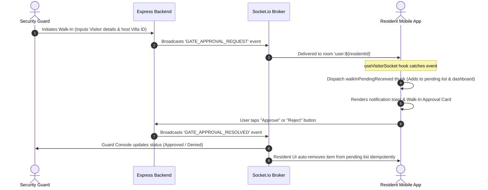

# Visitor Management System (VMS) - Mobile Frontend Comprehensive Technical Report

This document provides an exhaustive, production-grade technical specification and audit report of the **Visitor Management System (VMS)** implemented within the React Native / Expo mobile application. It covers architecture, directory design, screen navigation routes, multi-step invitation flows, real-time WebSocket synchronization, Redux state management, data mappers, and UI components.

---

## 1. System Architecture & Overview

The Visitor Management module provides residents, security guards, and estate administrators with end-to-end access control for modern gated communities. 

### Core Highlights
* **Decoupled Architecture**: UI components do not invoke API clients directly. All user interactions flow through custom hooks (`useVisitorPass`, `useVisitorSocket`) acting as controllers, delegating async logic to Redux Toolkit thunks (`visitorPassSlice`), which interact with Axios API services (`visitorService`).
* **Real-Time Push Approvals**: Socket.io event channels (`user:${userId}`) deliver instant push notifications for guard walk-in verification requests (`GATE_APPROVAL_REQUEST`) and broadcast resolution updates (`GATE_APPROVAL_RESOLVED`).
* **Multi-Category Pass Creation**: Supports **5 distinct visitor entry pass workflows**:
  1. **Guest Pass** (Single/Frequent personal visitors)
  2. **Group Pass** (Party gatherings, multi-guest event entry)
  3. **Cab/Taxi Pass** (Uber, Ola, Rapido pre-approvals with vehicle registration)
  4. **Delivery Pass** (Swiggy, Zomato, Amazon, Blinkit doorstep entry)
  5. **Service/Staff Pass** (Maids, drivers, cooks with weekday and time-slot rules)
* **Digital QR & Short Key Distribution**: Passes generate a **6-digit numeric key code** and **QR code payload** that can be shared directly to WhatsApp or SMS via native mobile sharing.

---

## 2. Directory Anatomy & Feature Modularization

The mobile frontend enforces strict encapsulation following the **Feature-Based Architecture**:

```
mobile/mobile-app/
├── app/(resident)/visitor/           # Navigation Routes (Expo Router)
│   ├── index.tsx                     # Main Visitor Hub & KPI Dashboard
│   ├── invite.tsx                    # Multi-Step Creation Wizard
│   ├── resident-passes.tsx           # Active Passes & Management List
│   ├── walk-ins.tsx                  # Gate Walk-In Approval Queue
│   ├── history.tsx                   # Audit Logs & Entry History
│   ├── gate-console.tsx              # Guard Check-In Console
│   ├── cab-pass.tsx                  # Cab Pre-Approval Entry Point
│   ├── delivery-pass.tsx             # Delivery Pre-Approval Entry Point
│   ├── staff-pass.tsx                # Daily Staff Entry Point
│   ├── admin-logs.tsx                # Admin Audit Trail
│   └── kid-exit.tsx                  # Parental Kid Exit Control
└── src/features/visitor/             # Isolated Feature Directory
    ├── components/                   # UI Presentation Components
    │   ├── cab/                      # Cab flow steps (Provider, Vehicle, Schedule, Review)
    │   ├── delivery/                 # Delivery flow steps (Partner, Details, Validity, Review)
    │   ├── group/                    # Group flow steps (Event, Add Guests, Guest List, Review)
    │   ├── guest/                    # Guest flow steps (Details, Schedule, Options, Review)
    │   ├── service/                  # Staff flow steps (Staff, Category, DateRange, Weekday, Slot)
    │   ├── history/                  # Log history views & detail modals
    │   ├── shared/                   # Header, Footer, Stepper, Pass Sheets, QR, Pass Codes
    │   ├── walkin/                   # Approval cards & modals
    │   └── VisitorPassCard.tsx       # Standardized list card item
    ├── hooks/                        # Custom Hook Controllers
    │   ├── useVisitorPass.ts         # Primary controller bridging Redux state & UI actions
    │   └── useVisitorSocket.ts       # Real-time WebSocket listener
    ├── services/                     # Axios HTTP API Service Layer
    │   └── visitorService.ts         # REST API endpoints
    ├── store/                        # Redux Toolkit Slice
    │   └── visitorPassSlice.ts       # Async thunks, reducers & state logic
    ├── utils/                        # Data Mappers & Payload Transformers
    │   ├── mapBackendPassToHistoryItem.ts
    │   ├── mapBackendWalkInToApprovalItem.ts
    │   ├── mapGuestFormToApiPayload.ts
    │   ├── mapGroupFormToApiPayload.ts
    │   ├── mapCabFormToApiPayload.ts
    │   ├── mapDeliveryFormToApiPayload.ts
    │   └── mapServiceFormToApiPayload.ts
    └── mocks/                        # Type Definitions & Mock Structures
        └── visitorMocks.ts           # Interfaces & types
```

---

## 3. Screen & Navigation Matrix (Expo Router)

All screens leverage Expo Router (`app/(resident)/visitor/`) and wrap content using standard UI components (`ScreenShell`, `SearchFilterBar`, `PaginatedList`, `FAB`).

| Route File | Screen Title | Key Responsibilities |
| :--- | :--- | :--- |
| [index.tsx](file:///d:/Atominos%20Consulting/web%20app/Manage-My-Gate/mobile/mobile-app/app/%28resident%29/visitor/index.tsx) | Visitors & Passes | Main dashboard featuring KPIs (Active Passes, Walk-Ins Waiting), Quick Action Grid, and Recent Visitor Passes. |
| [invite.tsx](file:///d:/Atominos%20Consulting/web%20app/Manage-My-Gate/mobile/mobile-app/app/%28resident%29/visitor/invite.tsx) | Invite a Visitor | Stepper form for creating 5 pass types with step indicators, client validation, payload transformation, and digital ticket presentation. |
| [resident-passes.tsx](file:///d:/Atominos%20Consulting/web%20app/Manage-My-Gate/mobile/mobile-app/app/%28resident%29/visitor/resident-passes.tsx) | Resident Visitor Passes | Paginated list of active/pending passes with search, status filters (ALL, ACTIVE, PENDING, REVOKED, EXPIRED), and revocation dialogs. |
| [walk-ins.tsx](file:///d:/Atominos%20Consulting/web%20app/Manage-My-Gate/mobile/mobile-app/app/%28resident%29/visitor/walk-ins.tsx) | Gate Walk-In Approvals | Real-time approval screen for gate requests initiated by security guards. |
| [history.tsx](file:///d:/Atominos%20Consulting/web%20app/Manage-My-Gate/mobile/mobile-app/app/%28resident%29/visitor/history.tsx) | Visitor Pass History | Tabbed history view (Active, Upcoming, Completed, Rejected) with pull-to-refresh and infinite scroll. |
| [gate-console.tsx](file:///d:/Atominos%20Consulting/web%20app/Manage-My-Gate/mobile/mobile-app/app/%28resident%29/visitor/gate-console.tsx) | Gate Security Console | Feature container for Guard domain check-in operations. |
| [cab-pass.tsx](file:///d:/Atominos%20Consulting/web%20app/Manage-My-Gate/mobile/mobile-app/app/%28resident%29/visitor/cab-pass.tsx) | Cab Pre-Approval | Pre-approves incoming Uber/Ola vehicles. Launches cab invite wizard. |
| [delivery-pass.tsx](file:///d:/Atominos%20Consulting/web%20app/Manage-My-Gate/mobile/mobile-app/app/%28resident%29/visitor/delivery-pass.tsx) | Allow Delivery | Pre-approves food/courier deliveries. Launches delivery invite wizard. |
| [staff-pass.tsx](file:///d:/Atominos%20Consulting/web%20app/Manage-My-Gate/mobile/mobile-app/app/%28resident%29/visitor/staff-pass.tsx) | Visiting Help & Staff | Manages daily staff passes for maids/drivers. Launches service invite wizard. |
| [admin-logs.tsx](file:///d:/Atominos%20Consulting/web%20app/Manage-My-Gate/mobile/mobile-app/app/%28resident%29/visitor/admin-logs.tsx) | Admin Gate Logs | Administrator security audit trail screen. |
| [kid-exit.tsx](file:///d:/Atominos%20Consulting/web%20app/Manage-My-Gate/mobile/mobile-app/app/%28resident%29/visitor/kid-exit.tsx) | Kid Exit Approval | Parental permission controls for child gate departures. |

---

## 4. Multi-Step Visitor Invitation Flow

The invitation wizard ([invite.tsx](file:///d:/Atominos%20Consulting/web%20app/Manage-My-Gate/mobile/mobile-app/app/%28resident%29/visitor/invite.tsx)) coordinates a dynamic step pipeline depending on the selected pass category:

### Stepper Configurations
1. **GUEST Pass**:
   - Step 1: `GuestDetailsStep` (Visitor Name, Phone Number, Purpose)
   - Step 2: `GuestScheduleStep` (Visit Date, Time Slot: Immediate vs Scheduled)
   - Step 3: `GuestPassOptionsStep` (Single vs Frequent Entry, Vehicle Plate, Gate Instructions)
   - Step 4: `GuestPassReviewStep` (Summary verification)
2. **GROUP Pass**:
   - Step 1: `GroupVisitDetailsStep` (Event Title, House Gathering Purpose, Date & Time Range)
   - Step 2: `AddGroupGuestsStep` (Dynamic Guest Name & Phone entry)
   - Step 3: `GroupGuestListStep` (Review & remove attendees)
   - Step 4: `GroupPassReviewStep` (Summary verification)
3. **CAB Pass**:
   - Step 1: `CabProviderStep` (Uber, Ola, Rapido, Taxi, Private)
   - Step 2: `CabVehicleStep` (License Plate Registration, Driver Contact)
   - Step 3: `CabScheduleStep` (Arrival Window: Immediate vs 15/30 min)
   - Step 4: `CabPassReviewStep` (Summary verification)
4. **DELIVERY Pass**:
   - Step 1: `DeliveryPartnerStep` (Swiggy, Zomato, Amazon, Blinkit, Flipkart, Dunzo)
   - Step 2: `DeliveryDetailsStep` (Order ID, Package Count, Doorstep vs Gate Collection)
   - Step 3: `DeliveryValidityStep` (Pass Duration: 1hr, 2hr, End of Day)
   - Step 4: `DeliveryPassReviewStep` (Summary verification)
5. **SERVICE Pass**:
   - Step 1: `StaffDetailsStep` (Staff Member Name, Phone Number, Notes)
   - Step 2: `ServiceTypeStep` (Maid, Driver, Cook, Gardener, Nanny, Maintenance)
   - Step 3: `ServiceDateRangeStep` (Start Date to End Date boundary validation)
   - Step 4: `ServiceWeekdayStep` (Allowed Days selection: MON, TUE, WED, etc.)
   - Step 5: `ServiceTimeWindowStep` (Daily Time Slot boundaries, e.g., 08:00 AM - 01:00 PM)
   - Step 6: `ServicePassReviewStep` (Summary verification)

### Pass Generation & Digital Ticket
Upon successful API submission, [GeneratedPassView.tsx](file:///d:/Atominos%20Consulting/web%20app/Manage-My-Gate/mobile/mobile-app/src/features/visitor/components/shared/GeneratedPassView.tsx) renders a digital pass ticket complete with:
- **Status Badge**: Indicates `ACTIVE` pass state.
- **Visual QR Code**: Rendered via `VisitorQRCode.tsx`.
- **6-Digit Short Code**: Rendered via `VisitorPassCode.tsx`.
- **Native Share Integration**: Uses React Native `Share.share()` to distribute invitations over WhatsApp/SMS.

---

## 5. Walk-In Approvals & Security Guard Real-Time Sync

When a visitor arrives at the community gate without a pre-approved pass, security guards initiate a **Walk-In Request** from the Guard Console.



### Components Involved:
- [WalkInApprovalsView.tsx](file:///d:/Atominos%20Consulting/web%20app/Manage-My-Gate/mobile/mobile-app/src/features/visitor/components/walkin/WalkInApprovalsView.tsx): Paginated view rendering pending requests.
- [WalkInApprovalCard.tsx](file:///d:/Atominos%20Consulting/web%20app/Manage-My-Gate/mobile/mobile-app/src/features/visitor/components/walkin/WalkInApprovalCard.tsx): Action card providing instant "Approve" and "Reject" buttons.
- [WalkInVisitorDetailsModal.tsx](file:///d:/Atominos%20Consulting/web%20app/Manage-My-Gate/mobile/mobile-app/src/features/visitor/components/walkin/WalkInVisitorDetailsModal.tsx): Deep-dive modal presenting visitor photo snapshot, vehicle details, and ID verification data.

---

## 6. State Management & Data Layer Architecture

The frontend follows the **Redux First Data Architecture** with zero hardcoded endpoints or raw component fetching.

### 1. API Service Layer (`visitorService.ts`)
Encapsulates all REST calls using `apiClient` (which injects correlation IDs and authentication tokens):
- `createPass(payload)`
- `getPassDetails(id)`
- `getPassByCode(code)`
- `updatePassStatus(id, status)`
- `getPasses(orgId, params)`
- `getPendingApprovals(orgId)`
- `resolveWalkIn(id, status)`

### 2. Redux Slice (`visitorPassSlice.ts`)
Maintains normalized application state:
- `passes`: Array of loaded visitor pass records.
- `activePass`: Currently focused pass model.
- `dashboard`: Contains `recentPasses`, `activePassesCount`, `pendingWalkIns`, loading status, and error state.
- `walkIns`: Contains `pendingList`, loading status, action status, and error state.
- `pagination`: Tracks `currentPage`, `totalPages`, `totalRecords`, and `limit`.

### 3. Custom Controller Hook (`useVisitorPass.ts`)
Acts as the single point of interaction for visual components:
```typescript
const {
  passes,
  activePass,
  dashboard,
  walkIns,
  pagination,
  status,
  fetchPasses,
  fetchDashboardData,
  loadPendingWalkIns,
  resolveWalkIn,
  createNewPass,
  revokePass,
} = useVisitorPass();
```

---

## 7. Real-Time WebSockets (`useVisitorSocket.ts`)

The `useVisitorSocket` hook attaches real-time event handlers to the central Socket.io instance (`useAppSocket`):

1. **`GATE_APPROVAL_REQUEST`**:
   - Triggers when a guard submits a walk-in.
   - Maps raw backend logs via `mapBackendWalkInToApprovalItem`.
   - Dispatches `walkInPendingReceived`, updating Redux state **idempotently** without full page reloads.
2. **`GATE_APPROVAL_RESOLVED`**:
   - Triggers when a request is resolved by another co-resident or admin.
   - Dispatches `walkInResolvedReceived`, removing the request from the pending list.
3. **Automatic Connection Recovery (`connect`)**:
   - When network connectivity is restored after a drop, the socket `connect` event automatically triggers background REST synchronization (`fetchPendingWalkIns` & `fetchDashboardSummary`).

---

## 8. Data Mappers & Payload Transformers

To maintain separation between client form states and database models, isolated mappers transform data back and forth:

* [mapBackendPassToHistoryItem.ts](file:///d:/Atominos%20Consulting/web%20app/Manage-My-Gate/mobile/mobile-app/src/features/visitor/utils/mapBackendPassToHistoryItem.ts): Normalizes heterogeneous backend VisitorPass documents (Guest, Group, Cab, Delivery, Service) into a standardized `ExtendedVisitorPass` shape.
* [mapBackendWalkInToApprovalItem.ts](file:///d:/Atominos%20Consulting/web%20app/Manage-My-Gate/mobile/mobile-app/src/features/visitor/utils/mapBackendWalkInToApprovalItem.ts): Converts backend VisitorLog schemas into UI approval card items.
* [mapGuestFormToApiPayload.ts](file:///d:/Atominos%20Consulting/web%20app/Manage-My-Gate/mobile/mobile-app/src/features/visitor/utils/mapGuestFormToApiPayload.ts): Encodes guest forms into database schemas.
* [mapGroupFormToApiPayload.ts](file:///d:/Atominos%20Consulting/web%20app/Manage-My-Gate/mobile/mobile-app/src/features/visitor/utils/mapGroupFormToApiPayload.ts): Formats event details and guest arrays.
* [mapCabFormToApiPayload.ts](file:///d:/Atominos%20Consulting/web%20app/Manage-My-Gate/mobile/mobile-app/src/features/visitor/utils/mapCabFormToApiPayload.ts): Maps taxi vendors and license plates.
* [mapDeliveryFormToApiPayload.ts](file:///d:/Atominos%20Consulting/web%20app/Manage-My-Gate/mobile/mobile-app/src/features/visitor/utils/mapDeliveryFormToApiPayload.ts): Formats order IDs and delivery partner metadata.
* [mapServiceFormToApiPayload.ts](file:///d:/Atominos%20Consulting/web%20app/Manage-My-Gate/mobile/mobile-app/src/features/visitor/utils/mapServiceFormToApiPayload.ts): Converts 12-hour time strings (`08:00 AM`) to 24-hour formats (`08:00`) and converts weekday names (`MON`, `TUE`) to numeric array representations (`[1, 2]`).

---

## 9. Design System, UI Components & Aesthetics

The module strictly uses the shared design system components (`@/components/ui`), incorporating modern aesthetics (dark mode support, glassmorphism, dynamic badges, micro-animations):

* **`ScreenShell`**: Page wrapper providing header navigation, back buttons, and title subtitles.
* **`KPICard`**: Metric cards displaying live counters with trend badges.
* **`ListCard`**: Standardized card layout with custom icons, status badges, and action buttons.
* **`StatusBadge`**: Color-coded badges mapping status states (`ACTIVE` = success/green, `PENDING` = warning/amber, `REVOKED` = danger/red, `EXPIRED` = neutral/gray).
* **`BottomSheet` & `ConfirmationModal`**: Slide-up panels and modal dialogs for details and revocation confirmations.
* **`PaginatedList`**: Handles pull-to-refresh, infinite scroll pagination, loading spinners, and empty states.

---

## 10. Summary & Key File Index

| File / Component Path | Description / Purpose |
| :--- | :--- |
| [index.tsx](file:///d:/Atominos%20Consulting/web%20app/Manage-My-Gate/mobile/mobile-app/app/%28resident%29/visitor/index.tsx) | Main Visitor Dashboard & KPI Overview |
| [invite.tsx](file:///d:/Atominos%20Consulting/web%20app/Manage-My-Gate/mobile/mobile-app/app/%28resident%29/visitor/invite.tsx) | Multi-Step Visitor Invitation Stepper Wizard |
| [resident-passes.tsx](file:///d:/Atominos%20Consulting/web%20app/Manage-My-Gate/mobile/mobile-app/app/%28resident%29/visitor/resident-passes.tsx) | Paginated Resident Visitor Passes Screen |
| [walk-ins.tsx](file:///d:/Atominos%20Consulting/web%20app/Manage-My-Gate/mobile/mobile-app/app/%28resident%29/visitor/walk-ins.tsx) | Pending Walk-In Gate Approvals Screen |
| [history.tsx](file:///d:/Atominos%20Consulting/web%20app/Manage-My-Gate/mobile/mobile-app/app/%28resident%29/visitor/history.tsx) | Tabbed Visitor Entry & Audit Logs History Screen |
| [useVisitorPass.ts](file:///d:/Atominos%20Consulting/web%20app/Manage-My-Gate/mobile/mobile-app/src/features/visitor/hooks/useVisitorPass.ts) | Primary Custom Controller Hook |
| [useVisitorSocket.ts](file:///d:/Atominos%20Consulting/web%20app/Manage-My-Gate/mobile/mobile-app/src/features/visitor/hooks/useVisitorSocket.ts) | Real-Time WebSocket Event Listener Hook |
| [visitorPassSlice.ts](file:///d:/Atominos%20Consulting/web%20app/Manage-My-Gate/mobile/mobile-app/src/features/visitor/store/visitorPassSlice.ts) | Redux Toolkit Slice (Thunks & State Management) |
| [visitorService.ts](file:///d:/Atominos%20Consulting/web%20app/Manage-My-Gate/mobile/mobile-app/src/features/visitor/services/visitorService.ts) | Axios HTTP Client Service Layer |
| [mapBackendPassToHistoryItem.ts](file:///d:/Atominos%20Consulting/web%20app/Manage-My-Gate/mobile/mobile-app/src/features/visitor/utils/mapBackendPassToHistoryItem.ts) | Backend Document to UI Model Mapper |
| [GeneratedPassView.tsx](file:///d:/Atominos%20Consulting/web%20app/Manage-My-Gate/mobile/mobile-app/src/features/visitor/components/shared/GeneratedPassView.tsx) | Digital Pass Ticket Presentation & Native Share Component |
| [VisitorLogDetailsModal.tsx](file:///d:/Atominos%20Consulting/web%20app/Manage-My-Gate/mobile/mobile-app/src/features/visitor/components/history/VisitorLogDetailsModal.tsx) | Pass & Log Details Modal with Revoke Actions |
