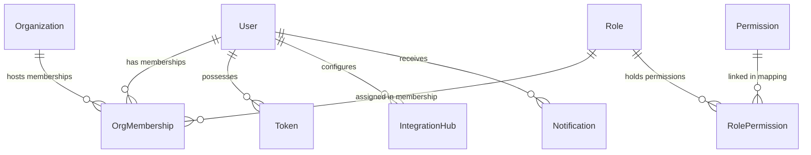

# Detailed Process Report: Secure User Management & RBAC Administration

This document provides a highly detailed engineering and architectural breakdown of the **Secure User Management & RBAC Administration** project, explaining design patterns, cross-database connections, server and client setups, and feature configurations.

---

## 1. System Architecture & Flow (`arcehteh`)

The project is configured as a modular monorepo containing a modern React client (frontend) and an Express/Mongoose server (backend). It enforces strict separation of concerns, decoupling transport protocols from business workflows.

### A. Modular Isolation & "One Model, One Feature" Rule
Both frontend and backend structure source files inside feature directories (e.g., `src/features/`). 
* **The Rule:** Each database collection or business model has a single dedicated feature folder. 
* **Scope of Use:** If a utility, hook, configuration, validator, or component is only used by one feature, it stays inside that feature's directory. It is only promoted to global structures (e.g., `/src/components/common/` or `/src/utils/`) if it is shared by two or more separate modules.

### B. Unidirectional Request Flows

#### Backend Flow:
```
┌──────────────────┐       ┌────────────────────────┐       ┌──────────────────────┐
│  Express Router  │ ───>  │   Express Validator    │ ───>  │      Controller      │
│  (role.router)   │       │   (role.validateRules) │       │  (role.controller)   │
└──────────────────┘       └────────────────────────┘       └──────────┬───────────┘
                                                                       │
┌──────────────────┐       ┌────────────────────────┐                  │
│  Mongoose Model  │ <───  │       Repository       │ <────────────────┘
│ (role.model.js)  │       │   (role.repository)    │
└──────────────────┘       └────────────────────────┘
```
1. **Router:** Mounts routes and intercepts incoming HTTP requests.
2. **Validator:** Uses `express-validator` to validate and sanitize payloads at the entry gate.
3. **Controller:** Extract parameters, acts as the "Traffic Cop," and calls the feature's service.
4. **Service:** Contains 100% of business logic and transaction orchestration.
5. **Repository:** Executes database queries using Mongoose models.

#### Frontend Flow:
```
┌─────────────────┐       ┌────────────────────────┐       ┌──────────────────────┐
│  UI Component   │ ───>  │  Custom Hook / Control │ ───>  │  Redux Toolkit Thunk │
│ (Visual Canvas) │       │    (useUserList.js)    │       │   (userSlice.js)     │
└─────────────────┘       └────────────────────────┘       └──────────┬───────────┘
                                                                       │
┌─────────────────┐       ┌────────────────────────┐                  │
│     Backend     │ <───  │    Global API Client   │ <────────────────┘
│   API Route     │       │     (apiClient.js)     │
└─────────────────┘       └────────────────────────┘
```
* **"Thin View" Pattern:** UI components are visual layouts. They are not allowed to access Redux selectors/dispatch directly or invoke APIs. Instead, they use custom hooks that act as frontend controllers to manage logic, slice interactions, and forms.

### C. Correlation Tracing & Observability
Every request entering the Express server is tagged with a unique `X-Request-ID` correlation ID via a middleware. This ID propagates to Winston log entries and database trace actions to simplify debugging.

---

## 2. Database Connections & Relationships (`datatable connection on other table`)

The database architecture is designed to support multi-tenancy and role mapping. Database collections are connected through specialized junction tables and Mongoose reference structures.

### A. Entity Relationship Layout



1. **[User](file:///d:/Personal%20Project/propmt%20testing%20Project%201/backend/src/features/user/user.model.js):** Stashes primary authentication credentials, status, and profile information.
2. **[Organization](file:///d:/Personal%20Project/propmt%20testing%20Project%201/backend/src/features/organization/organization.model.js):** Models isolated workspaces. Includes `isPlatform` (distinguishing the central platform from tenants) and `allowedFeatures`.
3. **[OrgMembership](file:///d:/Personal%20Project/propmt%20testing%20Project%201/backend/src/features/orgMembership/orgMembership.model.js):** A many-to-many junction collection mapping `userId` to `orgId` and attaching a specific `roleId`. 
4. **[Role](file:///d:/Personal%20Project/propmt%20testing%20Project%201/backend/src/features/role/role.model.js):** Represents user roles. Roles are scoped to organizations via `orgId`.
5. **[Permission](file:///d:/Personal%20Project/propmt%20testing%20Project%201/backend/src/features/permission/permission.model.js):** Groups granular actions (like `users:write`, `roles:read`) linked to individual features.
6. **[RolePermission](file:///d:/Personal%20Project/propmt%20testing%20Project%201/backend/src/features/rolePermission/rolePermission.model.js):** A many-to-many junction collection linking `roleId` directly to `permissionId`.

### B. Dynamic Joins and Aggregation Pipelines
Cross-feature collection access rules dictate that services cannot query repositories of other features. Relationships are fetched using Mongoose features:

#### 1. Mongoose Population joins
Junction collections use `.populate()` to load references. For example, [rolePermission.repository.js](file:///d:/Personal%20Project/propmt%20testing%20Project%201/backend/src/features/rolePermission/rolePermission.repository.js#L4-L6) maps permissions:
```javascript
async findByRoleId(roleId) {
  return await RolePermission.find({ roleId }).populate('permissionId');
}
```

#### 2. Paginated Aggregation Pipelines with `$facet` and `$lookup`
To query paginated lists of users across memberships, [orgMembership.repository.js](file:///d:/Personal%20Project/propmt%20testing%20Project%201/backend/src/features/orgMembership/orgMembership.repository.js#L26-L84) joins user details and roles in a single database round-trip:
```javascript
const result = await OrgMembership.aggregate([
  { $match: { orgId: new mongoose.Types.ObjectId(orgId) } },
  {
    $lookup: {
      from: 'users',
      localField: 'userId',
      foreignField: '_id',
      as: 'user',
    },
  },
  {
    $lookup: {
      from: 'roles',
      localField: 'roleId',
      foreignField: '_id',
      as: 'role',
    },
  },
  { $unwind: '$user' },
  { $unwind: '$role' },
  {
    $facet: {
      metadata: [{ $count: 'totalRecords' }],
      data: [
        { $skip: skip },
        { $limit: limit },
        {
          $project: {
            _id: 0,
            id: '$user._id',
            username: '$user.username',
            email: '$user.email',
            role: '$role.name',
            status: '$user.status',
          },
        },
      ],
    },
  },
]);
```

### C. Frontend DataTable Mapping
On the frontend, the generic [DataTable.jsx](file:///d:/Personal%20Project/propmt%20testing%20Project%201/frontend/src/components/common/DataTable.jsx) maps over records. The column structure receives a custom `render` function to display columns containing joined reference values:
```javascript
const columns = [
  { key: 'username', label: 'User' },
  { key: 'email', label: 'Email' },
  { 
    key: 'role', 
    label: 'Role', 
    render: (val) => <span className="badge bg-secondary">{val || 'Unassigned'}</span> 
  },
];
```

---

## 3. Backend Setup

The backend serves as a REST API and WebSocket host built with Express and MongoDB.

### A. Initialization Sequence ([server.js](file:///d:/Personal%20Project/propmt%20testing%20Project%201/backend/server.js))
1. **Connect DB:** Calls `connectToDb()` to open connection to MongoDB.
2. **Sync Permissions:** Invokes `syncPermissions()` to read [permissions.json](file:///d:/Personal%20Project/propmt%20testing%20Project%201/backend/src/config/permissions.json), populate the collections, and bootstrap default roles.
3. **SSO / Passport Init:** Initializes passport session configurations for login integrations.
4. **Initialize Sockets:** Configures Socket.io singleton using the HTTP server wrapper.
5. **Listen:** Binds the port and starts the listener.

### B. Core Middlewares ([index.js](file:///d:/Personal%20Project/propmt%20testing%20Project%201/backend/index.js))
* **CORS & Helmet:** Restricts origin access and locks header variables (Content Security Policy is set to `false` for development/integration testing).
* **Correlation ID Middleware:** Assigns `X-Request-ID` to requests.
* **HTTP Logger:** Tracks incoming requests and outputs them via Winston logger.
* **Tenant Middleware:** Evaluates and populates `req.tenant` context.
* **Global Error Handler:** Catches bubbling errors, sanitizes stack traces, and formats response envelopes.

---

## 4. Frontend Setup

The client is a single-page application compiler generated using Vite and configured with CoreUI and Redux.

### A. SPA Entry & Compiler Config
* **Vite Config:** Handles compiling and CSS preprocessing with SASS.
* **SPA Routing:** Configured with `HashRouter` to prevent server fallback issues. Routes are split using `React.lazy()` for performance optimization.
* **Redux Provider:** Wraps the app in [store.js](file:///d:/Personal%20Project/propmt%20testing%20Project%201/frontend/src/store/store.js), exposing a global state with custom `stateLoggerMiddleware` active in development mode.

### B. API Interceptors ([apiClient.js](file:///d:/Personal%20Project/propmt%20testing%20Project%201/frontend/src/services/apiClient.js))
* **Request Interceptor:** Injects bearer token (`Authorization: Bearer <jwt>`) and generates `X-Request-ID` header.
* **Response Interceptor:** Automatically extracts `.data` envelopes. Catches `401 Unauthorized` errors to execute global logout.

### C. Layout and Internationalization (i18n)
* **i18next Integration:** Handles language translation files (e.g. English, Arabic).
* **RTL Styling Rules:** In compliance with Arabic right-to-left layout rules, physical spacing margins are avoided; logical CSS variables (`ms-*` and `pe-*`) are implemented globally.

---

## 5. Feature Configurations & Workflows

### A. User Authentication & Multi-Tenancy Switch
* **Mechanism:** Passport local strategy authenticates usernames and passwords, generating a JWT token.
* **Context Switching:** Users can request `POST /api/auth/switch-context` passing a target `orgId`. `AuthService` verifies their membership in `OrgMembership`, extracts permissions linked to that workspace, and generates a fresh scoped token containing the active permissions.

### B. Platform Safeguards
* **Lockout Protection:** Platform administrators cannot block or edit the root platform organization (`isPlatform === true`). The backend validator checks database flags and rejects modifications.
* **Menu Segregation:** [AppSidebar.jsx](file:///d:/Personal%20Project/propmt%20testing%20Project%201/frontend/src/components/AppSidebar.jsx) filters navigation folders; options such as "Org Manager" are only displayed if the active workspace is the System Platform.

### C. Zero-Trust User Invitation
* **Invitation:** Admin enters user email.
* **Token Creation:** The backend generates a secure random 32-byte string, hashes it with SHA-256, stores it in `Token` collection, and returns the raw link. The user status defaults to `Pending` with no roles assigned.
* **Activation:** The user accesses the link and submits a password. The backend hashes the raw token, searches the database, activates the profile status to `Active`, hashes the user's password using `bcrypt`, and deletes the token.

### D. Real-Time Socket Notifications
* **Pipeline:** Service triggers `notification_created` using `notificationEvents`.
* **Emit:** The listener calls `dispatchIncomingNotification` in `notification.socket.js`, which pushes a socket payload to `user:${recipientId}`.
* **Client Catch:** A custom hook listens to socket connections, dispatches a Redux sync, and renders user-facing toast alerts.

### E. Integration Hub Setup
* **Credential Vault:** Handles user configurations for external API services (OpenAI, Twilio, Resend).
* **Encryption:** API keys are encrypted at rest using a custom utility that leverages standard initialization vectors (`iv`) and encrypts keys before saving. They are decrypted in-memory only when executing integrations.

### F. Non-Blocking Audit Logs
* **Event Dispatch:** High-level services emit audit actions (like `ORG_STATUS_CHANGED`).
* **Async Listener:** The decoupled event bus fires [auditLog.listeners.js](file:///d:/Personal%20Project/propmt%20testing%20Project%201/backend/src/features/auditLog/auditLog.listeners.js) to write audit log entries asynchronously, avoiding runtime performance delays.
