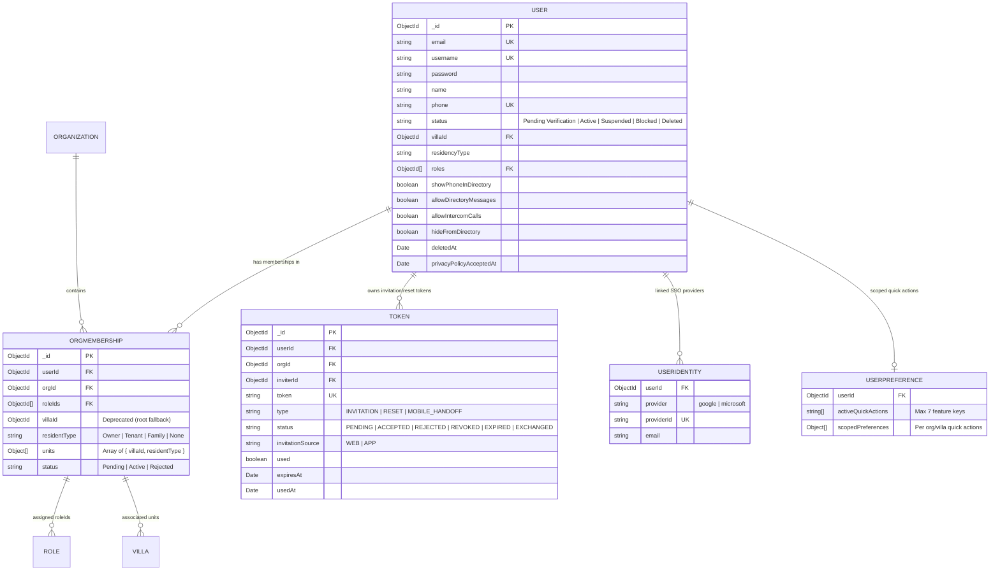
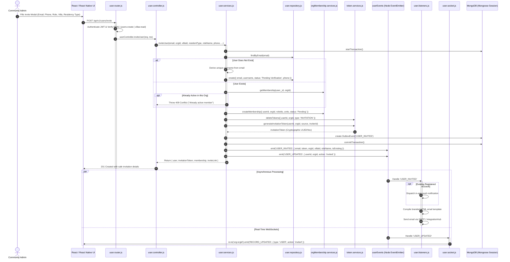
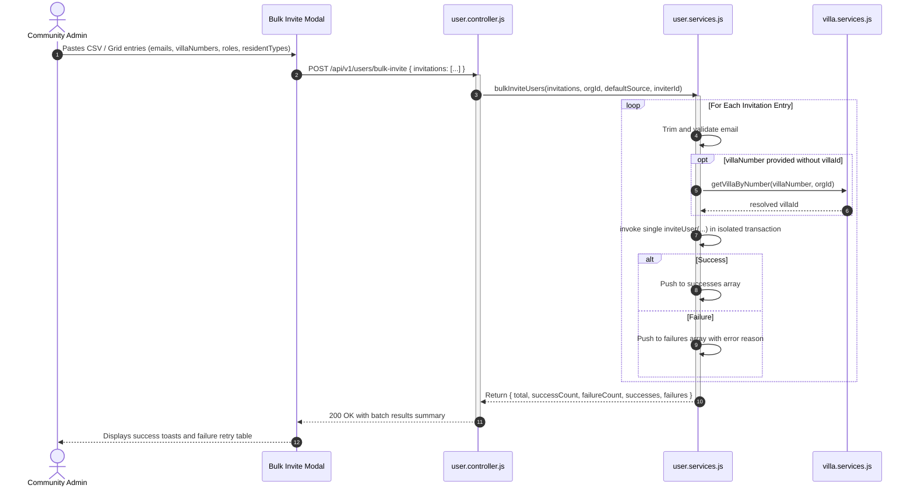
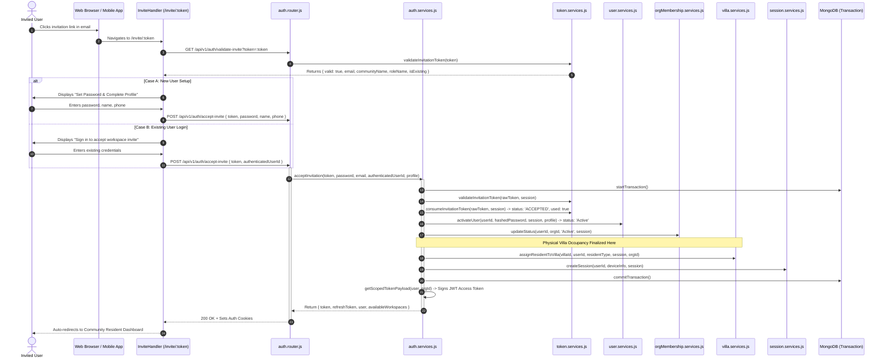
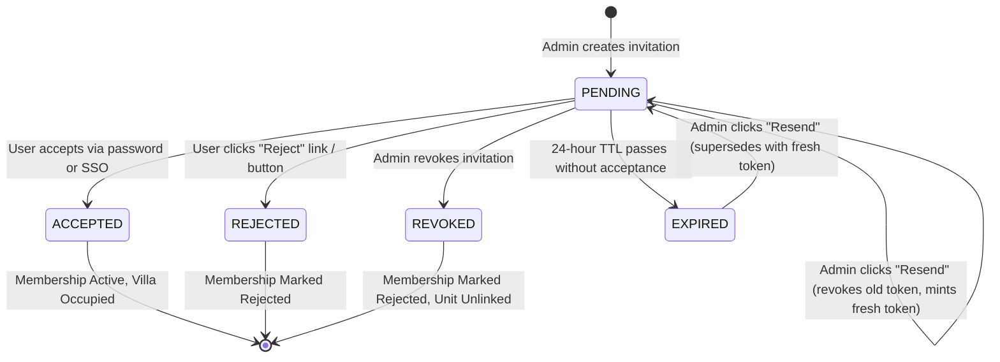
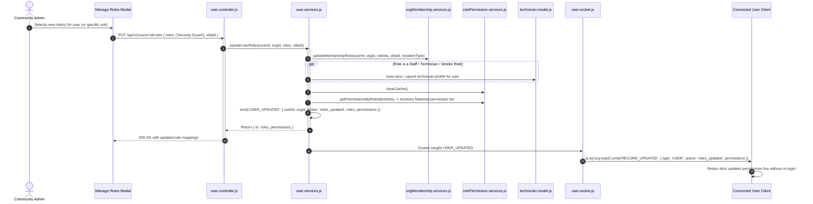
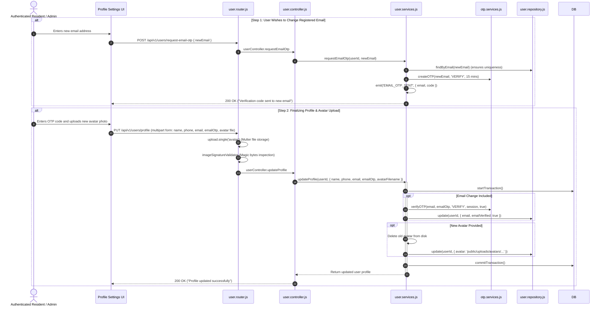
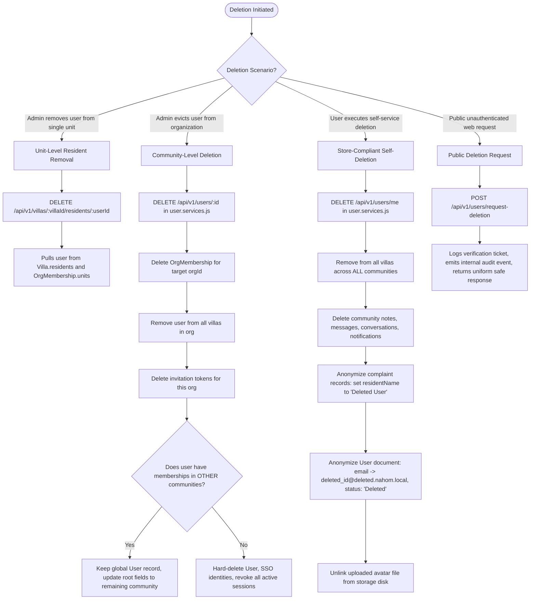

# User Management System Detailed E2E Report

This report provides an end-to-end technical guide to the **User Management & Invitation System** in ManageMyGate (Nahom). It details the multi-tenant architecture, user lifecycle states, database entity models, administrative controls, real-time WebSocket events, security and privacy compliance, and comprehensive Mermaid sequence diagrams for all core user workflows across Backend, Web, and Mobile.

---

## 1. System Architecture & Multi-Tenant Model

The User Management system is designed around strict tenant isolation, role-based access control (RBAC), and protocol decoupling:

- **Decoupled User Identity vs. Community Membership:**
  - A **`User`** represents a global account identity (credentials, contact profile, directory preferences).
  - An **`OrgMembership`** represents the user's localized relationship to a specific gated community or organization (`orgId`), including their assigned unit(s) (`units: [{ villaId, residentType }]`), localized status (`Pending`, `Active`, `Rejected`), and community-scoped roles (`roleIds`).
  - A single user account can simultaneously hold multiple community memberships (e.g., Resident in Community A, Committee Admin in Community B, and Landlord in Community C) without credential duplication.
- **Transactional Integrity:**
  - Critical multi-entity operations (inviting users, accepting invitations, assigning roles, deleting users, revoking invitations) execute inside atomic Mongoose Transactions (`session.startTransaction()`, `commitTransaction()`, `abortTransaction()`).
- **Deferred Villa Occupancy:**
  - When an admin invites a resident to a villa, the unit assignment is staged in the `OrgMembership` record with status `Pending`.
  - Physical villa occupancy and resident roster updates (`assignResidentToVilla`) are strictly deferred until the user explicitly accepts the invitation, preventing ghost reservations.
- **Universal Invitation Routing & Client Resolution:**
  - Invitation links utilize canonical URLs (`/invite/:token`). The backend `invite.utils.js` dynamically identifies client context (`APP` vs `WEB`) via headers (`X-Client-Type`), Origin/Referer ports, or User-Agent to render either the web portal or deep-link to the mobile app (`nahom://invite/...`).
- **Real-Time Decoupling (Event Bus + WebSockets):**
  - The service layer (`user.services.js`) never imports Socket.io directly. Upon state changes, it emits Node `EventEmitter` events (`userEvents`).
  - `user.socket.js` listens to these events and broadcasts room-isolated updates (`org:${orgId}`) to live web and mobile clients.
  - `user.listeners.js` handles asynchronous delivery of branded invitation emails via `messageTemplateService` and `integrationHubService` (SMTP/Resend), as well as in-app notifications for existing registered users.

---

## 2. Core Entity Schemas & Data Relationships

### Entity Relationship Diagram


### Key Field Descriptions & Behaviors
1. **`User` Entity (`backend/src/features/user/user.model.js`):**
   - `password`: Conditionally required only when user status is `Active`. Users created via invitation remain in `Pending Verification` with no initial password until they accept the invite.
   - `phone`: Unique sparse index ensuring mobile number uniqueness across the system while allowing unverified email-only accounts.
   - Directory Privacy: Resident self-service toggles (`showPhoneInDirectory`, `allowDirectoryMessages`, `allowIntercomCalls`, `hideFromDirectory`).
2. **`OrgMembership` Entity (`backend/src/features/orgMembership/orgMembership.model.js`):**
   - `units`: Multi-unit residency array allowing one resident or landlord to hold multiple units in the same community with distinct residency types (e.g. Unit 101 as `Owner`, Unit 204 as `Landlord`).
   - `status`: Lifecycle states: `Pending` (invited, unaccepted), `Active` (accepted & confirmed), `Rejected` (declined by user or revoked).
3. **`Token` Entity (`backend/src/features/token/token.model.js`):**
   - `status`: State machine enforcement (`PENDING` -> `ACCEPTED` / `REJECTED` / `REVOKED` / `EXPIRED`).
   - Standard 24-hour expiration window for invitation tokens.
4. **`UserPreference` Entity (`backend/src/features/userPreference/userPreference.model.js`):**
   - Limits resident home-screen quick actions to at most 7 unique non-duplicated shortcuts.

---

## 3. End-to-End Execution Flows (Sequence Diagrams)

### Flow 1: Single User Invitation Workflow (Web & Mobile Admin)


---

### Flow 2: Bulk User Invitation Workflow


---

### Flow 3: Invitation Acceptance & Account Activation


---

### Flow 4: Invitation Resend, Revoke & Lifecycle State Transitions


#### Resend & Revoke Technical Safeguards
1. **Concurrency-Safe Resend (`user.services.js:resendInvitation`):**
   - Prohibits resending tokens that are already in `ACCEPTED`, `REJECTED`, or `REVOKED` states.
   - Atomically transitions old token to `EXPIRED` (if past TTL) or `REVOKED` (if still pending) using a single-consumer atomic query (`findAndInvalidateForResend`).
   - Mints a brand-new cryptographic token, logs an audit outbox event, and re-triggers notification delivery.
2. **Atomic Revocation (`user.services.js:revokeInvitation`):**
   - Atomically updates token status to `REVOKED`.
   - Transitions user's `OrgMembership.status` to `Rejected`.
   - Automatically cleans up any pending villa assignments (`removeUserFromAllVillasInOrg`).
   - Emits `INVITATION_REVOKED` and `USER_UPDATED` WebSocket events.

---

### Flow 5: Role Assignment & Dynamic RBAC Updates


---

### Flow 6: Profile & Secure Contact Information Updates


---

### Flow 7: User Deletion & Multi-Tenant Erasure

The platform supports three distinct deletion tiers:



---

### Flow 8: Stale User Cleanup (Automated Cron Scheduler)
- Handled by `backend/src/features/user/user.cron.js`.
- Scheduled via `node-cron` to execute daily at midnight UTC (`0 0 * * *`).
- Queries users with `status === 'Pending Verification'` whose `createdAt` is older than 30 days.
- Deletes stale unverified records to prevent database bloating.

---

## 4. API Endpoints & REST Specification

All user routes (except public deletion) require authenticated JWT bearer sessions (`isAuthenticated`), enforce tenant scoping (`tenantContext`), and check dynamic permissions:

| HTTP Method | Route Endpoint | Middleware Stack | RBAC Permission | Purpose |
| :--- | :--- | :--- | :--- | :--- |
| `POST` | `/api/v1/users/request-deletion` | `validate(requestDeletionRules)` | *Public* | Public self-service account deletion request (GDPR/App Store compliance). |
| `GET` | `/api/v1/users/preferences` | `isAuthenticated`, `tenantContext` | Authenticated | Mounts user preference sub-router for dashboard quick actions. |
| `GET` | `/api/v1/users` | `isAuthenticated`, `tenantContext`, RBAC | `users:read` | Returns paginated, searchable list of users in the active organization. |
| `POST` | `/api/v1/users/invite` | `isAuthenticated`, `tenantContext`, RBAC, `validate(inviteUserRules)` | `users:create` OR `villas:read` | Invites a single user with role and unit assignment. |
| `POST` | `/api/v1/users/bulk-invite` | `isAuthenticated`, `tenantContext`, RBAC, `validate(bulkInviteUserRules)` | `users:create` | Bulk invites an array of users with batch validation. |
| `GET` | `/api/v1/users/invitations` | `isAuthenticated`, `tenantContext`, RBAC, `validate(listInvitationsRules)` | `users:read` | Paginated organization invitations with status filtering. |
| `POST` | `/api/v1/users/invitations/:id/resend` | `isAuthenticated`, `tenantContext`, RBAC, `validate(resendInvitationRules)` | `users:create` | Resends invitation, invalidating old token and issuing a new one. |
| `POST` | `/api/v1/users/invitations/:id/revoke` | `isAuthenticated`, `tenantContext`, RBAC, `validate(revokeInvitationRules)` | `users:create` | Revokes unconsumed invitation and marks membership rejected. |
| `POST` | `/api/v1/users/request-email-otp` | `isAuthenticated`, `otpLimiter`, `validate(requestEmailOtpRules)` | Authenticated | Sends 6-digit verification OTP to a proposed new email address. |
| `PUT` | `/api/v1/users/profile` | `isAuthenticated`, `upload.single('avatar')`, `imageSignatureValidator`, `validate(updateProfileRules)` | Authenticated | Updates current user's profile, verifies email OTP, and uploads avatar. |
| `DELETE` | `/api/v1/users/me` | `isAuthenticated` | Authenticated | Self-service account deletion and complete PII anonymization. |
| `PUT` | `/api/v1/users/:id/roles` | `isAuthenticated`, `tenantContext`, RBAC, `validate(updateUserRolesRules)` | `users:update` | Updates user's assigned roles in the current organization. |
| `DELETE` | `/api/v1/users/:id` | `isAuthenticated`, `tenantContext`, RBAC | `users:delete` | Deletes user from organization (or specific villa unit). |

---

## 5. Web Frontend Implementation Architecture

The web frontend strictly adheres to the feature-sliced architecture in `frontend/src/features/userManagement/`:

```
frontend/src/features/userManagement/
├── components/
│   ├── BulkInviteModal.jsx          # Multi-user bulk invite grid & CSV parser
│   ├── InvitationToolbar.jsx        # Search, status pills, rows-per-page for invites
│   ├── InviteUserButton.jsx         # Action button triggering modal
│   ├── InviteUserModal.jsx          # Single user invite form (villa, role, resident type)
│   ├── ManageRolesModal.jsx         # Role checkbox manager with RBAC guards
│   ├── RevokeInvitationModal.jsx    # Confirmation modal for invitation revocation
│   └── UserToolbar.jsx              # Search, role filter, status pills, rows-per-page
├── hooks/
│   ├── useInvitationList.js         # Controller hook for administrative invitation manager
│   └── useUserList.js               # Controller hook bridging UserList view to Redux
├── services/
│   └── userApi.js                   # Pure Axios API calls with X-Request-ID injection
├── store/
│   └── userSlice.js                 # Redux Toolkit slice with async thunks & state
├── styles/
│   └── _userManagement.scss         # Centralized SCSS partial for user management styling
├── views/
│   └── InvitationManagementView.jsx # Dedicated invitation tracking view
└── UserList.jsx                     # Primary enterprise user data table orchestrator
```

### Key Web Features
- **Server-Side Pagination & Faceted Lookups:** `UserList.jsx` and `InvitationManagementView.jsx` delegate all pagination, search queries, and status filtering directly to the backend aggregation pipelines via Redux thunks (`fetchUsersAsync`, `fetchInvitationsAsync`).
- **Multi-Unit Resident Visualization:** Users holding multiple units render with clear unit badges and unit-specific roles directly inside the table rows.
- **Universal Invitation Landing Portal (`src/views/pages/invite/InviteHandler.jsx`):**
  - Evaluates invitation validity on mount.
  - Automatically toggles between "Sign Up" (for new users) and "Sign In" (for existing users).
  - Supports one-click Single Sign-On (Google / Microsoft).
  - Offers a QR code / Mobile Handoff card allowing desktop users to complete registration on mobile.

---

## 6. Mobile App Implementation Architecture

The mobile app (`mobile/mobile-app/`) mirrors the web capabilities using React Native and NativeWind design system tokens:

```
mobile/mobile-app/
├── app/
│   ├── (auth)/
│   │   └── accept-invite.tsx        # Native screen for accepting invitations & setting passwords
│   ├── (resident)/admin/
│   │   ├── users.tsx                # Admin mobile user list with FAB & search
│   │   └── invitations.tsx          # Admin mobile invitation management & resend/revoke
│   └── invite.tsx                   # Deep link router handling universal invite links
└── src/features/userManagement/
    ├── components/
    │   ├── BulkInviteModal.tsx
    │   ├── ConfigureInviteTemplateModal.tsx
    │   ├── InviteUserModal.tsx
    │   ├── ManageRolesModal.tsx
    │   ├── UserCard.tsx             # Touch-friendly card component for user listings
    │   └── UserFilterSheet.tsx      # Bottom sheet for mobile filtering
    ├── hooks/
    │   └── useUserList.ts
    ├── services/
    │   └── userService.ts
    └── store/
        └── userSlice.ts
```

### Catalog Component Reuse Mandate
- Screens wrap content in `<ScreenShell>` or `<KeyboardAvoidingShell>`.
- All modals consume `<ConfirmationModal>` and `<BottomSheet>`.
- Status indicators consume `<StatusBadge>`.
- Loading states utilize `<SkeletonLoader>`.
- Inputs consume `<TextInput>` from `@/components/forms`.
- Deep linking is handled natively through Expo Router (`/invite/:token` maps directly to `app/invite.tsx`).

---

## 7. Security, Privacy & Compliance Highlights

1. **Brute-Force & Rate Limiting Protections:**
   - Public account deletion requests and email OTP generation are throttled by `otpLimiter`.
2. **Preventing User Enumeration Attacks:**
   - The public deletion request endpoint (`POST /users/request-deletion`) performs an internal audit search without exposing whether the submitted email/mobile matches an active account. It returns an identical, uniform success message in all cases.
3. **App Store Review Guideline 5.1.1(v) Compliance:**
   - Both Apple App Store and Google Play require mobile apps with account creation to support immediate, in-app account deletion. The `DELETE /api/v1/users/me` endpoint enables residents to delete and anonymize their own accounts without contacting an administrator.
4. **Malicious File Upload Protections:**
   - Avatar uploads (`/users/profile`) are protected by `imageSignatureValidator` (`backend/src/features/user/middlewares/upload.middleware.js`). This middleware inspects magic byte headers to verify that files are genuine JPEG, PNG, or WebP images, blocking disguised executables or scripts.
5. **Token Hygiene in Logs:**
   - Raw invitation tokens are masked in system logs (`token.slice(0, 6)...`) to prevent token leakage in centralized log streams.

---

## 8. Summary Checklist

| Capability | Backend | Web Frontend | Mobile App |
| :--- | :---: | :---: | :---: |
| Single User Invite (Email, Phone, Villa, Role) | Done | Done | Done |
| Bulk User Invite (Batch processing & CSV) | Done | Done | Done |
| Multi-Unit Residency Support | Done | Done | Done |
| Dynamic Role Management (Live RBAC Sync) | Done | Done | Done |
| Invitation State Machine (Resend, Revoke, Expire) | Done | Done | Done |
| Universal Link Resolution (`/invite/:token`) | Done | Done | Done |
| SSO Acceptance (Google / Microsoft) | Done | Done | Done |
| 2-Step OTP Email Change Flow | Done | Done | Done |
| Avatar Upload with Magic Byte Security | Done | Done | Done |
| Multi-Tenant User Deletion (Unit vs Org vs Global) | Done | Done | Done |
| Self-Service App Store Account Erasure | Done | Done | Done |
| Stale User 30-Day Cleanup Cron | Done | N/A | N/A |
