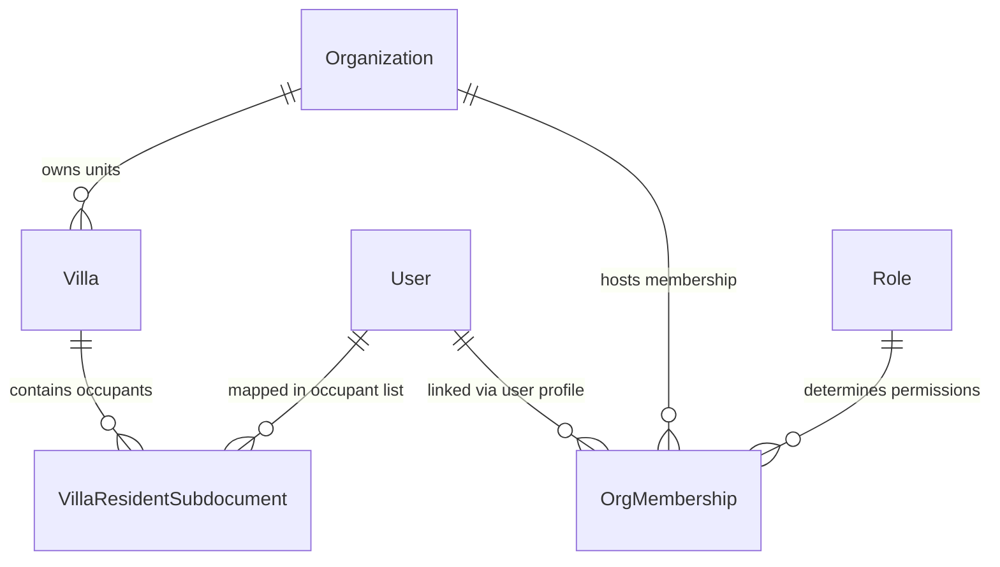
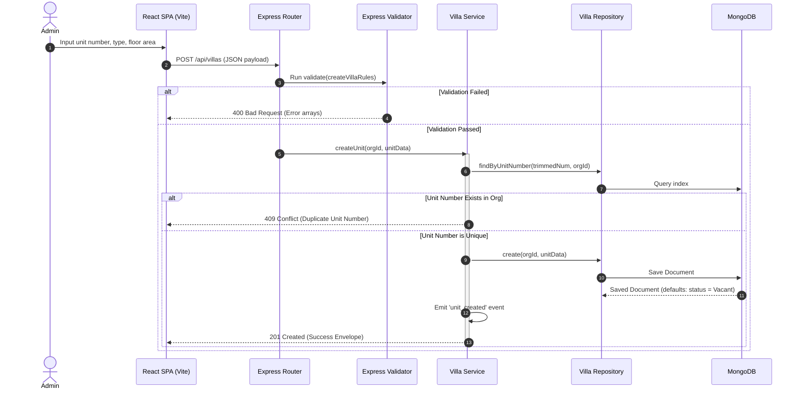
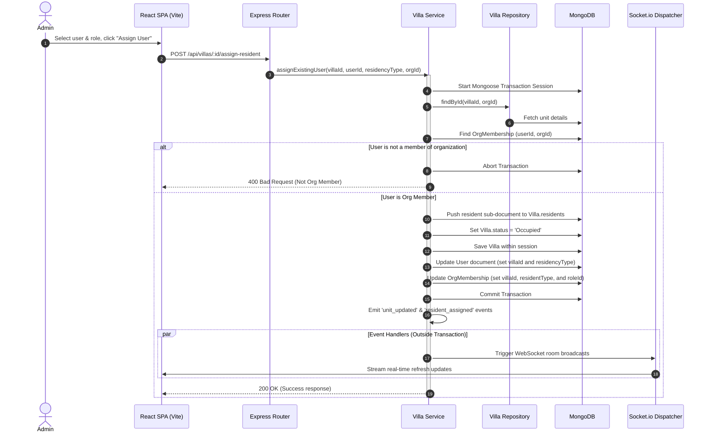

# Villa Management System (VMS) - Architectural & Process Report

This report provides a comprehensive guide to the **Villa Management System (Unit Management)** architecture, detailing the end-to-end design patterns, database schemas, cross-feature integrations, and real-time synchronization pipelines. It concludes with a **Detailed Bug Report** identifying specific logical, security, and performance issues discovered during our audit.

---

## 1. System Architecture & Flow

The Villa Management module enforces strict separation of concerns, ensuring transport layers, validations, business logic, and database operations are fully decoupled.

### A. Unidirectional Request Flows

#### Backend Execution Flow:
```
┌──────────────────┐       ┌────────────────────────┐       ┌──────────────────────┐
│  Express Router  │ ───>  │   Express Validator    │ ───>  │      Controller      │
│  (villa.router)  │       │ (villa.validateRules)  │       │  (villa.controller)  │
└──────────────────┘       └────────────────────────┘       └──────────┬───────────┘
                                                                       │
┌──────────────────┐       ┌────────────────────────┐                  │
│  Mongoose Model  │ <───  │       Repository       │ <────────────────┘
│ (villa.model.js) │       │   (villa.repository)   │
└──────────────────┘       └────────────────────────┘
```
1. **Router:** Mounts REST endpoints, registers tenant-context boundaries, and routes requests.
2. **Validator:** Sanitizes payload parameters via `express-validator` rules at the entry gate.
3. **Controller:** Acts as a lightweight traffic controller. Extracts parameters and calls the service layer.
4. **Service:** Implements 100% of business logic, manages Mongoose transactions, and emits native EventBus events.
5. **Repository:** Abstracts database access, executing CRUD operations and single-roundtrip paginated queries.

#### Frontend Execution Flow ("Thin View" Pattern):
```
┌─────────────────┐       ┌────────────────────────┐       ┌──────────────────────┐
│  UI Component   │ ───>  │   Custom Hook Bridge   │ ───>  │  Redux Toolkit Thunk │
│ (VillaGrid/Modal)│       │      (useVilla.js)     │       │   (villaSlice.js)    │
└─────────────────┘       └────────────────────────┘       └──────────┬───────────┘
                                                                       │
┌─────────────────┐       ┌────────────────────────┐                  │
│  Express Server │ <───  │   Global API Client    │ <────────────────┘
│   API Route     │       │     (apiClient.js)     │
└─────────────────┘       └────────────────────────┘
```
* **Separation of Concerns:** React views never interact with Redux dispatchers or API services directly. Instead, they interact with `useVilla.js`, which serves as a centralized frontend controller handling side effects and component states.

---

## 2. Directory & Module Map

The following folder structure outlines the exact placement of files under the feature-module folders, conforming to the monorepo encapsulation rules:

```
├─ backend/src/features/villa/
│  ├─ villa.model.js           # Mongoose Schema defining Unit status, area, and occupants list
│  ├─ villa.repository.js      # Encapsulated Mongoose aggregation pipelines and CRUD queries
│  ├─ villa.services.js        # Core transaction business logic, batch generation, and CSV uploads
│  ├─ villa.controller.js      # Traffic controller mapping HTTP requests to services
│  ├─ villa.router.js          # REST routes configured with authentication and RBAC guards
│  ├─ villa.validateRules.js   # Express-validator input verification rules
│  ├─ villa.events.js          # Native domain event emitter
│  └─ villa.socket.js          # Socket.io room broadcaster mapping domain events to WebSockets
│
├─ frontend/src/features/villa/
│  ├─ views/
│  │  └─ VillaManagementView.jsx # Main container managing the units dashboard grid
│  ├─ hooks/
│  │  ├─ useVilla.js           # Controller hook managing React states and Redux mappings
│  │  └─ useVillaSocket.js     # Real-time WebSocket room synchronization listener
│  ├─ components/
│  │  ├─ VillaCard.jsx         # Card component displaying unit-specific details
│  │  ├─ VillaGrid.jsx         # Visual layout manager mapping cards
│  │  ├─ VillaDetailsModal.jsx # Detailed view of residents, including assignment tabs
│  │  ├─ VillaFormModal.jsx    # Form interface for Unit creation or editing
│  │  ├─ BatchGenerateModal.jsx# Interface for generating multiple units automatically
│  │  └─ BulkUploadVillasModal.jsx # CSV parser interface for batch uploads
│  ├─ services/
│  │  └─ villaService.js       # Axios client endpoint wrapper queries
│  ├─ store/
│  │  └─ villaSlice.js         # Redux Toolkit actions, state reducers, and async thunks
│  └─ styles/
│     └─ _villa.scss           # Feature-level centralized styling variables and animations
```

---

## 3. Database Relationships & Multi-Tenancy

The VMS database structure is designed to isolate data dynamically using organization keys while linking units to system roles and resident profiles.



### A. Multi-Tenant Partitioning
Every data collection contains an `orgId` attribute. Database queries in `villa.repository.js` strictly enforce:
`{ _id: id, orgId }` or `{ unitNumber, orgId }`
This guarantees tenant-scoping isolation and prevents cross-tenant data leaks. A compound index on `{ orgId: 1, unitNumber: 1 }` with `{ unique: true }` enforces unit-number uniqueness strictly within each organization, allowing identical unit numbers (e.g., `101`) to coexist across different organizations.

### B. High-Performance Paginated Queries via `$facet`
Instead of performing dual queries to retrieve the total count and the paginated documents (causing double database roundtrips), `villa.repository.js` utilizes Mongoose aggregation pipelines with a `$facet` stage:
```javascript
const pipeline = [
  { $match: matchQuery },
  { $sort: { unitNumber: 1 } },
  {
    $facet: {
      data: [{ $skip: skip }, { $limit: limit }],
      totalRecords: [{ $count: 'count' }]
    }
  }
];
```

---

## 4. End-to-End Execution Flows

### Flow A: Creating or Editing a Unit


### Flow B: Assigning an Existing Resident (Mongoose Transaction Setup)


---

## 5. Real-Time Synchronization Pipeline

The VMS implements a fully decoupled WebSocket synchronization framework that ensures data updates broadcast in real-time across the client application.

1. **Domain Event Bus:** The service layer operates protocol-agnostically, emitting native Node `EventEmitter` actions (e.g., `villaEvents.emit('unit_updated', updatedVilla)`).
2. **Socket Dispatcher Layer (`villa.socket.js`):** Listens to native domain events, maps the client target workspace, and pipes them securely to Socket.io channels:
   ```javascript
   villaEvents.on('unit_updated', (payload) => {
     try {
       const room = `org:${payload.orgId}`;
       getIO().to(room).emit('unit_updated', payload);
     } catch (error) {
       logger.error('Failed to emit unit_updated socket event:', error);
     }
   }
   ```
3. **Frontend Listener Hook (`useVillaSocket.js`):** Subscribes to the organization-specific room channel. Upon receiving an event, it automatically triggers Redux Toolkit thunks (`fetchVillasAsync` and `fetchVillaStatsAsync`) to re-sync the view state seamlessly.

---

## 6. Detailed Bug Report & Gaps Analysis

During a thorough audit of the backend (`src/features/villa/`, `src/features/user/`) and frontend (`src/features/villa/`) codebase, the following bugs and architectural issues were identified:

### [BUG 1] Security/RBAC Privilege Leak on Resident Removal
* **File Location:** [villa.services.js](file:///d:/Personal%20Project/propmt%20testing%20Project%201/backend/src/features/villa/villa.services.js#L541-L600) -> `removeResident()`
* **Impact:** **High (Security Vulnerability)**
* **Description:** When removing a resident from a unit, the code clears the `villaId` and sets `residencyType` / `residentType` to `null` / `'None'` inside the `User` and `OrgMembership` collections. However, the user's `roleId` and `roleIds` (which manage system permission privileges) are **NOT** updated or cleared from their membership. 
* **Consequence:** The unassigned user retains all workspace permissions and API access (e.g., as a "Tenant" or "Resident Owner") despite no longer residing in or owning the unit.
* **Suggested Fix:** In `removeResident()`, locate the associated `OrgMembership` update and reset `roleId` and `roleIds` to the default "Guest" role or a basic non-privileged resident role:
  ```javascript
  await OrgMembership.updateOne(
    { userId, orgId },
    { $set: { villaId: null, residentType: 'None', roleId: defaultGuestRoleId, roleIds: [defaultGuestRoleId] } }
  ).session(session);
  ```

---

### [BUG 2] Transaction Database Write Contention in `inviteUser()`
* **File Location:** [user.services.js](file:///d:/Personal%20Project/propmt%20testing%20Project%201/backend/src/features/user/user.services.js#L260-L281) -> `inviteUser()`
* **Impact:** **Medium (Performance & Database Contention)**
* **Description:** When an administrator invites a user, the backend performs an initial modification on the `Villa` model within the active transaction using `villa.save({ session })` to record the resident details and set the status to `Occupied`. Immediately after, the service calls `villaService.updateVillaOccupancy(villaId, orgId, occupancyStatus, session)`. Inside `updateVillaOccupancy`, the repository executes a `findOneAndUpdate` query on the *exact same document*.
* **Consequence:** This executes redundant database updates and concurrent write lock cycles on the same record within the same transaction context, which can cause transactional locks, delays, or document overwrite issues.
* **Suggested Fix:** Refactor `user.services.js` to modify the unit status directly in the `villa` document in-memory prior to execution of `villa.save({ session })`, omitting the redundant `updateVillaOccupancy` call:
  ```javascript
  villa.residents.push({ userId: user._id, residencyType, isPrimary: false, assignedAt: new Date() });
  villa.status = 'Occupied';
  await villa.save({ session });
  // Omit the villaService.updateVillaOccupancy block entirely
  ```

---

### [BUG 3] Mongoose Deprecation Warning in Repository Update
* **File Location:** [villa.repository.js](file:///d:/Personal%20Project/propmt%20testing%20Project%201/backend/src/features/villa/villa.repository.js#L50-L59) -> `update()`
* **Impact:** **Low (Code Quality)**
* **Description:** The repository utilizes `{ new: true }` inside `findOneAndUpdate` to return the updated record. Modern Mongoose versions deprecate the `new` parameter and output warning logs in the environment shell:
  `Warning: mongoose: the new option for findOneAndUpdate() and findOneAndReplace() is deprecated. Use returnDocument: 'after' instead.`
* **Suggested Fix:** Replace `{ new: true }` with `{ returnDocument: 'after' }` inside `villaRepository.update()`.

---

### [BUG 4] Dead Code/Unused Endpoint Bypass in UI Modals
* **File Location:** [villaService.js](file:///d:/Personal%20Project/propmt%20testing%20Project%201/frontend/src/features/villa/services/villaService.js#L54-L57) & [villaSlice.js](file:///d:/Personal%20Project/propmt%20testing%20Project%201/frontend/src/features/villa/store/villaSlice.js#L75-L86)
* **Impact:** **Low (Bypassed Functionality)**
* **Description:** The REST endpoint `PATCH /api/villas/:id/assign` (`assignPrimaryResident`) is registered in both the backend router and the frontend Redux thunks. However, this logic is completely unused by the UI views. The `VillaDetailsModal` exclusively dispatches `assignExistingUser` which adds the user to the array instead of assigning them as the primary resident.
* **Consequence:** There is dead code in the project, and the database field `primaryResidentId` remains `null` even when residents are added to the unit, breaking fields like intercom shortcuts or dashboard greetings.
* **Suggested Fix:** Integrate a checkbox in the resident assignment UI to allow marking a specific resident as "Primary", which would trigger `assignPrimaryResidentAsync`.

---

### [BUG 5] Socket Connection Leak in `useVillaSocket`
* **File Location:** [useVillaSocket.js](file:///d:/Personal%20Project/propmt%20testing%20Project%201/frontend/src/features/villa/hooks/useVillaSocket.js#L51-L59)
* **Impact:** **Medium (Client Performance)**
* **Description:** The socket hook cleanup block detaches the event listeners using `.off()` and disconnects the client using `.disconnect()`. However, the hook instantiates the socket object as a local constant (`const socket = io(...)`) inside the `useEffect` scope.
* **Consequence:** If the custom hook is unmounted and remounted during workspace toggles, subsequent renders might instantiate multiple active connections.
* **Suggested Fix:** Standardize connection hooks using a global singleton pattern or wrap the connection client inside a React `useRef` to maintain a single reference and avoid connection leaks.
