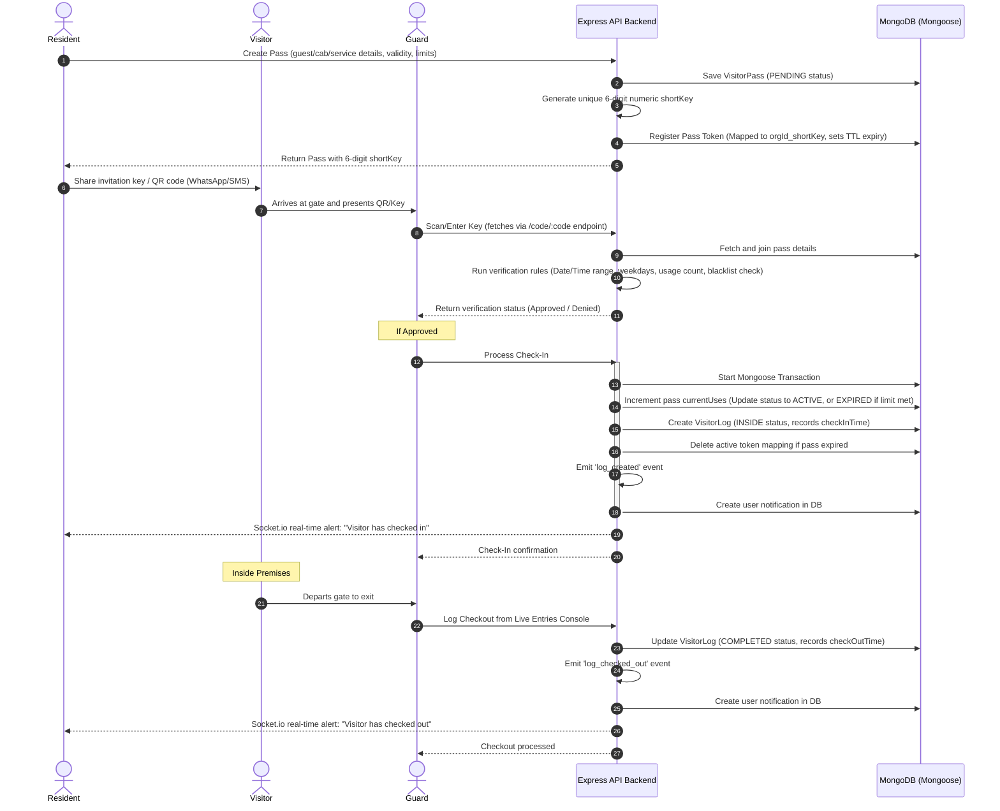
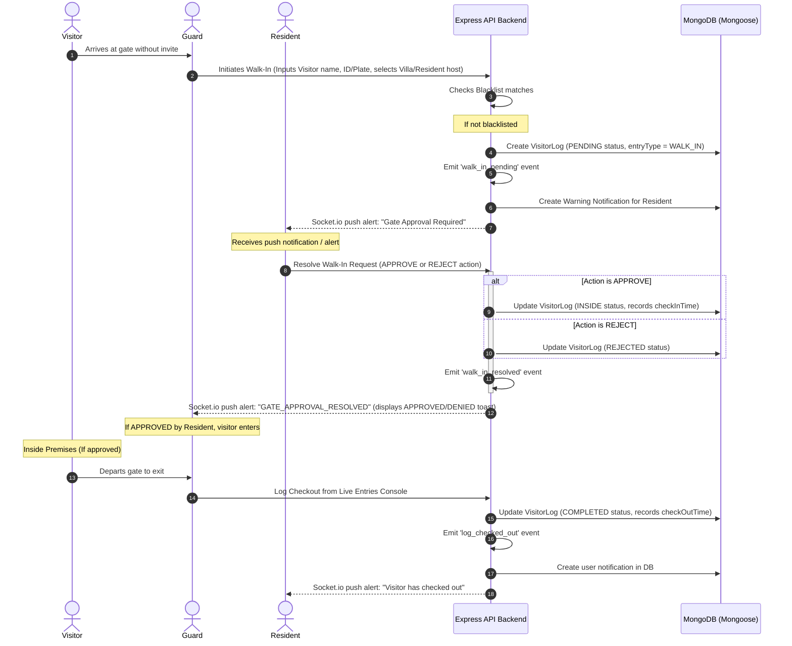

# Visitor Management System (VMS) Detailed Report

This report provides a comprehensive guide to the **Visitor Management System (VMS)** architecture, detailing the specific functionalities available to the **Resident**, **Guard**, and **Admin** roles, and explaining the end-to-end execution flows.

---

## 1. System Architecture & Real-Time Sync

The VMS is built on a modular decoupled pattern that separates business logic (Services) from transport layers (HTTP/WebSockets). 

- **State Management & UI Control:** Handled via Redux Toolkit slices (`visitorPassSlice.js` and `visitorLogSlice.js`) mapping to custom React hooks acting as Controllers (`useResidentVisitorManagement`, `useGuardVisitorManagement`, `useAdminVisitorManagement`).
- **Real-Time Notification Pipeline:** Socket.io room-based channels (`user:${userId}`) synchronize state.
  - When guards submit a walk-in, the event flows: `Guard Console → Express Server → Event Bus (.events.js) → Socket Dispatcher (.socket.js) → Resident UI Room`.
  - When residents approve/deny, the return event flows: `Resident UI → Express Server → Event Bus (.events.js) → Socket Dispatcher (.socket.js) → Guard UI Room`.
- **Blacklist Enforcement:** Enforced during pass check-in and walk-in creation. The `BlacklistService` checks visitor name, phone, or license plate fields at the database layer.

---

## 2. Role-Based Functionality Matrix

| Feature Module | Resident Role | Guard Role | Admin Role |
| :--- | :--- | :--- | :--- |
| **Pass Creation & Invites** | **Yes** (Guest, Group, Cab/Delivery, Service passes) | **No** (Initiates walk-ins only) | **Yes** (Same as Resident + Admin Guest passes) |
| **Pass Customization** | Set validity dates, allowed weekdays, and specific time windows. | N/A | Set validity dates, allowed weekdays, and specific time windows. |
| **ID Verification Mode** | Select to enforce ID verification (Aadhaar, PAN, Passport, Voter ID, DL). | Performs verification check during console lookup. | Select to enforce ID verification (Aadhaar, PAN, Passport, Voter ID, DL). |
| **Pass Management** | View active passes, copy shareable 6-digit key, and revoke passes. | N/A | View all active passes, copy keys, and revoke passes. |
| **Verification Console** | N/A | **Yes** (Camera QR reader or typed 6-digit key search). Checks date, time, days, usage limits, and blacklist. | N/A |
| **Walk-In Initiation** | N/A | **Yes** (Enter visitor details & select Resident/Villa or Admin host). | N/A |
| **Walk-In Approvals** | **Yes** (Review, approve, or deny pending entries for their villa unit). | Receives real-time approval/denial alerts via WebSockets. | **Yes** (Approve walk-ins targeted to admins). |
| **Live Entries Tracker** | N/A | **Yes** (Real-time view of visitors inside; perform direct checkout). | N/A |
| **Villa Directory** | N/A | **Yes** (Access unit occupancies and intercom contacts for manual calls). | N/A |
| **Visitor Log Auditing** | View local log history for their own unit. | N/A | **Yes** (Platform-wide searchable, paginated log history). |
| **Blacklist Settings** | N/A | N/A | **Yes** (Ban/unban profiles by name, phone, or license plate). |
| **Analytics Dashboard** | N/A | N/A | **Yes** (Live entries count, active passes, blocked alerts, traffic charts). |

---

## 3. End-to-End Execution Flows

### Flow A: Pre-Approved Visitor Pass (QR Code / Short Key)

### Flow B: Walk-In / Guard-Initiated Entry

---

## 4. Architectural Implementation Details

### Mongoose Schemas

#### A. VisitorPass Schema (`visitorPass.model.js`)
Contains the primary settings configuration for any pre-approved entry.
- `orgId`: Scope identifier for multi-tenancy.
- `createdById`: Reference to the host resident/admin.
- `passType`: ENUM (`GUEST`, `DELIVERY`, `CAB`, `SERVICE`, `ADMIN_GUEST`).
- `status`: ENUM (`PENDING`, `ACTIVE`, `REVOKED`, `EXPIRED`).
- `visitorDetails`: Sub-document containing `name`, `phone`, and optional `idProofType`/`idProofNumber`.
- `vehicleDetails`: Sub-document containing vehicle plate details.
- `validity`: Sub-document specifying `startDate`, `endDate`, time window boundaries, and allowed days of the week array.
- `usageLimit`: Configures `maxUses` and tracks `currentUses`.

#### B. VisitorLog Schema (`visitorLog.model.js`)
Acts as a ledger for entry transactions.
- `passId`: Reference to the `VisitorPass` (empty for direct walk-ins).
- `guardId`: Reference to the guard checking in/out.
- `residentId`: Reference to the resident host.
- `entryType`: ENUM (`PRE_APPROVED`, `WALK_IN`).
- `logStatus`: ENUM (`PENDING`, `INSIDE`, `COMPLETED`, `REJECTED`).
- `snapshot`: Flat copy of the visitor name, ID number, and plate at time of entry.
- `checkInTime` / `checkOutTime`: Timestamps.

#### C. VisitorPassToken Schema (`visitorPassToken.model.js`)
Keeps short 6-digit codes alive for rapid lookup. Includes a TTL index on `expiresAt` so Mongoose automatically drops keys when they expire.
- `shortKey`: 6-digit random code.
- `passCode`: Combined index key (`${orgId}_${shortKey}`).
- `expiresAt`: Date boundary mapping to `validity.endDate` on the pass.

---

## 5. Security Guardrails

1. **Transaction Wrapping:** Both pre-approved check-ins and walk-in resolutions use Mongoose transactions. If log creation succeeds but pass usage state update fails, the transaction is aborted to prevent visitor logs out-of-sync with pass states.
2. **Strict Regex ID Validations:** Forms enforce structure formatting on ID proofs on the frontend:
   - *Aadhaar:* 12 digits (`\d{4}\s?\d{4}\s?\d{4}`).
   - *PAN:* standard Indian format (`[A-Z]{5}[0-9]{4}[A-Z]{1}`).
   - *Driving License:* Indian DL format (`[A-Z]{2}\d{13}`).
   - *Taxi License Plate:* Matches Indian state or central BH series plates.
3. **Double-Click Checks:** Guard consoles disable check-in buttons after the first click and maintain lock states while the API calls resolve asynchronously.
4. **Room-Based Channel Safety:** Socket connections subscribe to specific room namespaces matching authenticated user IDs. Guards cannot intercept approvals intended for another resident's namespace.
