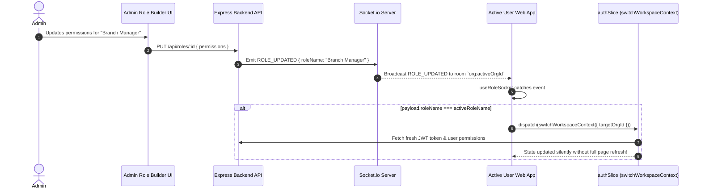

# Web Frontend Role Building Feature Detailed Technical & Architectural Analysis

> **Feature Module**: `src/features/roleBuilder/` (Manage-My-Gate Web Frontend)  
> **Architecture Standard**: Feature-Based Modular Architecture (React + Redux Toolkit + CoreUI + React Hook Form + Yup)  
> **Integration Reach**: Integration Hub (Provider Mappings) + WebSockets (`ROLE_UPDATED` Real-Time Context Sync)  
> **Rule Compliance**: 100% Compliant with `frontend-rules.md` (Thin View Pattern, Single Component Files, Centralized SCSS)  

---

## 1. Executive Summary & Feature Architecture

The **Role Building Feature** (`src/features/roleBuilder/`) is a core administrative module in the Manage-My-Gate web frontend. It empowers system administrators and community managers to create, edit, customize, and delete dynamic Access Control Roles (RBAC) with granular resource permissions, tenant scope flags, and third-party integration credential mappings.

```
┌─────────────────────────────────────────────────────────────────────────────┐
│                       Role Builder UI Presentation                          │
│     RoleBuilderList.jsx ── RoleFormModal.jsx ── PermissionMatrix.jsx        │
│                    RoleIntegrationConfigurator.jsx                          │
└──────────────────────────────────────┬──────────────────────────────────────┘
                                       │
┌──────────────────────────────────────▼──────────────────────────────────────┐
│                    Controller Custom Hooks (Thin View Layer)                 │
│        useRoles ── useRoleForm ── useRoleIntegrationConfigurator            │
│                         useRoleSocket (WebSockets)                          │
└──────────────────────────────────────┬──────────────────────────────────────┘
                                       │
┌──────────────────────────────────────▼──────────────────────────────────────┐
│                         Redux Toolkit State Engine                          │
│       `roleSlice.js` (`roleBuilder` slice registered in `store.js`)         │
│          Async Thunks: fetchRolesAsync, syncRolePermissionsAsync, etc.      │
└──────────────────────────────────────┬──────────────────────────────────────┘
                                       │
┌──────────────────────────────────────▼──────────────────────────────────────┐
│                    Axios Network Gateway & REST Client                      │
│        `roleApi.js` ── `apiClient.js` (Bearer Token, X-Request-ID)          │
└─────────────────────────────────────────────────────────────────────────────┘
```

### Architectural Highlights
- **Strict Feature Encapsulation:** All view orchestrators, sub-components, custom hooks, Redux slices, API services, and SCSS partials reside within `src/features/roleBuilder/`.
- **Thin View Pattern:** Visual components (`RoleBuilderList.jsx`, `RoleFormModal.jsx`) contain zero direct API calls or heavy Redux logic. All interaction logic is delegated to custom hooks (`useRoles`, `useRoleForm`, `useRoleIntegrationConfigurator`).
- **Dynamic Permission Matrix:** Groups system permissions into visual domain categories (`visitor`, `amenities`, `billing`, `villas`, `users`, `notices`, `integrations`, `complaints`). Enforces radio-button constraints on visitor roles and multi-select checkboxes on standard resource permissions.
- **Role Integration Mapping:** Connects directly with the `integrationHub` slice to map role-level provider connections (SMTP, Twilio, OpenAI, Resend, Firebase, Razorpay, Banking) per role.
- **Real-Time Workspace Sync:** Uses `useRoleSocket` to listen for backend `ROLE_UPDATED` WebSocket events. If an active user's role is modified, it triggers a silent JWT and workspace context refresh without reloading the page.

---

## 2. Directory Architecture & Layer Responsibilities

```
frontend/src/features/roleBuilder/
├── RoleBuilderList.jsx                 # Top-level View Container & DataTable Orchestrator
├── components/                         # Feature UI Components (One Component Per File)
│   ├── PermissionMatrix.jsx            # Category-Grouped Checkbox & Radio Permission Grid
│   ├── RoleFormModal.jsx               # Role Creation & Edit Form Modal
│   └── RoleIntegrationConfigurator.jsx # Provider Connection Mapper (Carousel + Radio Table)
├── hooks/                              # Custom Logic Controllers (Thin View Pattern)
│   ├── useRoles.js                     # Main Controller Hook for Role Data, Modals & Pagination
│   ├── useRoleForm.js                  # React Hook Form + Yup Validation Controller
│   ├── useRoleIntegrationConfigurator.js # Integration Hub Connection Selection Controller
│   └── useRoleSocket.js                # Socket.io Listener for Real-Time Role Updates
├── services/                           # HTTP API Client Layer
│   └── roleApi.js                      # Axios Endpoints (/roles, /roles/permissions)
├── store/                              # Redux Toolkit Feature Engine
│   └── roleSlice.js                    # Redux Slice (Roles, Permissions, Pagination)
└── styles/                             # Centralized Feature SCSS Partial
    └── _roleBuilder.scss               # Single Partial Styling File
```

---

## 3. UI Layer & Component Breakdown

### 1. `RoleBuilderList.jsx` (Top-Level Container)
Located at [`src/features/roleBuilder/RoleBuilderList.jsx`](file:///d:/atominos/GatedCommunity/frontend/src/features/roleBuilder/RoleBuilderList.jsx):
- **Role:** Main page container listing system roles using generic `PageHeader` and `DataTable` components.
- **System Role Protection:** Identifies system roles (`Super Admin`, `Platform Super Admin`) and disables Edit/Delete action buttons with descriptive tooltips.
- **Scope Badging:** Displays `Tenant / Unit` (info badge) vs `Global` (primary badge) scope.
- **Permissions Counter:** Renders pill badges displaying the total count of granted permissions per role.

### 2. `RoleFormModal.jsx` (Creation & Edit Modal)
Located at [`src/features/roleBuilder/components/RoleFormModal.jsx`](file:///d:/atominos/GatedCommunity/frontend/src/features/roleBuilder/components/RoleFormModal.jsx):
- **Role:** Modal container handling role creation and updates.
- **Form Controls:** Text input for `Role Name`, textarea for `Description`, and checkbox for `isTenantRole`.
- **Integrations Drawer:** Toggles the inline `RoleIntegrationConfigurator` drawer and shows an active mapping pill counter.
- **Permissions Scroll Area:** Embeds `PermissionMatrix` wrapped in a loading spinner state while permissions load.

### 3. `PermissionMatrix.jsx` (Granular Permission Grid)
Located at [`src/features/roleBuilder/components/PermissionMatrix.jsx`](file:///d:/atominos/GatedCommunity/frontend/src/features/roleBuilder/components/PermissionMatrix.jsx):
- **Category Mapper:** Categorizes permissions into `Visitor Management`, `Amenities & Bookings`, `Billing & Invoices`, `Unit Management`, `User Management`, `Notices Board`, `Integrations Hub`, and `Complaints/Maintenance`.
- **Visitor Permission Rule:** Visitor permissions enforce single-choice radio selection (`visitor:view` OR `visitor:manage`) using native radio elements to prevent focus accessibility issues inside modals.
- **Complaints Permission Filter:** Applies exact category filtering for allowed complaints actions (`dashboard`, `raise_ticket`, `complaint_management`, `staff_vendors`, `assignee`, `track_requests`, `staff`).
- **Group Select All:** Provides a "Select All" check option for fast bulk selection per category.

### 4. `RoleIntegrationConfigurator.jsx` (Integration Mapping Tool)
Located at [`src/features/roleBuilder/components/RoleIntegrationConfigurator.jsx`](file:///d:/atominos/GatedCommunity/frontend/src/features/roleBuilder/components/RoleIntegrationConfigurator.jsx):
- **Provider Carousel:** Top scrollable horizontal carousel representing available third-party providers (`SMTP Email`, `Twilio SMS`, `OpenAI AI`, `Resend Email`, `Firebase`, `Message Central`, `Bank Details`, `Razorpay`).
- **Connections Radio Table:** Bottom radio selection table listing active integration connections created in the Integration Hub, allowing administrators to bind specific provider accounts to a role.

---

## 4. State Management & Data Flow (`roleSlice.js` & `useRoles.js`)

Global state is managed by Redux Toolkit in `roleSlice.js` and registered in the central store under `state.roleBuilder`.

```
┌─────────────────────────────────────────────────────────────────────────────┐
│                           Redux Store State (`roleBuilder`)                 │
├─────────────────┬─────────────────┬─────────────────┬───────────────────────┤
│ roles: []       │ isLoading: bool │ error: string   │ permissionsList: {}   │
│ totalRecords: 0 │ currentPage: 1  │ totalPages: 1   │ rowsPerPage: 10       │
└─────────────────┴─────────────────┴─────────────────┴───────────────────────┘
```

### Async Thunks in `roleSlice.js`
- **`fetchRolesAsync({ page, limit })`:** Fetches paginated role records from `GET /api/roles`. Updates `roles`, `totalRecords`, `currentPage`, `totalPages`.
- **`fetchPermissions()`:** Fetches system permission dictionary from `GET /api/roles/permissions`.
- **`createRoleAsync(roleData)`:** Posts new role data to `POST /api/roles`.
- **`updateRoleAsync({ roleId, roleData })`:** Updates existing role via `PUT /api/roles/:roleId`.
- **`deleteRoleAsync(roleId)`:** Deletes role via `DELETE /api/roles/:roleId`.
- **`syncRolePermissionsAsync({ roleId, permissionIds })`:** Syncs array of permission IDs to a role via `PUT /api/roles/:roleId/permissions`.

### Custom Controller Hook (`useRoles.js`)
Acts as the sole controller between visual components and Redux. Exposes state selectors and helper handlers (`openCreateModal`, `openEditModal`, `closeModal`, `handleSaveRole`, `handleDeleteRole`, `handlePageChange`, `handleRowsPerPageChange`).

---

## 5. Form Validation & Schema Architecture (`useRoleForm.js`)

Form state and validation are managed by **React Hook Form** with a strict **Yup** schema validation resolver:

```javascript
const schema = yup.object().shape({
  name: yup.string().trim().required('Role name is required'),
  description: yup.string().trim().optional(),
  isTenantRole: yup.boolean().optional().default(false),
  permissions: yup.array().of(yup.string().required()).required('Permissions array is required'),
  integrationMappings: yup.object().optional().default({}),
})
```

### Key Form Logic & Features
- **Visitor Mutual Exclusion:** When selecting a visitor permission, `handleTogglePermission` automatically clears existing `visitor:*` permissions before setting the newly selected radio value.
- **Form Reset on Modal Open:** Populates existing values on edit or resets to empty defaults on create modal open.

---

## 6. Real-Time WebSockets & Dynamic Permission Refresh (`useRoleSocket.js`)

To prevent users from operating with stale permissions when an administrator modifies a role, the feature includes a dedicated socket listener hook:



---

## 7. SCSS Styling Architecture (`_roleBuilder.scss`)

All styles for the feature are encapsulated in [`src/features/roleBuilder/styles/_roleBuilder.scss`](file:///d:/atominos/GatedCommunity/frontend/src/features/roleBuilder/styles/_roleBuilder.scss):

```scss
.role-builder-container {
  .modal-title-custom {
    font-size: 1.15rem;
    font-weight: 700;
  }
  .form-label-custom {
    font-weight: 600;
    font-size: 0.875rem;
  }
  .permissions-scroll-container {
    max-height: 380px;
    overflow-y: auto;
  }
  .permission-category-card {
    border: 1px solid var(--cui-border-color);
    border-radius: 0.5rem;
    padding: 0.85rem;
    background-color: var(--cui-body-bg);
  }
  .role-integration-configurator {
    .carousel-container {
      scroll-behavior: smooth;
    }
  }
}
```

---

## 8. Summary of Architectural Compliance

| Architectural Rule | Status | Compliance Details |
| :--- | :---: | :--- |
| **Feature Isolation** | ✅ Compliant | All code strictly contained inside `src/features/roleBuilder/` |
| **Thin View Pattern** | ✅ Compliant | `RoleBuilderList.jsx` and modals delegate 100% of logic to custom hooks |
| **Single Component Per File**| ✅ Compliant | Sub-components (`PermissionMatrix.jsx`, `RoleFormModal.jsx`, `RoleIntegrationConfigurator.jsx`) live in separate files |
| **Redux State Management** | ✅ Compliant | Isolated `roleBuilder` slice registered in `store.js` with server-side pagination |
| **Form Validation** | ✅ Compliant | React Hook Form + Yup schema validation |
| **Centralized SCSS** | ✅ Compliant | Centralized feature file `_roleBuilder.scss` |
| **Real-Time Transport** | ✅ Compliant | Socket listener encapsulated in `useRoleSocket.js` with Redux dispatch cleanup |
| **Cross-Feature Gateway** | ✅ Compliant | Integration Hub connection mapping decoupled via custom hook |
